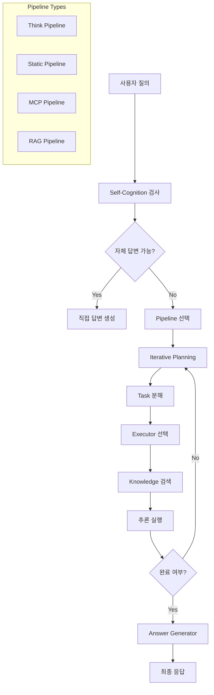

## 개요

이번 포스트에서는 **KAG Solver 모듈**의 심층 아키텍처를 분석합니다. Solver는 구축된 지식 그래프를 기반으로 지능형 추론을 수행하고, 복잡한 질의를 단계적으로 분해하여 정확한 답변을 생성하는 KAG 프레임워크의 핵심 추론 엔진입니다.

## 1. KAG Solver 개요

### 1.1 Solver 아키텍처 전체 구조

```python
# KAG Solver의 핵심 구성 요소
kag/solver/
├── main_solver.py       # 메인 진입점 및 QA 오케스트레이션
├── planner/             # 작업 계획 수립
├── executor/            # 작업 실행 엔진들
├── generator/           # 답변 생성기
├── pipeline/            # 처리 파이프라인들
├── prompt/              # 프롬프트 템플릿들
└── reporter/            # 결과 리포팅
```

**Solver의 핵심 역할:**
- **질의 분석**: 복잡한 질문을 하위 작업으로 분해
- **지식 검색**: 그래프 DB에서 관련 지식 검색
- **추론 실행**: 논리적 추론과 계산 수행
- **답변 생성**: LLM을 활용한 자연스러운 응답 생성

### 1.2 문제 해결 플로우



## 2. Main Solver - 중앙 오케스트레이터

### 2.1 QA 함수 - 질의응답 진입점

```python
async def qa(task_id, query, project_id, host_addr, params=None):
    """중앙 질의응답 처리 함수"""
    
    # 1. 설정 초기화
    use_pipeline = params.get("usePipeline", "think_pipeline")
    qa_config = params.get("config", KAG_CONFIG.all_config)
    thinking_enabled = use_pipeline == "think_pipeline"
    
    # 2. 리포터 시작
    reporter = OpenSPGReporter(
        task_id=task_id,
        host_addr=host_addr,
        project_id=project_id,
        thinking_enabled=thinking_enabled,
    )
    await reporter.start()
    
    try:
        # 3. 언어 감지 및 설정
        if is_chinese(query):
            KAG_PROJECT_CONF.language = "zh"
        else:
            KAG_PROJECT_CONF.language = "en"
        
        # 4. Self-Cognition 단계
        self_cognition_conf = get_pipeline_conf("self_cognition_pipeline", qa_config)
        self_cognition_pipeline = SolverPipelineABC.from_config(self_cognition_conf)
        self_cognition_res = await self_cognition_pipeline.ainvoke(
            query, reporter=reporter
        )
        
        if not self_cognition_res:
            # 5. 메인 파이프라인 실행
            if custom_pipeline_conf:
                pipeline_config = custom_pipeline_conf
            else:
                pipeline_config = get_pipeline_conf(use_pipeline, qa_config)
            
            pipeline = SolverPipelineABC.from_config(pipeline_config)
            answer = await pipeline.ainvoke(query, reporter=reporter)
        else:
            answer = self_cognition_res
            
    except Exception as e:
        # 에러 처리 및 다국어 지원
        if KAG_PROJECT_CONF.language == "en":
            answer = f"Sorry, An exception occurred while processing query: {query}..."
        else:
            answer = f"抱歉，处理查询 {query} 时发생异常..."
    
    await reporter.stop()
    return answer
```

### 2.2 파이프라인 설정 관리

```python
def get_pipeline_conf(use_pipeline_name, config):
    """동적 파이프라인 설정 로딩"""
    
    # 1. YAML 설정 파일들 로딩
    conf_map = load_yaml_files_from_conf_dir()
    if use_pipeline_name not in conf_map:
        raise RuntimeError(f"Pipeline configuration not found: {use_pipeline_name}")
    
    # 2. 플레이스홀더 추출 및 교체
    placeholders = []
    get_all_placeholders(conf_map[use_pipeline_name], placeholders)
    placeholders = list(set(placeholders))
    
    placeholders_replacement_map = {}
    for placeholder in placeholders:
        value = config.get(placeholder)
        
        # 백업 키 처리 (llm, vectorizer 등)
        if value is None:
            backup_key = None
            if "llm" in placeholder:
                backup_key = "llm"
            if "vectorizer" in placeholder:
                backup_key = "vectorizer"
            if backup_key:
                value = config.get(backup_key)
        
        if value is None:
            raise RuntimeError(f"Placeholder '{placeholder}' not found in config.")
        
        value["enable_check"] = False
        placeholders_replacement_map[placeholder] = value
    
    # 3. 플레이스홀더 교체 및 설정 반환
    default_pipeline_conf = replace_placeholders(
        conf_map[use_pipeline_name], placeholders_replacement_map
    )
    
    # 4. KAG_CONFIG 업데이트
    KAG_CONFIG.update_conf(default_pipeline_conf)
    return default_pipeline_conf["solver_pipeline"]
```

## 3. Planner - 지능형 작업 계획 수립

### 3.1 반복적 계획 수립기

```python
@PlannerABC.register("kag_iterative_planner")
class KAGIterativePlanner(PlannerABC):
    """LLM 기반 반복적 작업 계획 수립기"""
    
    def __init__(self, llm: LLMClient, plan_prompt: PromptABC, **kwargs):
        super().__init__(**kwargs)
        self.llm = llm
        self.plan_prompt = plan_prompt
    
    def format_context(self, context: Context = None):
        """실행 컨텍스트를 구조화된 이력으로 포맷팅"""
        formatted_context = []
        
        if context and isinstance(context, Context):
            for task in context.gen_task():
                formatted_context.append({
                    "action": {
                        "name": task.executor, 
                        "argument": task.arguments
                    },
                    "result": (
                        task.result.to_string() 
                        if hasattr(task.result, "to_string")
                        else task.result
                    ),
                })
        return formatted_context
    
    async def ainvoke(self, query, **kwargs) -> List[Task]:
        """비동기 작업 계획 생성"""
        num_iteration = kwargs.get("num_iteration", 0)
        
        return await self.llm.ainvoke(
            {
                "query": query,
                "context": self.format_context(kwargs.get("context")),
                "executors": kwargs.get("executors", []),
            },
            self.plan_prompt,
            segment_name="thinker",
            tag_name=f"Iterative planning {num_iteration}",
            **kwargs,
        )
```

### 3.2 계획 수립 프롬프트 예시

```python
# 실제 계획 수립 시 LLM에 전달되는 구조
planning_input = {
    "query": "알리바바 2024년 9월까지 총수입과 은행 이자 계산",
    "context": [
        {
            "action": {"name": "KnowledgeSearch", "argument": {"query": "알리바바 2024년 수입"}},
            "result": "2024년 9월까지 총수입: 2,365억 위안"
        }
    ],
    "executors": [
        {"name": "KnowledgeSearch", "description": "지식 그래프 검색"},
        {"name": "Calculator", "description": "수학적 계산 수행"},
        {"name": "Finish", "description": "작업 완료"}
    ]
}
```

## 4. Executor - 작업 실행 엔진들

### 4.1 실행기 타입별 분류

```python
kag/solver/executor/
├── retriever/           # 정보 검색 실행기들
│   ├── local_knowledge_base/  # 로컬 지식베이스 검색
│   └── web_search/      # 웹 검색
├── deduce/              # 논리적 추론 실행기들
├── math/                # 수학적 계산 실행기들
├── mcp/                 # Model Context Protocol 실행기들
└── finish_executor.py   # 작업 완료 표시 실행기
```

### 4.2 KAG 하이브리드 검색 실행기

```python
class KAGRetrievedResponse(ExecutorResponse):
    """지식 그래프 검색 결과 응답 객체"""
    
    def __init__(self):
        super().__init__()
        self.task_id = "0"
        self.sub_retrieved_set = []      # 하위 질의 결과들
        self.retrieved_task = ""         # 원본 작업 설명
        self.graph_data = None           # 그래프 데이터
        self.chunk_datas = []            # 텍스트 청크들
        self.summary = ""                # 검색 결과 요약
    
    def get_chunk_list(self):
        """검색된 청크들을 리스트로 반환"""
        res = []
        for c in self.chunk_datas:
            res.append(f"{c.content}")
        
        if len(res) == 0:
            return to_reference_list(self.task_id, [self.graph_data])
        return res
    
    def to_reference_list(self):
        """참조 형식으로 변환"""
        return {
            "id": f"{self.task_id}",
            "content": self.summary,
            "chunks": self.get_chunk_list(),
            "graph_data": self.graph_data.to_dict() if self.graph_data else None
        }
```

### 4.3 완료 실행기

```python
@ExecutorABC.register("finish_executor")
class FinishExecutor(ExecutorABC):
    """작업 완료를 나타내는 특수 실행기"""
    
    def schema(self):
        return {
            "name": "Finish",
            "description": "작업이 완료되었음을 나타내는 무연산 실행기",
            "parameters": {},
        }
```

## 5. Pipeline - 처리 파이프라인들

### 5.1 반복적 파이프라인 아키텍처

```python
@SolverPipelineABC.register("kag_iterative_pipeline")
class KAGIterativePipeline(SolverPipelineABC):
    """단계별 문제 분해 및 해결 파이프라인"""
    
    def __init__(
        self,
        planner: PlannerABC,
        executors: List[ExecutorABC],
        generator: GeneratorABC,
        max_iteration: int = 5,
    ):
        super().__init__()
        self.planner = planner
        self.executors = executors
        self.generator = generator
        self.max_iteration = max_iteration
        
        # 완료 실행기 자동 추가
        self.finish_executor = ExecutorABC.from_config({"type": "finish_executor"})
        self.executors.append(self.finish_executor)
    
    def select_executor(self, executor_name: str):
        """실행기 이름으로 실행기 선택"""
        for executor in self.executors:
            schema = executor.schema()
            if executor_name == schema["name"]:
                return executor
        return None
    
    @retry(stop=stop_after_attempt(3), reraise=True)
    async def planning(self, query, context, **kwargs):
        """계획 수립 단계"""
        task = await self.planner.ainvoke(
            query,
            context=context,
            executors=[x.schema() for x in self.executors],
            **kwargs,
        )
        
        if isinstance(task, list):
            task = task[0]
            
        executor = self.select_executor(task.executor)
        if not executor:
            raise ValueError(f"Executor {task.executor} not found")
        
        return task, executor
    
    async def ainvoke(self, query, **kwargs):
        """메인 처리 루프"""
        num_iteration = 0
        context = Context()
        
        # 반복적 계획-실행 루프
        while num_iteration < self.max_iteration:
            num_iteration += 1
            
            # 1. 계획 수립
            task, executor = await self.planning(
                query, context, num_iteration=num_iteration, **kwargs
            )
            context.append_task(task)
            
            # 2. 완료 체크
            if executor == self.finish_executor:
                break
            
            # 3. 작업 실행
            await executor.ainvoke(query, task, context, **kwargs)
        
        # 4. 최종 답변 생성
        answer = await self.generator.ainvoke(query, context, **kwargs)
        return answer
```

### 5.2 실행 과정 시각화

```python
# 실제 실행 과정 예시
"""
Iteration 1:
Planning → Task: {"executor": "KnowledgeSearch", "args": {"query": "알리바바 2024년 수입"}}
Execution → Result: "2024년 9월까지 총수입: 2,365억 위안"

Iteration 2:
Planning → Task: {"executor": "Calculator", "args": {"expression": "2365*100000000*0.0009*88"}}
Execution → Result: "이자 계산 결과: 1,873만 위안"

Iteration 3:
Planning → Task: {"executor": "Finish", "args": {}}
Execution → Pipeline 종료

Answer Generation:
Context: [알리바바 수입 정보, 이자 계산 결과]
Final Answer: "알리바바 2024년 9월까지 총수입은 2,365억 위안입니다. 이를 은행에 예치 시 예상 이자는..."
"""
```

## 6. Generator - 답변 생성기

### 6.1 LLM 기반 답변 생성기

```python
@GeneratorABC.register("llm_generator")
class LLMGenerator(GeneratorABC):
    """LLM을 활용한 최종 답변 생성기"""
    
    def __init__(
        self,
        llm_client: LLMClient,
        generated_prompt: PromptABC,
        chunk_reranker: RerankByVector = None,
        enable_ref=False,
        **kwargs,
    ):
        super().__init__(**kwargs)
        self.llm_client = llm_client
        self.generated_prompt = generated_prompt
        self.chunk_reranker = chunk_reranker or RerankByVector.from_config({
            "type": "rerank_by_vector",
        })
        self.enable_ref = enable_ref
        
        # 참조 모드별 프롬프트 초기화
        if enable_ref:
            self.with_out_ref_prompt = init_prompt_with_fallback(
                "without_refer_generator_prompt", KAG_PROJECT_CONF.biz_scene
            )
            self.with_ref_prompt = init_prompt_with_fallback(
                "refer_generator_prompt", KAG_PROJECT_CONF.biz_scene
            )
    
    @retry(stop=stop_after_attempt(3))
    def generate_answer(self, query, content, refer_data, **kwargs):
        """답변 생성 (재시도 로직 포함)"""
        if not self.enable_ref:
            return self.llm_client.invoke(
                {"query": query, "content": content},
                self.generated_prompt,
                segment_name="answer",
                tag_name="Final Answer",
                with_json_parse=self.generated_prompt.is_json_format(),
                **kwargs,
            )
        
        # 참조 데이터 유무에 따른 프롬프트 선택
        if refer_data and len(refer_data):
            refer_data_str = json.dumps(refer_data, ensure_ascii=False, indent=2)
            return self.llm_client.invoke(
                {"query": query, "content": content, "ref": refer_data_str},
                self.with_ref_prompt,
                segment_name="answer",
                tag_name="Final Answer",
                **kwargs,
            )
        else:
            return self.llm_client.invoke(
                {"query": query, "content": content},
                self.with_out_ref_prompt,
                segment_name="answer", 
                tag_name="Final Answer",
                **kwargs,
            )
    
    def invoke(self, query, context, **kwargs):
        """컨텍스트 기반 답변 생성"""
        reporter = kwargs.get("reporter", None)
        results = []
        rerank_queries = []
        chunks = []
        graph_data = context.variables_graph
        
        # 1. 컨텍스트에서 결과 수집
        for task in context.gen_task(False):
            if isinstance(task.result, KAGRetrievedResponse) and self.chunk_reranker:
                rerank_queries.append(
                    task.arguments.get("rewrite_query", task.arguments["query"])
                )
                chunks.append(task.result.chunk_datas)
            results.append(to_task_context_str(task.get_task_context()))
        
        # 2. 청크 재순위화
        rerank_chunks = self.chunk_reranker.invoke(query, rerank_queries, chunks)
        refer_data = to_reference_list(prefix_id=0, retrieved_datas=rerank_chunks)
        
        # 3. 컨텐츠 구성
        content_json = {"step": results}
        
        # 4. 리포터에 정보 전달
        if reporter:
            reporter.add_report_line(
                "generator", "final_generator_input", content_json, "FINISH"
            )
            reporter.add_report_line(
                "generator_reference", "reference_chunk", rerank_chunks, "FINISH"
            )
            
        # 5. 참조 데이터 포함
        if len(refer_data) and (not self.enable_ref):
            content_json["reference"] = refer_data
        
        content = json.dumps(content_json, ensure_ascii=False, indent=2)
        
        # 6. 최종 답변 생성
        return self.generate_answer(
            query=query, content=content, refer_data=refer_data, **kwargs
        )
```

### 6.2 컨텍스트 구조화

```python
def to_task_context_str(context):
    """작업 컨텍스트를 문자열로 변환"""
    if not context or "task" not in context:
        return ""
    
    return f"""{context['name']}:{context['task']}
thought: {context['result']}.{context.get('thought', '')}"""

# 실제 컨텍스트 예시
"""
KnowledgeSearch:알리바바 2024년 수입 조회
thought: 2024년 9월까지 총수입은 2,365억 위안입니다.

Calculator:이자 계산
thought: 2365억 위안을 88일간 예치 시 일이율 0.0009로 계산하면 1,873만 위안의 이자가 발생합니다.
"""
```

## 7. 고급 기능들

### 7.1 Self-Cognition 시스템

```python
# Self-Cognition 파이프라인을 통한 자체 답변 능력
self_cognition_conf = get_pipeline_conf("self_cognition_pipeline", qa_config)
self_cognition_pipeline = SolverPipelineABC.from_config(self_cognition_conf)
self_cognition_res = await self_cognition_pipeline.ainvoke(query, reporter=reporter)

if self_cognition_res:
    # LLM이 직접 답변 가능한 경우
    return self_cognition_res
else:
    # 복잡한 추론이 필요한 경우 메인 파이프라인 실행
    pipeline = SolverPipelineABC.from_config(pipeline_config)
    answer = await pipeline.ainvoke(query, reporter=reporter)
```

### 7.2 다중 파이프라인 지원

```python
# 다양한 파이프라인 타입들
PIPELINE_TYPES = {
    "think_pipeline": KAGIterativePipeline,      # 단계별 사고 파이프라인
    "static_pipeline": KAGStaticPipeline,        # 정적 처리 파이프라인  
    "mcp_pipeline": MCPPipeline,                 # MCP 통합 파이프라인
    "naive_rag_pipeline": NaiveRAGPipeline,      # 단순 RAG 파이프라인
    "naive_generation_pipeline": NaiveGenerationPipeline,  # 직접 생성 파이프라인
}

# 동적 파이프라인 선택
use_pipeline = params.get("usePipeline", "think_pipeline")
pipeline_config = get_pipeline_conf(use_pipeline, qa_config)
```

### 7.3 MCP (Model Context Protocol) 지원

```python
# MCP 서버 통합을 통한 외부 도구 연결
if use_pipeline_name == "mcp_pipeline":
    mcp_servers = config.get("mcpServers", None)
    mcp_executors = []
    
    if mcp_servers is not None:
        for mcp_name, mcp_conf in mcp_servers.items():
            desc = mcp_conf["description"]
            env = mcp_conf["env"]
            store_path = mcp_conf["store_path"]
            
            mcp_executors.append({
                "type": "mcp_executor",
                "store_path": store_path,
                "name": mcp_name,
                "description": desc,
                "env": env,
                "llm": config.get("llm"),
            })
    
    default_solver_pipeline["executors"] = mcp_executors
```

## 8. 리포팅 및 모니터링

### 8.1 OpenSPG 리포터

```python
reporter = OpenSPGReporter(
    task_id=task_id,
    host_addr=host_addr, 
    project_id=project_id,
    thinking_enabled=thinking_enabled,
)

# 실행 과정 상세 기록
reporter.add_report_line("generator", "final_generator_input", content_json, "FINISH")
reporter.add_report_line("generator_reference", "reference_chunk", rerank_chunks, "FINISH")
reporter.add_report_line("generator_reference_graphs", "reference_graph", graph_data, "FINISH")
```

### 8.2 실행 추적 및 디버깅

```python
# 각 단계별 상세 로깅
logger.info(f"Planning iteration {num_iteration}: {task}")
logger.info(f"Executor selected: {executor.__class__.__name__}")
logger.info(f"Task result: {task.result}")
logger.info(f"Final answer: {answer}")
```

## 결론

KAG Solver 모듈은 **계층적 추론 아키텍처**와 **적응형 파이프라인**을 통해 복잡한 질의를 체계적으로 분해하고 해결하는 지능형 시스템입니다.

**핵심 혁신 포인트:**
- **반복적 계획-실행**: 동적 문제 분해 및 단계적 해결
- **다중 파이프라인**: 질의 유형에 맞는 최적화된 처리 경로
- **하이브리드 검색**: 그래프 + 벡터 + 텍스트 통합 검색
- **Self-Cognition**: LLM의 내재적 지식 활용

다음 포스트에서는 KAG의 데이터베이스 통합 전략과 Neo4j, Elasticsearch 활용 방안을 상세히 분석하겠습니다.

---

**연관 포스트:**
- ## 관련 글

- [KAG (Knowledge Augmented Generation) 프로젝트 개요 및 아키텍처 심층 분석]()
- [KAG Docker 컨테이너 오케스트레이션 및 마이크로서비스 아키텍처 심층 분석]()
- [KAG Builder 모듈 아키텍처 심층 분석 - 지식 추출 및 그래프 구축 엔진]()

**참고 자료:**
- [LangChain ReAct Agent](https://python.langchain.com/docs/modules/agents/agent_types/react)
- [Model Context Protocol](https://modelcontextprotocol.io/)
- [Tenacity 재시도 라이브러리](https://tenacity.readthedocs.io/)
- [Neo4j Python Driver](https://neo4j.com/docs/python-manual/current/)