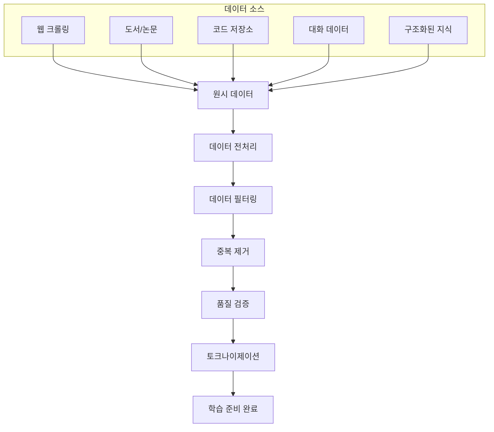

## 개요

이번 포스트에서는 **파운데이션 모델의 핵심 구성 요소**인 학습 데이터와 모델 아키텍처를 심층 분석합니다. 현대 AI의 기반이 되는 파운데이션 모델이 어떻게 구축되고, 어떤 데이터로 학습되며, 어떤 아키텍처를 사용하는지 상세히 살펴보겠습니다.

## 1. 파운데이션 모델이란?

### 1.1 정의와 특징

```python
# 파운데이션 모델의 핵심 특성
FOUNDATION_MODEL_CHARACTERISTICS = {
    "scale": "대규모 매개변수 (수십억~수조 개)",
    "training_data": "방대한 다양성 데이터",
    "adaptability": "다양한 태스크 적응 가능",
    "emergence": "창발적 능력 발현",
    "generalization": "강력한 일반화 능력"
}
```

**파운데이션 모델의 혁신적 특징:**
- **규모의 경제**: 매개변수 수와 성능의 상관관계
- **제로샷/퓨샷 학습**: 새로운 태스크에 즉시 적응
- **창발적 능력**: 훈련 시 명시적으로 학습하지 않은 능력 발현
- **범용성**: 하나의 모델로 다양한 응용 가능

## 2. 학습 데이터 (Training Data)

### 2.1 데이터의 중요성



### 2.2 데이터 구성 요소

```python
# 대표적인 파운데이션 모델 학습 데이터 구성
TRAINING_DATA_COMPOSITION = {
    "common_crawl": {
        "source": "웹 크롤링 데이터",
        "size": "수 테라바이트",
        "content": "웹페이지, 블로그, 뉴스, 포럼",
        "languages": "다국어 (100+ 언어)",
        "challenges": ["노이즈", "편향", "저품질 콘텐츠"]
    },
    "books": {
        "source": "도서 및 문학 작품",
        "size": "수십 기가바이트",
        "content": "소설, 논픽션, 교과서, 참고서",
        "quality": "높은 언어 품질",
        "benefits": ["문맥 이해", "언어 구조", "지식 체계"]
    },
    "academic_papers": {
        "source": "학술 논문 및 연구 자료",
        "size": "수백 기가바이트",
        "content": "ArXiv, PubMed, 학회 논문",
        "expertise": "전문 지식 및 추론",
        "formats": ["LaTeX", "PDF 추출", "XML"]
    },
    "code_repositories": {
        "source": "오픈소스 코드",
        "size": "수백 기가바이트",
        "content": "GitHub, GitLab, 기타 저장소",
        "languages": "Python, JavaScript, Java, C++, 기타",
        "benefits": ["논리적 추론", "구조적 사고", "문제 해결"]
    },
    "reference_data": {
        "source": "구조화된 지식",
        "content": "Wikipedia, 백과사전, 사전",
        "structure": "체계적 정보 조직",
        "reliability": "검증된 정보"
    }
}
```

### 2.3 데이터 전처리 파이프라인

```python
class DataPreprocessingPipeline:
    """파운데이션 모델을 위한 데이터 전처리 파이프라인"""
    
    def __init__(self):
        self.filters = []
        self.deduplicators = []
        self.quality_checkers = []
    
    def language_detection(self, text):
        """언어 감지 및 분류"""
        # 다국어 모델을 위한 언어별 분류
        pass
    
    def content_filtering(self, text):
        """콘텐츠 필터링"""
        filters = {
            "adult_content": self.detect_adult_content,
            "spam_detection": self.detect_spam,
            "low_quality": self.detect_low_quality,
            "duplicate_content": self.detect_duplicates,
            "privacy_sensitive": self.detect_pii
        }
        return all(not filter_func(text) for filter_func in filters.values())
    
    def quality_assessment(self, text):
        """텍스트 품질 평가"""
        metrics = {
            "readability": self.calculate_readability_score,
            "coherence": self.measure_coherence,
            "information_density": self.measure_info_density,
            "language_complexity": self.assess_complexity
        }
        return {metric: func(text) for metric, func in metrics.items()}
    
    def tokenization_prep(self, text):
        """토크나이제이션 전처리"""
        # BPE, SentencePiece 등을 위한 전처리
        return self.normalize_text(text)
```

## 3. 다국어 모델 (Multilingual Models)

### 3.1 다국어 모델의 도전과제

```python
# 다국어 모델 구축의 주요 도전과제
MULTILINGUAL_CHALLENGES = {
    "data_imbalance": {
        "problem": "언어별 데이터 불균형",
        "high_resource": ["영어", "중국어", "스페인어"],
        "low_resource": ["아프리카 언어", "소수 언어"],
        "solution": "데이터 증강, 전이 학습, 언어별 가중치 조정"
    },
    "script_diversity": {
        "problem": "문자 체계 다양성",
        "scripts": ["라틴", "한글", "아랍", "데바나가리", "키릴"],
        "solution": "유니코드 정규화, 스크립트별 토크나이저"
    },
    "linguistic_phenomena": {
        "problem": "언어학적 현상 차이",
        "morphology": "형태론적 복잡성 (독일어, 핀란드어)",
        "syntax": "어순 차이 (SOV, SVO, VSO)",
        "pragmatics": "문화적 맥락 차이"
    },
    "cross_lingual_transfer": {
        "goal": "언어 간 지식 전이",
        "methods": ["Zero-shot transfer", "Few-shot learning"],
        "evaluation": "XNLI, XQuAD, MLQA"
    }
}
```

### 3.2 다국어 토크나이제이션

```python
class MultilingualTokenizer:
    """다국어 지원 토크나이저"""
    
    def __init__(self, vocab_size=50000):
        self.vocab_size = vocab_size
        self.special_tokens = {
            "<PAD>": 0,
            "<UNK>": 1,
            "<BOS>": 2,
            "<EOS>": 3,
            "<MASK>": 4
        }
    
    def build_vocabulary(self, multilingual_corpus):
        """다국어 어휘 구축"""
        # SentencePiece를 사용한 언어 중립적 토크나이제이션
        import sentencepiece as spm
        
        # 언어별 샘플링 비율 조정
        language_weights = {
            "en": 0.3,  # 영어
            "zh": 0.15, # 중국어
            "es": 0.1,  # 스페인어
            "ar": 0.08, # 아랍어
            "hi": 0.07, # 힌디어
            "ko": 0.05, # 한국어
            "other": 0.25
        }
        
        # 균형 잡힌 다국어 샘플링
        balanced_corpus = self.balance_languages(
            multilingual_corpus, 
            language_weights
        )
        
        # SentencePiece 모델 훈련
        spm.SentencePieceTrainer.train(
            input=balanced_corpus,
            model_prefix='multilingual_tokenizer',
            vocab_size=self.vocab_size,
            character_coverage=0.9995,
            model_type='bpe',
            normalization_rule_name='nmt_nfkc_cf'
        )
    
    def handle_code_switching(self, text):
        """코드 스위칭 처리"""
        # 문장 내 언어 변경 감지 및 처리
        pass
```

### 3.3 언어별 적응 전략

```python
# 언어별 모델 적응 전략
LANGUAGE_ADAPTATION_STRATEGIES = {
    "continual_pretraining": {
        "method": "특정 언어 데이터로 추가 사전훈련",
        "benefits": "언어별 성능 향상",
        "risks": "다른 언어 성능 저하 (Catastrophic Forgetting)"
    },
    "adapter_modules": {
        "method": "언어별 어댑터 모듈 추가",
        "benefits": "매개변수 효율적, 모듈화",
        "implementation": "Bottleneck layers, LoRA"
    },
    "language_specific_heads": {
        "method": "언어별 출력 헤드",
        "use_case": "언어별 태스크 특화",
        "examples": "Named Entity Recognition, POS Tagging"
    },
    "multilingual_alignment": {
        "method": "언어 간 표현 정렬",
        "techniques": ["Adversarial training", "Contrastive learning"],
        "goal": "언어 중립적 표현 학습"
    }
}
```

## 4. 도메인 특화 모델 (Domain-Specific Models)

### 4.1 도메인 특화의 필요성

```python
# 주요 도메인별 특화 모델
DOMAIN_SPECIFIC_MODELS = {
    "biomedical": {
        "models": ["BioBERT", "ClinicalBERT", "PubMedBERT"],
        "data_sources": ["PubMed", "PMC", "Clinical notes"],
        "challenges": [
            "의학 용어 복잡성",
            "약어 및 전문용어",
            "환자 프라이버시",
            "규제 준수"
        ],
        "applications": [
            "질병 진단 보조",
            "약물 발견",
            "의료 문서 분석",
            "임상 의사결정 지원"
        ]
    },
    "legal": {
        "models": ["LegalBERT", "CaseLaw-BERT"],
        "data_sources": ["법률 문서", "판례", "법령"],
        "challenges": [
            "법률 언어 복잡성",
            "관할권별 차이",
            "시간에 따른 법률 변화",
            "해석의 주관성"
        ],
        "applications": [
            "계약서 분석",
            "판례 검색",
            "법률 자문 보조",
            "컴플라이언스 검토"
        ]
    },
    "financial": {
        "models": ["FinBERT", "BloombergGPT"],
        "data_sources": ["금융 뉴스", "재무제표", "시장 데이터"],
        "challenges": [
            "시장 변동성",
            "실시간 데이터 처리",
            "규제 변화",
            "리스크 관리"
        ],
        "applications": [
            "투자 분석",
            "리스크 평가",
            "고빈도 거래",
            "신용 평가"
        ]
    },
    "scientific": {
        "models": ["SciBERT", "ScholarBERT"],
        "data_sources": ["학술 논문", "연구 데이터", "특허"],
        "challenges": [
            "전문 용어 다양성",
            "수식 및 기호",
            "그래프 및 표",
            "인용 관계"
        ],
        "applications": [
            "논문 검색 및 추천",
            "연구 동향 분석",
            "가설 생성",
            "실험 설계 지원"
        ]
    }
}
```

### 4.2 도메인 적응 방법론

```python
class DomainAdaptationFramework:
    """도메인 특화 모델 구축 프레임워크"""
    
    def __init__(self, base_model, target_domain):
        self.base_model = base_model
        self.target_domain = target_domain
        self.adaptation_strategy = None
    
    def domain_adaptive_pretraining(self, domain_corpus):
        """도메인 적응 사전훈련"""
        # 1. 도메인 데이터로 MLM 계속 훈련
        mlm_config = {
            "learning_rate": 1e-5,  # 낮은 학습률
            "warmup_steps": 1000,
            "max_steps": 50000,
            "mlm_probability": 0.15
        }
        
        # 2. 도메인별 어휘 확장
        domain_vocab = self.extract_domain_vocabulary(domain_corpus)
        self.expand_vocabulary(domain_vocab)
        
        # 3. 점진적 학습률 감소
        return self.continue_pretraining(domain_corpus, mlm_config)
    
    def task_adaptive_finetuning(self, task_data):
        """태스크 적응 파인튜닝"""
        strategies = {
            "gradual_unfreezing": self.gradual_unfreezing,
            "discriminative_lr": self.discriminative_learning_rate,
            "knowledge_distillation": self.knowledge_distillation,
            "multi_task_learning": self.multi_task_learning
        }
        
        return strategies[self.adaptation_strategy](task_data)
    
    def evaluate_domain_adaptation(self, test_data):
        """도메인 적응 평가"""
        metrics = {
            "perplexity": self.calculate_perplexity,
            "domain_classification": self.domain_classification_acc,
            "downstream_tasks": self.evaluate_downstream_tasks,
            "human_evaluation": self.conduct_human_evaluation
        }
        
        return {metric: func(test_data) for metric, func in metrics.items()}
```

## 5. 모델링 (Modeling)

### 5.1 모델 아키텍처

#### 5.1.1 트랜스포머 아키텍처의 진화

```python
# 트랜스포머 아키텍처 발전 과정
TRANSFORMER_EVOLUTION = {
    "original_transformer": {
        "year": 2017,
        "paper": "Attention Is All You Need",
        "architecture": "Encoder-Decoder",
        "key_innovations": ["Self-attention", "Position encoding"],
        "parameters": "65M (Base), 213M (Large)"
    },
    "bert": {
        "year": 2018,
        "architecture": "Encoder-only",
        "key_innovations": ["Bidirectional", "MLM", "NSP"],
        "parameters": "110M (Base), 340M (Large)"
    },
    "gpt_series": {
        "gpt1": {"year": 2018, "params": "117M", "context": "512"},
        "gpt2": {"year": 2019, "params": "1.5B", "context": "1024"},
        "gpt3": {"year": 2020, "params": "175B", "context": "2048"},
        "gpt4": {"year": 2023, "params": "~1.7T", "context": "32K+"}
    },
    "recent_innovations": {
        "t5": "Text-to-Text Transfer Transformer",
        "switch_transformer": "Sparse Expert Models",
        "palm": "Pathways Language Model",
        "chinchilla": "Compute-Optimal Training"
    }
}
```

#### 5.1.2 어텐션 메커니즘

```python
import torch
import torch.nn as nn
import math

class MultiHeadAttention(nn.Module):
    """멀티헤드 어텐션 구현"""
    
    def __init__(self, d_model, num_heads, dropout=0.1):
        super().__init__()
        assert d_model % num_heads == 0
        
        self.d_model = d_model
        self.num_heads = num_heads
        self.d_k = d_model // num_heads
        
        self.w_q = nn.Linear(d_model, d_model)
        self.w_k = nn.Linear(d_model, d_model)
        self.w_v = nn.Linear(d_model, d_model)
        self.w_o = nn.Linear(d_model, d_model)
        
        self.dropout = nn.Dropout(dropout)
        
    def scaled_dot_product_attention(self, Q, K, V, mask=None):
        """스케일된 닷 프로덕트 어텐션"""
        scores = torch.matmul(Q, K.transpose(-2, -1)) / math.sqrt(self.d_k)
        
        if mask is not None:
            scores = scores.masked_fill(mask == 0, -1e9)
        
        attention_weights = torch.softmax(scores, dim=-1)
        attention_weights = self.dropout(attention_weights)
        
        output = torch.matmul(attention_weights, V)
        return output, attention_weights
    
    def forward(self, query, key, value, mask=None):
        batch_size = query.size(0)
        
        # 1. Linear transformations and reshape
        Q = self.w_q(query).view(batch_size, -1, self.num_heads, self.d_k).transpose(1, 2)
        K = self.w_k(key).view(batch_size, -1, self.num_heads, self.d_k).transpose(1, 2)
        V = self.w_v(value).view(batch_size, -1, self.num_heads, self.d_k).transpose(1, 2)
        
        # 2. Apply attention
        attention_output, attention_weights = self.scaled_dot_product_attention(Q, K, V, mask)
        
        # 3. Concatenate heads
        attention_output = attention_output.transpose(1, 2).contiguous().view(
            batch_size, -1, self.d_model
        )
        
        # 4. Apply output projection
        output = self.w_o(attention_output)
        
        return output, attention_weights
```

#### 5.1.3 위치 인코딩

```python
class PositionalEncoding(nn.Module):
    """위치 인코딩 구현"""
    
    def __init__(self, d_model, max_length=5000):
        super().__init__()
        
        pe = torch.zeros(max_length, d_model)
        position = torch.arange(0, max_length).unsqueeze(1).float()
        
        div_term = torch.exp(
            torch.arange(0, d_model, 2).float() * 
            -(math.log(10000.0) / d_model)
        )
        
        pe[:, 0::2] = torch.sin(position * div_term)
        pe[:, 1::2] = torch.cos(position * div_term)
        
        self.register_buffer('pe', pe.unsqueeze(0))
    
    def forward(self, x):
        return x + self.pe[:, :x.size(1)]

class RotaryPositionalEmbedding(nn.Module):
    """RoPE (Rotary Position Embedding) 구현"""
    
    def __init__(self, dim, max_position_embeddings=2048, base=10000):
        super().__init__()
        self.dim = dim
        self.max_position_embeddings = max_position_embeddings
        self.base = base
        
        inv_freq = 1.0 / (base ** (torch.arange(0, dim, 2).float() / dim))
        self.register_buffer("inv_freq", inv_freq)
    
    def forward(self, x, seq_len=None):
        if seq_len is None:
            seq_len = x.shape[-2]
        
        t = torch.arange(seq_len, device=x.device).type_as(self.inv_freq)
        freqs = torch.einsum("i,j->ij", t, self.inv_freq)
        emb = torch.cat((freqs, freqs), dim=-1)
        
        return emb.cos(), emb.sin()
```

### 5.2 모델 크기 (Model Size)

#### 5.2.1 스케일링 법칙

```python
# 신경망 스케일링 법칙 (Neural Scaling Laws)
SCALING_LAWS = {
    "chinchilla_scaling": {
        "compute_budget": "C",
        "optimal_parameters": "N* = (C / 6FLOPs_per_token) ^ 0.5",
        "optimal_tokens": "D* = (C * FLOPs_per_token / 6) ^ 0.5",
        "key_insight": "모델 크기와 데이터 크기를 균형있게 증가"
    },
    "parameter_efficiency": {
        "model_size": ["Small (< 1B)", "Medium (1B-10B)", "Large (10B-100B)", "XL (> 100B)"],
        "compute_requirements": "O(N^2) for training, O(N) for inference",
        "memory_requirements": "16-bit: 2N bytes, 8-bit: N bytes, 4-bit: 0.5N bytes"
    },
    "emergent_abilities": {
        "few_shot_learning": "~10B parameters",
        "chain_of_thought": "~100B parameters",
        "code_generation": "~10B parameters",
        "mathematical_reasoning": "~100B parameters"
    }
}
```

#### 5.2.2 모델 압축 기법

```python
class ModelCompressionTechniques:
    """모델 압축 기법들"""
    
    def __init__(self, model):
        self.model = model
    
    def quantization(self, bits=8):
        """양자화를 통한 모델 압축"""
        quantization_methods = {
            "post_training_quantization": self.ptq,
            "quantization_aware_training": self.qat,
            "dynamic_quantization": self.dynamic_quant
        }
        return quantization_methods
    
    def pruning(self, sparsity_ratio=0.5):
        """가지치기를 통한 모델 압축"""
        pruning_strategies = {
            "magnitude_pruning": "가중치 크기 기반",
            "structured_pruning": "채널/레이어 단위",
            "gradual_pruning": "점진적 가지치기",
            "lottery_ticket": "복권 가설 기반"
        }
        return pruning_strategies
    
    def knowledge_distillation(self, teacher_model, student_model):
        """지식 증류를 통한 모델 압축"""
        distillation_types = {
            "response_distillation": "출력 분포 학습",
            "feature_distillation": "중간 표현 학습",
            "attention_distillation": "어텐션 패턴 학습",
            "progressive_distillation": "점진적 증류"
        }
        return distillation_types
    
    def low_rank_approximation(self):
        """저랭크 근사를 통한 압축"""
        methods = {
            "svd_decomposition": "특이값 분해",
            "tucker_decomposition": "텐서 분해",
            "lora": "Low-Rank Adaptation",
            "adalora": "Adaptive LoRA"
        }
        return methods
```

## 6. 아키텍처 비교 및 선택 가이드

### 6.1 아키텍처별 특성 비교

```python
# 주요 아키텍처 비교
ARCHITECTURE_COMPARISON = {
    "encoder_only": {
        "examples": ["BERT", "RoBERTa", "DeBERTa"],
        "strengths": [
            "양방향 컨텍스트",
            "표현 학습 우수",
            "분류 태스크 강점"
        ],
        "weaknesses": [
            "생성 태스크 부적합",
            "고정 길이 제한"
        ],
        "use_cases": [
            "텍스트 분류",
            "개체명 인식",
            "질의응답",
            "감정 분석"
        ]
    },
    "decoder_only": {
        "examples": ["GPT", "LLaMA", "PaLM"],
        "strengths": [
            "자연스러운 텍스트 생성",
            "긴 시퀀스 처리",
            "창발적 능력"
        ],
        "weaknesses": [
            "단방향 컨텍스트",
            "추론 비용 높음"
        ],
        "use_cases": [
            "텍스트 생성",
            "대화 시스템",
            "코드 생성",
            "요약"
        ]
    },
    "encoder_decoder": {
        "examples": ["T5", "BART", "mT5"],
        "strengths": [
            "입출력 길이 유연성",
            "seq2seq 태스크 최적",
            "조건부 생성"
        ],
        "weaknesses": [
            "복잡한 아키텍처",
            "메모리 사용량 많음"
        ],
        "use_cases": [
            "번역",
            "요약",
            "데이터-텍스트 변환",
            "구조화된 생성"
        ]
    }
}
```

### 6.2 아키텍처 선택 기준

```python
def select_architecture(task_type, data_characteristics, resource_constraints):
    """태스크와 제약 조건에 따른 아키텍처 선택"""
    
    selection_criteria = {
        "task_requirements": {
            "understanding_tasks": "encoder_only",
            "generation_tasks": "decoder_only", 
            "seq2seq_tasks": "encoder_decoder"
        },
        "data_characteristics": {
            "short_sequences": "bert_like",
            "long_sequences": "gpt_like",
            "variable_length": "t5_like"
        },
        "resource_constraints": {
            "low_compute": "small_models",
            "high_compute": "large_models",
            "inference_speed": "efficient_architectures"
        }
    }
    
    # 종합적 추천 로직
    recommendations = {}
    
    return recommendations
```

## 결론

파운데이션 모델의 학습 데이터와 모델 아키텍처는 **모델 성능의 핵심 결정 요소**입니다. 

**핵심 인사이트:**
- **데이터 품질이 모델 성능을 좌우**: 큐레이션된 고품질 데이터의 중요성
- **다국어/도메인 특화의 균형**: 범용성과 전문성 사이의 트레이드오프
- **아키텍처 선택의 중요성**: 태스크에 맞는 적절한 아키텍처 선택
- **스케일링의 효과와 한계**: 크기 증가의 이익과 비용 고려

다음 포스트에서는 사후 학습(Post-training) 과정인 지도 파인튜닝과 선호도 파인튜닝을 상세히 다루겠습니다.

---

**연관 포스트:**
- [다음: 파운데이션 모델 이해하기 (2부) - 사후 학습과 파인튜닝 전략] (예정)

**참고 자료:**
- [Attention Is All You Need](https://arxiv.org/abs/1706.03762)
- [BERT: Pre-training of Deep Bidirectional Transformers](https://arxiv.org/abs/1810.04805)
- [Language Models are Few-Shot Learners](https://arxiv.org/abs/2005.14165)
- [Training Compute-Optimal Large Language Models](https://arxiv.org/abs/2203.15556)