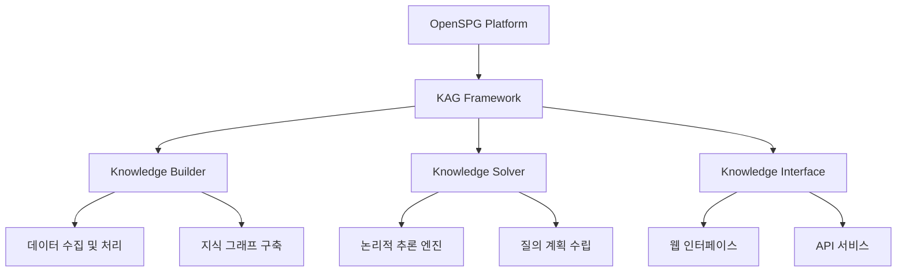
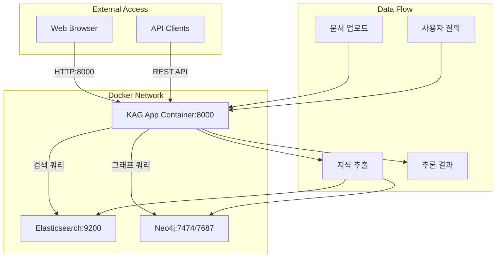
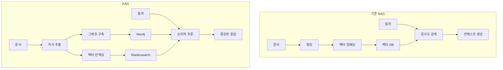

## 개요

이번 포스트에서는 **KAG(Knowledge Augmented Generation)** 프로젝트를 심층 분석합니다. KAG는 OpenSPG 생태계의 핵심 프로젝트로, 기존 RAG(Retrieval-Augmented Generation)의 한계를 극복하고 지식 그래프 기반의 고도화된 질의응답 시스템을 구현한 혁신적인 프레임워크입니다.

## 1. KAG 프로젝트 소개

### 1.1 KAG란 무엇인가?

```markdown
# KAG: 지식 증강 생성 (Knowledge Augmented Generation)

KAG는 대규모 언어 모델(LLM)을 기반으로 한 논리적 추론 및 Q&A 프레임워크로, 
수직 도메인 지식 기반을 위한 논리적 추론 및 Q&A 솔루션을 구축하는 데 사용됩니다.
```

**KAG의 핵심 혁신점:**

1. **기존 RAG의 한계 극복**: 벡터 유사도 계산의 모호성 문제 해결
2. **GraphRAG 노이즈 제거**: OpenIE로 인한 노이즈 문제 효과적 해결  
3. **논리적 추론 강화**: 단순 검색을 넘어선 지식 기반 추론
4. **수직 도메인 특화**: 특정 영역에 최적화된 지식 처리

### 1.2 OpenSPG 생태계와의 관계



**OpenSPG 연동 구조:**
- **OpenSPG**: 지식 그래프 플랫폼 기반 제공
- **KAG**: 지식 증강 생성 프레임워크 구현
- **통합 워크플로우**: 데이터 수집 → 지식 구축 → 추론 실행

## 2. 프로젝트 구조 분석

### 2.1 전체 디렉토리 구조

```bash
kag-docker/
├── kag/                    # 핵심 KAG 프레임워크
│   ├── builder/           # 지식 빌더 모듈
│   ├── solver/            # 추론 솔버 모듈
│   ├── interface/         # 사용자 인터페이스
│   ├── common/           # 공통 유틸리티
│   ├── bridge/           # 외부 시스템 연동
│   └── tools/            # 개발 도구
├── knext/                  # 확장 모듈
├── tests/                  # 테스트 코드
├── docs/                   # 문서화
├── docker-compose.yml      # 컨테이너 오케스트레이션
├── Dockerfile              # 애플리케이션 컨테이너
└── requirements.txt        # Python 의존성
```

### 2.2 핵심 모듈별 역할

#### 2.2.1 KAG Builder (지식 빌더)

```python
kag/builder/
├── component/           # 빌더 컴포넌트
├── model/              # 데이터 모델
├── operator/           # 데이터 처리 연산자
├── prompt/             # 프롬프트 템플릿
├── main_builder.py     # 메인 빌더 로직
├── default_chain.py    # 기본 처리 체인
└── runner.py           # 실행 엔진
```

**주요 기능:**
- **데이터 수집**: 다양한 소스에서 지식 데이터 수집
- **지식 추출**: 텍스트에서 구조화된 지식 추출
- **그래프 구축**: Neo4j 기반 지식 그래프 생성
- **인덱싱**: Elasticsearch 기반 검색 인덱스 구축

#### 2.2.2 KAG Solver (추론 솔버)

```python
kag/solver/
├── executor/           # 실행 엔진
├── generator/          # 응답 생성기
├── planner/           # 질의 계획 수립
├── pipeline/          # 처리 파이프라인
├── reporter/          # 결과 보고
├── main_solver.py     # 메인 솔버 로직
└── utils.py           # 유틸리티 함수
```

**주요 기능:**
- **질의 분석**: 사용자 질의의 의도 파악
- **논리적 추론**: 지식 그래프 기반 추론 수행
- **증거 수집**: 관련 지식과 증거 검색
- **응답 생성**: 컨텍스트 기반 최종 응답 생성

## 3. 기술 스택 분석

### 3.1 코어 기술 스택

```yaml
# 핵심 기술 구성
Language: Python 3.9+
Framework: 
  - LangChain (LLM 통합)
  - FastAPI (웹 서비스)
Database:
  - Neo4j (그래프 데이터베이스)
  - Elasticsearch (검색 엔진)
AI/ML:
  - OpenAI GPT
  - Dashscope (알리바바 AI)
  - Ollama (로컬 LLM)
Infrastructure:
  - Docker & Docker Compose
  - Python Package Management
```

### 3.2 의존성 분석 (requirements.txt)

#### 3.2.1 AI/ML 관련 패키지

```pip-requirements
# LLM 및 AI 서비스
openai                    # OpenAI API 클라이언트
dashscope                 # 알리바바 클라우드 AI 서비스
ollama                    # 로컬 LLM 실행
langchain-community       # LangChain 커뮤니티 확장
langchain-text-splitters  # 텍스트 분할 도구

# 자연어 처리
jieba==0.42.1            # 중국어 분할
nltk==3.8.1              # 자연어 처리 툴킷
```

#### 3.2.2 데이터베이스 및 검색

```pip-requirements
# 데이터베이스
neo4j                     # Neo4j 그래프 데이터베이스 드라이버
elasticsearch==8.10.0    # Elasticsearch 클라이언트

# 데이터 처리
pandas                    # 데이터 프레임 처리
numpy>=1.23.1            # 수치 연산
networkx==3.1            # 그래프 알고리즘
```

#### 3.2.3 문서 처리 및 포맷

```pip-requirements
# 문서 처리
pypdf                     # PDF 파일 처리
python-docx              # Word 문서 처리
pdfminer.six==20231228   # PDF 텍스트 추출
markdown                 # Markdown 처리
bs4                      # HTML 파싱

# 데이터 직렬화
protobuf==3.20.1         # Protocol Buffers
json5                    # JSON5 파서
```

## 4. Docker 컨테이너 아키텍처

### 4.1 서비스 구성 (docker-compose.yml)

```yaml
version: '3.8'

services:
  # 메인 애플리케이션
  app:
    build:
      context: .
      dockerfile: Dockerfile
    ports:
      - "8000:8000"
    depends_on:
      - elasticsearch
      - neo4j
    environment:
      - ELASTICSEARCH_HOST=elasticsearch
      - NEO4J_HOST=neo4j
      - NEO4J_USER=neo4j
      - NEO4J_PASSWORD=password

  # Elasticsearch 검색 엔진
  elasticsearch:
    image: docker.elastic.co/elasticsearch/elasticsearch:8.10.0
    environment:
      - discovery.type=single-node
      - xpack.security.enabled=false
      - "ES_JAVA_OPTS=-Xms512m -Xmx512m"
    ports:
      - "9200:9200"

  # Neo4j 그래프 데이터베이스
  neo4j:
    image: neo4j:5.15
    environment:
      - NEO4J_AUTH=neo4j/password
    ports:
      - "7474:7474"  # HTTP
      - "7687:7687"  # Bolt
```

### 4.2 컨테이너 구성도



## 5. 애플리케이션 컨테이너 분석

### 5.1 Dockerfile 구조

```dockerfile
FROM python:3.9-slim

WORKDIR /app

# 시스템 의존성 설치
RUN apt-get update && apt-get install -y \
    build-essential \
    && rm -rf /var/lib/apt/lists/*

# Python 의존성 설치 (레이어 캐싱 최적화)
COPY requirements.txt .
RUN pip install --no-cache-dir -r requirements.txt

# 애플리케이션 코드 복사
COPY . .

# 환경 변수 설정
ENV PYTHONPATH=/app
ENV PYTHONUNBUFFERED=1

# 포트 노출
EXPOSE 8000

# 애플리케이션 실행
CMD ["python", "-m", "kag"]
```

### 5.2 컨테이너 최적화 전략

**레이어 캐싱 최적화:**
1. **requirements.txt 먼저 복사**: 의존성 변경 시에만 재설치
2. **애플리케이션 코드 나중 복사**: 코드 변경 시 빠른 빌드
3. **multi-stage build 미적용**: 단일 스테이지로 단순화

**환경 변수 활용:**
- `PYTHONPATH=/app`: 모듈 경로 설정
- `PYTHONUNBUFFERED=1`: 실시간 로그 출력
- 외부 서비스 연결 정보 주입

## 6. KAG vs 기존 RAG 비교

### 6.1 기술적 차별점

| 특성 | 기존 RAG | KAG |
|------|----------|-----|
| **검색 방식** | 벡터 유사도 | 지식 그래프 + 벡터 |
| **추론 능력** | 단순 검색 | 논리적 추론 |
| **노이즈 처리** | 제한적 | 구조화된 필터링 |
| **도메인 적응** | 일반적 | 수직 도메인 특화 |
| **지식 표현** | 임베딩 벡터 | 그래프 + 임베딩 |

### 6.2 아키텍처 비교



## 7. 핵심 혁신 기능

### 7.1 하이브리드 검색 시스템

**지식 그래프 + 벡터 검색 통합:**
- Neo4j를 통한 구조화된 지식 탐색
- Elasticsearch를 통한 의미적 유사성 검색
- 두 결과의 지능적 융합

### 7.2 논리적 추론 엔진

**다단계 추론 프로세스:**
1. **질의 분석**: 사용자 의도 파악
2. **지식 탐색**: 관련 정보 수집
3. **논리적 연결**: 지식 간 관계 분석
4. **결론 도출**: 증거 기반 답변 생성

### 7.3 수직 도메인 최적화

**도메인별 특화 기능:**
- 도메인 온톨로지 활용
- 전문 용어 처리
- 업계 특화 추론 규칙
- 맞춤형 평가 지표

## 8. 실제 사용 시나리오

### 8.1 기업 지식 관리

```yaml
# 적용 영역
- 내부 문서 기반 Q&A
- 정책 및 규정 해석
- 기술 문서 검색
- 업무 프로세스 가이드
```

### 8.2 연구 및 학술 분야

```yaml
# 활용 사례
- 논문 및 연구 자료 분석
- 문헌 리뷰 자동화
- 가설 검증 지원
- 연구 동향 분석
```

## 9. 성능 및 확장성

### 9.1 시스템 요구사항

```yaml
# 최소 사양
CPU: 4 cores
RAM: 8GB
Storage: 50GB SSD
Network: 1Gbps

# 권장 사양  
CPU: 8+ cores
RAM: 16GB+
Storage: 100GB+ NVMe SSD
Network: 10Gbps
```

### 9.2 확장성 고려사항

**수평 확장:**
- 마이크로서비스 아키텍처 적용
- Kubernetes 오케스트레이션
- 로드 밸런싱 구성

**성능 최적화:**
- 캐싱 레이어 도입
- 비동기 처리 파이프라인
- GPU 가속 추론

## 결론

KAG 프로젝트는 **지식 그래프와 벡터 검색의 하이브리드 접근법**을 통해 기존 RAG 시스템의 한계를 혁신적으로 극복한 차세대 지식 증강 생성 프레임워크입니다.

**핵심 성과:**
- **정확도 향상**: 논리적 추론을 통한 높은 정확도
- **노이즈 제거**: 구조화된 지식 표현으로 노이즈 최소화
- **도메인 특화**: 수직 영역에 최적화된 성능
- **확장성**: 모듈화된 아키텍처로 높은 확장성

다음 포스트에서는 KAG의 Docker 컨테이너 오케스트레이션과 각 서비스 간의 상호작용을 더 자세히 분석하겠습니다.

---

**연관 포스트:**
- [다음: KAG Docker 컨테이너 오케스트레이션 심층 분석] (예정)

**참고 자료:**
- [OpenSPG 공식 문서](https://spg.openkg.cn/)
- [KAG GitHub Repository](https://github.com/OpenSPG/KAG)
- [Neo4j 그래프 데이터베이스](https://neo4j.com/)
- [Elasticsearch 검색 엔진](https://www.elastic.co/)