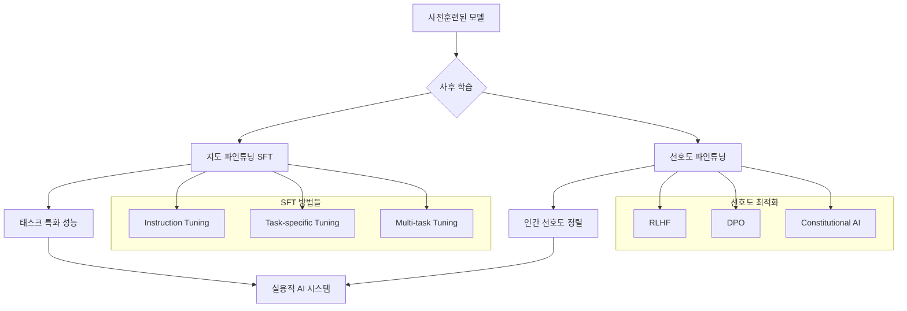

## 개요

이번 포스트에서는 **파운데이션 모델의 사후 학습(Post-training)** 과정을 심층 분석합니다. 사전훈련된 모델을 특정 태스크나 인간의 선호도에 맞춰 조정하는 지도 파인튜닝(SFT)과 선호도 파인튜닝 기법들을 상세히 살펴보겠습니다.

## 1. 사후 학습 개요

### 1.1 사후 학습의 필요성



### 1.2 사후 학습 파이프라인

```python
# 사후 학습 파이프라인
POST_TRAINING_PIPELINE = {
    "stage_1_sft": {
        "purpose": "기본 태스크 수행 능력 획득",
        "data": "고품질 instruction-response 쌍",
        "duration": "수천 스텝",
        "learning_rate": "1e-5 ~ 5e-5",
        "techniques": ["Instruction tuning", "Multi-task learning"]
    },
    "stage_2_preference": {
        "purpose": "인간 선호도 정렬",
        "data": "선호도 순위 데이터",
        "duration": "수백~수천 스텝", 
        "learning_rate": "1e-6 ~ 1e-5",
        "techniques": ["RLHF", "DPO", "Constitutional AI"]
    },
    "stage_3_safety": {
        "purpose": "안전성 및 유해성 완화",
        "data": "안전성 평가 데이터",
        "techniques": ["Red teaming", "Safety filtering", "Jailbreak defense"]
    }
}
```

## 2. 지도 파인튜닝 (Supervised Fine-Tuning, SFT)

### 2.1 인스트럭션 튜닝

```python
class InstructionTuningDataset:
    """인스트럭션 튜닝 데이터셋"""
    
    def __init__(self, instruction_data):
        self.data = instruction_data
        self.templates = self.load_prompt_templates()
    
    def load_prompt_templates(self):
        """다양한 프롬프트 템플릿"""
        return {
            "basic": "### Instruction:\n{instruction}\n\n### Response:\n{response}",
            "with_input": "### Instruction:\n{instruction}\n\n### Input:\n{input}\n\n### Response:\n{response}",
            "conversational": "Human: {instruction}\n\nAssistant: {response}",
            "alpaca": "Below is an instruction that describes a task. Write a response that appropriately completes the request.\n\n### Instruction:\n{instruction}\n\n### Response:\n{response}"
        }
    
    def format_sample(self, sample, template="basic"):
        """샘플을 지정된 템플릿으로 포맷팅"""
        template_str = self.templates[template]
        return template_str.format(**sample)
    
    def create_training_sample(self, instruction, response, input_text=None):
        """훈련 샘플 생성"""
        sample = {
            "instruction": instruction,
            "response": response
        }
        
        if input_text:
            sample["input"] = input_text
            template = "with_input"
        else:
            template = "basic"
        
        formatted_text = self.format_sample(sample, template)
        
        # 토크나이제이션 및 라벨 마스킹
        return self.prepare_for_training(formatted_text)
    
    def prepare_for_training(self, formatted_text):
        """훈련을 위한 데이터 준비"""
        # 인스트럭션 부분은 손실 계산에서 제외
        # 응답 부분만 손실 계산에 포함
        pass

# 인스트럭션 튜닝 예시 데이터
INSTRUCTION_EXAMPLES = [
    {
        "instruction": "다음 텍스트를 요약해주세요.",
        "input": "인공지능은 인간의 지능을 모방하여 만든 기계의 지능을 의미합니다. 기계가 인간의 인지능력을 모방할 수 있도록 하는 기술로, 학습, 추론, 인식, 이해 등의 기능을 컴퓨터가 수행할 수 있게 합니다.",
        "response": "인공지능은 기계가 인간의 학습, 추론, 인식, 이해 등의 인지능력을 모방할 수 있도록 하는 기술입니다."
    },
    {
        "instruction": "Python으로 피보나치 수열을 생성하는 함수를 작성해주세요.",
        "response": """```python
def fibonacci(n):
    if n <= 1:
        return n
    return fibonacci(n-1) + fibonacci(n-2)

def fibonacci_iterative(n):
    if n <= 1:
        return n
    a, b = 0, 1
    for _ in range(2, n + 1):
        a, b = b, a + b
    return b
```"""
    },
    {
        "instruction": "긍정적인 감정과 부정적인 감정을 구분해주세요.",
        "input": "오늘 날씨가 너무 좋아서 기분이 좋습니다.",
        "response": "이 문장은 '좋아서', '기분이 좋습니다'라는 표현을 통해 긍정적인 감정을 나타냅니다."
    }
]
```

### 2.2 멀티태스크 파인튜닝

```python
class MultiTaskFineTuning:
    """멀티태스크 파인튜닝 프레임워크"""
    
    def __init__(self, base_model):
        self.base_model = base_model
        self.task_weights = {}
        self.task_samplers = {}
    
    def setup_tasks(self, task_configs):
        """다양한 태스크 설정"""
        self.tasks = {
            "question_answering": {
                "datasets": ["SQuAD", "Natural Questions", "MS MARCO"],
                "format": "context + question -> answer",
                "weight": 0.3
            },
            "text_classification": {
                "datasets": ["IMDB", "SST-2", "AG News"],
                "format": "text -> label",
                "weight": 0.2
            },
            "text_generation": {
                "datasets": ["CNN/DM", "XSum", "Reddit"],
                "format": "prompt -> completion",
                "weight": 0.25
            },
            "instruction_following": {
                "datasets": ["Alpaca", "Dolly", "OpenAssistant"],
                "format": "instruction + input -> response",
                "weight": 0.25
            }
        }
    
    def balanced_sampling(self, task_datasets):
        """균형 잡힌 태스크 샘플링"""
        # 태스크별 가중치에 따른 샘플링
        # 온도 기반 샘플링으로 다양성 확보
        pass
    
    def task_adaptive_learning(self):
        """태스크 적응적 학습"""
        strategies = {
            "curriculum_learning": "쉬운 태스크부터 어려운 태스크로",
            "alternating_training": "태스크를 번갈아가며 훈련",
            "gradient_surgery": "태스크 간 그래디언트 충돌 해결",
            "meta_learning": "태스크 간 공통 패턴 학습"
        }
        return strategies
```

### 2.3 Parameter-Efficient Fine-tuning

```python
import torch
import torch.nn as nn

class LoRALayer(nn.Module):
    """Low-Rank Adaptation (LoRA) 레이어"""
    
    def __init__(self, in_features, out_features, rank=16, alpha=32, dropout=0.1):
        super().__init__()
        self.rank = rank
        self.alpha = alpha
        self.scaling = alpha / rank
        
        # LoRA 행렬들
        self.lora_A = nn.Parameter(torch.randn(rank, in_features) * 0.01)
        self.lora_B = nn.Parameter(torch.zeros(out_features, rank))
        self.dropout = nn.Dropout(dropout)
        
    def forward(self, x):
        # x @ A^T @ B^T = x @ (BA)^T
        lora_output = self.dropout(x) @ self.lora_A.T @ self.lora_B.T
        return lora_output * self.scaling

class AdapterLayer(nn.Module):
    """어댑터 레이어"""
    
    def __init__(self, d_model, adapter_size=64):
        super().__init__()
        self.down_project = nn.Linear(d_model, adapter_size)
        self.up_project = nn.Linear(adapter_size, d_model)
        self.activation = nn.ReLU()
        self.dropout = nn.Dropout(0.1)
        
    def forward(self, x):
        residual = x
        x = self.down_project(x)
        x = self.activation(x)
        x = self.dropout(x)
        x = self.up_project(x)
        return x + residual

class PrefixTuning(nn.Module):
    """프리픽스 튜닝"""
    
    def __init__(self, num_layers, num_heads, d_model, prefix_length=20):
        super().__init__()
        self.prefix_length = prefix_length
        self.num_layers = num_layers
        
        # 가상 토큰들을 위한 임베딩
        self.prefix_embeddings = nn.Parameter(
            torch.randn(prefix_length, d_model)
        )
        
        # 레이어별 key, value 프리픽스
        self.prefix_mlp = nn.ModuleList([
            nn.Sequential(
                nn.Linear(d_model, d_model),
                nn.Tanh(),
                nn.Linear(d_model, 2 * num_heads * d_model // num_heads)
            ) for _ in range(num_layers)
        ])
```

## 3. 선호도 파인튜닝 (Preference Fine-tuning)

### 3.1 인간 피드백 강화학습 (RLHF)

```python
class RLHFTrainer:
    """RLHF 훈련 프레임워크"""
    
    def __init__(self, policy_model, value_model, reference_model):
        self.policy_model = policy_model  # 정책 모델 (파인튜닝 대상)
        self.value_model = value_model    # 가치 함수
        self.reference_model = reference_model  # 참조 모델 (KL 정규화용)
        
    def train_reward_model(self, preference_data):
        """선호도 데이터로 보상 모델 훈련"""
        # 1. 선호도 쌍 데이터 준비
        # [(prompt, chosen_response, rejected_response), ...]
        
        # 2. Bradley-Terry 모델로 보상 함수 학습
        def preference_loss(chosen_reward, rejected_reward):
            # P(y_w > y_l) = sigmoid(r(x,y_w) - r(x,y_l))
            return -torch.log(torch.sigmoid(chosen_reward - rejected_reward))
        
        # 3. 보상 모델 훈련
        for batch in preference_data:
            chosen_rewards = self.value_model(batch['chosen'])
            rejected_rewards = self.value_model(batch['rejected'])
            loss = preference_loss(chosen_rewards, rejected_rewards)
            loss.backward()
    
    def ppo_training(self, prompts, epochs=4, clip_ratio=0.2):
        """PPO를 사용한 정책 최적화"""
        for epoch in range(epochs):
            # 1. 현재 정책으로 응답 생성
            responses = self.policy_model.generate(prompts)
            
            # 2. 보상 계산
            rewards = self.value_model(prompts, responses)
            
            # 3. KL 정규화 항 계산
            ref_logprobs = self.reference_model.log_prob(prompts, responses)
            policy_logprobs = self.policy_model.log_prob(prompts, responses)
            kl_penalty = policy_logprobs - ref_logprobs
            
            # 4. PPO 손실 계산
            advantages = self.compute_advantages(rewards)
            ratio = torch.exp(policy_logprobs - ref_logprobs.detach())
            
            surr1 = ratio * advantages
            surr2 = torch.clamp(ratio, 1-clip_ratio, 1+clip_ratio) * advantages
            policy_loss = -torch.min(surr1, surr2).mean()
            
            # 5. 전체 손실
            total_loss = policy_loss + 0.1 * kl_penalty.mean()
            total_loss.backward()
    
    def compute_advantages(self, rewards):
        """어드밴티지 함수 계산 (GAE)"""
        # Generalized Advantage Estimation
        pass
```

### 3.2 Direct Preference Optimization (DPO)

```python
class DPOTrainer:
    """Direct Preference Optimization 훈련기"""
    
    def __init__(self, model, reference_model, beta=0.1):
        self.model = model
        self.reference_model = reference_model
        self.beta = beta  # KL 정규화 계수
    
    def dpo_loss(self, prompts, chosen_responses, rejected_responses):
        """DPO 손실 함수"""
        # 1. 로그 확률 계산
        chosen_logprobs = self.model.log_prob(prompts, chosen_responses)
        rejected_logprobs = self.model.log_prob(prompts, rejected_responses)
        
        # 2. 참조 모델 로그 확률
        ref_chosen_logprobs = self.reference_model.log_prob(prompts, chosen_responses)
        ref_rejected_logprobs = self.reference_model.log_prob(prompts, rejected_responses)
        
        # 3. DPO 손실
        chosen_rewards = self.beta * (chosen_logprobs - ref_chosen_logprobs)
        rejected_rewards = self.beta * (rejected_logprobs - ref_rejected_logprobs)
        
        # 4. Bradley-Terry 손실
        loss = -torch.log(torch.sigmoid(chosen_rewards - rejected_rewards)).mean()
        
        return loss
    
    def train_step(self, batch):
        """DPO 훈련 스텝"""
        prompts = batch['prompts']
        chosen = batch['chosen']
        rejected = batch['rejected']
        
        loss = self.dpo_loss(prompts, chosen, rejected)
        
        # 추가 메트릭
        metrics = {
            "loss": loss.item(),
            "chosen_rewards": chosen_rewards.mean().item(),
            "rejected_rewards": rejected_rewards.mean().item(),
            "reward_margin": (chosen_rewards - rejected_rewards).mean().item()
        }
        
        return loss, metrics
```

### 3.3 Constitutional AI

```python
class ConstitutionalAI:
    """Constitutional AI 프레임워크"""
    
    def __init__(self, model, constitution):
        self.model = model
        self.constitution = constitution  # AI 헌법 (원칙들)
        
    def setup_constitution(self):
        """AI 헌법 설정"""
        self.principles = {
            "helpfulness": "사용자에게 도움이 되는 정보를 제공한다",
            "harmlessness": "해로운 내용이나 편견을 포함하지 않는다", 
            "honesty": "모르는 것은 모른다고 솔직히 말한다",
            "respect": "모든 사람을 존중하며 차별하지 않는다",
            "privacy": "개인정보를 요구하거나 공유하지 않는다"
        }
        
        self.critique_prompts = {
            "harmlessness": "이 응답이 누군가에게 해를 끼칠 수 있나요?",
            "helpfulness": "이 응답이 사용자의 질문에 도움이 되나요?",
            "accuracy": "이 응답에 잘못된 정보가 있나요?"
        }
    
    def self_critique_and_revise(self, prompt, initial_response):
        """자기 비판 및 수정"""
        revised_responses = []
        
        for principle, critique_prompt in self.critique_prompts.items():
            # 1. 자기 비판
            critique_input = f"""
원본 질문: {prompt}
AI 응답: {initial_response}

{critique_prompt} 구체적인 문제점이 있다면 설명해주세요.
"""
            critique = self.model.generate(critique_input)
            
            # 2. 수정된 응답 생성
            if "문제" in critique or "해로" in critique:
                revision_prompt = f"""
원본 질문: {prompt}
이전 응답: {initial_response}
문제점: {critique}

위 문제점을 해결한 더 나은 응답을 생성해주세요.
"""
                revised_response = self.model.generate(revision_prompt)
                revised_responses.append(revised_response)
        
        return revised_responses
    
    def constitutional_training(self, training_data):
        """헌법적 원칙을 따르는 훈련"""
        constitutional_data = []
        
        for sample in training_data:
            prompt = sample['prompt']
            
            # 1. 초기 응답 생성
            initial_response = self.model.generate(prompt)
            
            # 2. 헌법적 원칙에 따른 자기 비판 및 수정
            revised_responses = self.self_critique_and_revise(prompt, initial_response)
            
            # 3. 최종 응답 선택 (인간 평가 또는 자동 평가)
            final_response = self.select_best_response(revised_responses)
            
            constitutional_data.append({
                'prompt': prompt,
                'response': final_response,
                'principle_adherence': self.evaluate_principles(final_response)
            })
        
        return constitutional_data
```

## 4. 선호도 데이터 수집 및 구성

### 4.1 선호도 데이터 생성

```python
class PreferenceDataCollection:
    """선호도 데이터 수집 프레임워크"""
    
    def __init__(self):
        self.annotation_guidelines = self.setup_guidelines()
        self.quality_filters = self.setup_quality_filters()
    
    def setup_guidelines(self):
        """어노테이션 가이드라인"""
        return {
            "helpfulness": {
                "criteria": ["정확성", "완성도", "관련성", "명확성"],
                "scale": "1-5점 척도",
                "examples": self.load_helpfulness_examples()
            },
            "harmlessness": {
                "criteria": ["독성", "편견", "불법성", "프라이버시"],
                "binary": "안전/위험",
                "red_flags": ["폭력", "차별", "개인정보", "불법행위"]
            },
            "honesty": {
                "criteria": ["사실 정확성", "불확실성 표현", "출처 명시"],
                "evaluation": "Fact-checking, Citation verification"
            }
        }
    
    def generate_comparison_pairs(self, prompts, models):
        """모델 응답 비교 쌍 생성"""
        comparison_data = []
        
        for prompt in prompts:
            responses = {}
            
            # 여러 모델로부터 응답 생성
            for model_name, model in models.items():
                responses[model_name] = model.generate(prompt)
            
            # 모든 가능한 쌍 조합 생성
            from itertools import combinations
            for (model_a, resp_a), (model_b, resp_b) in combinations(responses.items(), 2):
                comparison_data.append({
                    'prompt': prompt,
                    'response_a': resp_a,
                    'response_b': resp_b,
                    'model_a': model_a,
                    'model_b': model_b
                })
        
        return comparison_data
    
    def human_annotation_interface(self, comparison_pairs):
        """인간 어노테이션 인터페이스"""
        annotation_schema = {
            "overall_preference": "A/B/Tie",
            "criteria_scores": {
                "helpfulness": "A/B/Tie",
                "harmlessness": "A/B/Tie", 
                "honesty": "A/B/Tie"
            },
            "reasoning": "자유 텍스트 설명",
            "confidence": "1-5점 척도"
        }
        return annotation_schema
    
    def automatic_preference_generation(self, responses):
        """자동 선호도 생성"""
        methods = {
            "constitutional_ai": self.ca_preference,
            "reward_model": self.rm_preference,
            "llm_as_judge": self.llm_judge_preference
        }
        return methods
```

### 4.2 데이터 품질 관리

```python
class PreferenceDataQuality:
    """선호도 데이터 품질 관리"""
    
    def __init__(self):
        self.quality_metrics = self.setup_quality_metrics()
    
    def inter_annotator_agreement(self, annotations):
        """어노테이터 간 일치도 측정"""
        from sklearn.metrics import cohen_kappa_score
        
        agreements = {}
        for criterion in ['helpfulness', 'harmlessness', 'honesty']:
            scores = [ann[criterion] for ann in annotations]
            agreements[criterion] = {
                "kappa": cohen_kappa_score(scores[::2], scores[1::2]),
                "percent_agreement": self.calculate_agreement(scores)
            }
        
        return agreements
    
    def detect_annotation_bias(self, annotations):
        """어노테이션 편향 감지"""
        bias_patterns = {
            "position_bias": "첫 번째 응답 선호 경향",
            "length_bias": "긴 응답 선호 경향", 
            "model_bias": "특정 모델 선호 경향",
            "demographic_bias": "인구통계학적 편향"
        }
        
        detected_biases = {}
        for bias_type, description in bias_patterns.items():
            detected_biases[bias_type] = self.test_bias(annotations, bias_type)
        
        return detected_biases
    
    def data_validation(self, preference_dataset):
        """데이터 검증"""
        validation_checks = {
            "completeness": self.check_completeness,
            "consistency": self.check_consistency,
            "diversity": self.check_diversity,
            "balance": self.check_balance
        }
        
        validation_results = {}
        for check_name, check_func in validation_checks.items():
            validation_results[check_name] = check_func(preference_dataset)
        
        return validation_results
```

## 5. 평가 및 벤치마크

### 5.1 파인튜닝 성능 평가

```python
class FineTuningEvaluation:
    """파인튜닝 성능 평가"""
    
    def __init__(self):
        self.benchmarks = self.setup_benchmarks()
        self.human_eval_setup = self.setup_human_evaluation()
    
    def setup_benchmarks(self):
        """표준 벤치마크 설정"""
        return {
            "instruction_following": {
                "alpaca_eval": "인스트럭션 따르기 능력",
                "super_natural_instructions": "다양한 태스크 수행",
                "user_oriented_instructions": "사용자 중심 평가"
            },
            "safety_evaluation": {
                "red_teaming": "적대적 프롬프트 대응",
                "toxic_generation": "독성 생성 방지",
                "bias_evaluation": "편향 측정"
            },
            "domain_expertise": {
                "mmlu": "다영역 전문 지식",
                "big_bench": "종합적 추론 능력",
                "helm": "포괄적 평가"
            }
        }
    
    def evaluate_instruction_following(self, model, test_data):
        """인스트럭션 따르기 평가"""
        results = {}
        
        for sample in test_data:
            response = model.generate(sample['instruction'])
            
            # 자동 평가 메트릭
            results['bleu'] = self.calculate_bleu(response, sample['reference'])
            results['rouge'] = self.calculate_rouge(response, sample['reference'])
            results['bertscore'] = self.calculate_bertscore(response, sample['reference'])
            
            # GPT-4를 판사로 사용한 평가
            results['gpt4_judge'] = self.gpt4_evaluation(
                sample['instruction'], 
                response, 
                sample['reference']
            )
        
        return results
    
    def safety_evaluation(self, model):
        """안전성 평가"""
        safety_tests = {
            "jailbreak_attempts": self.test_jailbreak_resistance,
            "bias_probes": self.test_bias_amplification,
            "toxic_prompts": self.test_toxic_generation,
            "privacy_leakage": self.test_privacy_protection
        }
        
        safety_scores = {}
        for test_name, test_func in safety_tests.items():
            safety_scores[test_name] = test_func(model)
        
        return safety_scores
```

### 5.2 A/B 테스트 및 실제 배포 평가

```python
class DeploymentEvaluation:
    """배포 후 실제 성능 평가"""
    
    def __init__(self):
        self.user_feedback_system = self.setup_feedback_system()
        self.ab_testing_framework = self.setup_ab_testing()
    
    def setup_feedback_system(self):
        """사용자 피드백 시스템"""
        return {
            "thumbs_up_down": "간단한 만족도 평가",
            "detailed_rating": "세부 항목별 평가",
            "comparative_evaluation": "다른 응답과 비교 평가",
            "free_text_feedback": "자유 의견"
        }
    
    def conduct_ab_test(self, model_a, model_b, test_duration="7 days"):
        """A/B 테스트 실행"""
        test_results = {
            "user_preference": self.measure_user_preference(model_a, model_b),
            "engagement_metrics": self.measure_engagement(model_a, model_b),
            "task_completion": self.measure_task_success(model_a, model_b),
            "safety_incidents": self.monitor_safety_issues(model_a, model_b)
        }
        
        # 통계적 유의성 검정
        statistical_significance = self.statistical_analysis(test_results)
        
        return {
            "results": test_results,
            "significance": statistical_significance,
            "recommendation": self.make_deployment_recommendation(test_results)
        }
```

## 결론

파운데이션 모델의 사후 학습은 **범용 모델을 실용적 AI 시스템으로 변환하는 핵심 과정**입니다.

**핵심 인사이트:**
- **SFT의 중요성**: 기본적인 태스크 수행 능력과 인스트럭션 따르기 능력 확보
- **선호도 정렬의 필요성**: 인간의 가치와 선호도에 맞는 모델 행동 유도
- **안전성과 유용성의 균형**: 도움이 되면서도 해롭지 않은 AI 시스템 구축
- **지속적인 개선**: 사용자 피드백을 통한 지속적인 모델 개선

다음 포스트에서는 샘플링 기법과 생성 전략을 상세히 다루겠습니다.

---

**연관 포스트:**
- [파운데이션 모델 이해하기 (1부) - 학습 데이터와 모델 아키텍처 심층 분석]()
- [다음: 파운데이션 모델 이해하기 (3부) - 샘플링과 생성 전략] (예정)

**참고 자료:**
- [Training language models to follow instructions with human feedback](https://arxiv.org/abs/2203.02155)
- [Direct Preference Optimization](https://arxiv.org/abs/2305.18290)
- [Constitutional AI: Harmlessness from AI Feedback](https://arxiv.org/abs/2212.08073)
- [LoRA: Low-Rank Adaptation of Large Language Models](https://arxiv.org/abs/2106.09685)