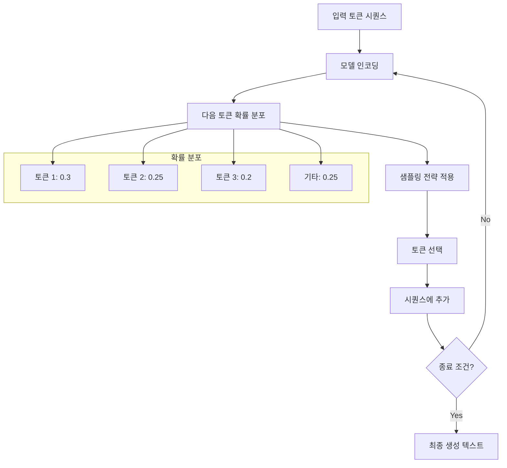

## 개요

이번 포스트에서는 **파운데이션 모델의 샘플링과 생성 전략**을 심층 분석합니다. 모델이 학습한 지식을 바탕으로 어떻게 텍스트를 생성하는지, 다양한 샘플링 기법들과 구조화된 출력 생성 방법, 그리고 AI의 확률적 특성을 상세히 살펴보겠습니다.

## 1. 샘플링의 기초 (Sampling Fundamentals)

### 1.1 언어 모델의 생성 과정



### 1.2 기본 샘플링 개념

```python
import torch
import torch.nn.functional as F
import numpy as np

class TextGenerator:
    """텍스트 생성을 위한 기본 클래스"""
    
    def __init__(self, model, tokenizer):
        self.model = model
        self.tokenizer = tokenizer
        self.vocab_size = len(tokenizer)
    
    def get_next_token_logits(self, input_ids):
        """다음 토큰에 대한 로짓 계산"""
        with torch.no_grad():
            outputs = self.model(input_ids)
            logits = outputs.logits[:, -1, :]  # 마지막 위치의 로짓
        return logits
    
    def apply_temperature(self, logits, temperature=1.0):
        """온도 스케일링 적용"""
        if temperature == 0:
            # 온도가 0이면 argmax (greedy)
            return torch.zeros_like(logits).scatter_(-1, logits.argmax(-1, keepdim=True), 1.0)
        else:
            return F.softmax(logits / temperature, dim=-1)
    
    def generate_step(self, input_ids, sampling_strategy="greedy", **kwargs):
        """단일 생성 스텝"""
        logits = self.get_next_token_logits(input_ids)
        
        # 샘플링 전략에 따른 다음 토큰 선택
        if sampling_strategy == "greedy":
            next_token = self.greedy_search(logits)
        elif sampling_strategy == "multinomial":
            next_token = self.multinomial_sampling(logits, **kwargs)
        elif sampling_strategy == "top_k":
            next_token = self.top_k_sampling(logits, **kwargs)
        elif sampling_strategy == "top_p":
            next_token = self.top_p_sampling(logits, **kwargs)
        elif sampling_strategy == "typical":
            next_token = self.typical_sampling(logits, **kwargs)
        else:
            raise ValueError(f"Unknown sampling strategy: {sampling_strategy}")
        
        return next_token

# 확률 분포 분석 예시
PROBABILITY_DISTRIBUTIONS = {
    "peaked_distribution": {
        "characteristics": "소수 토큰에 높은 확률 집중",
        "example": [0.7, 0.15, 0.1, 0.05],
        "behavior": "예측 가능한 생성",
        "use_case": "정확성이 중요한 태스크"
    },
    "flat_distribution": {
        "characteristics": "여러 토큰에 고른 확률 분포",
        "example": [0.25, 0.25, 0.25, 0.25],
        "behavior": "다양하고 창의적인 생성",
        "use_case": "창작, 브레인스토밍"
    },
    "heavy_tail": {
        "characteristics": "긴 꼬리를 가진 분포",
        "example": [0.4, 0.3, 0.15, 0.1, 0.05],
        "behavior": "주요 선택지 + 다양성",
        "use_case": "균형 잡힌 생성"
    }
}
```

## 2. 샘플링 전략 (Sampling Strategies)

### 2.1 Greedy Decoding

```python
def greedy_search(self, logits):
    """탐욕적 검색 - 항상 가장 확률이 높은 토큰 선택"""
    return torch.argmax(logits, dim=-1)

def beam_search(self, input_ids, num_beams=5, max_length=50):
    """빔 서치 - 여러 후보를 동시에 탐색"""
    batch_size = input_ids.size(0)
    
    # 초기 빔 설정
    beams = [(input_ids, 0.0)]  # (sequence, score)
    
    for step in range(max_length):
        candidates = []
        
        for seq, score in beams:
            if seq[0, -1] == self.tokenizer.eos_token_id:
                candidates.append((seq, score))
                continue
            
            logits = self.get_next_token_logits(seq)
            log_probs = F.log_softmax(logits, dim=-1)
            
            # 상위 num_beams개 토큰 고려
            top_log_probs, top_indices = torch.topk(log_probs, num_beams)
            
            for i in range(num_beams):
                new_seq = torch.cat([seq, top_indices[:, i:i+1]], dim=1)
                new_score = score + top_log_probs[0, i].item()
                candidates.append((new_seq, new_score))
        
        # 상위 num_beams개 후보 선택
        candidates.sort(key=lambda x: x[1], reverse=True)
        beams = candidates[:num_beams]
    
    return beams[0][0]  # 최고 점수 시퀀스 반환

# Greedy vs Beam Search 비교
SEARCH_STRATEGIES_COMPARISON = {
    "greedy_search": {
        "advantages": ["빠른 속도", "메모리 효율성", "결정론적"],
        "disadvantages": ["지역 최적해", "반복적 생성", "다양성 부족"],
        "complexity": "O(V) per step",
        "use_cases": ["실시간 응답", "정확성 중시", "리소스 제약"]
    },
    "beam_search": {
        "advantages": ["더 나은 전역 해", "품질 향상", "안정적"],
        "disadvantages": ["계산 비용", "메모리 사용량", "여전히 반복적"],
        "complexity": "O(B*V) per step",
        "use_cases": ["번역", "요약", "품질 중시 생성"]
    }
}
```

### 2.2 확률적 샘플링

```python
def multinomial_sampling(self, logits, temperature=1.0):
    """다항 분포 샘플링"""
    probs = self.apply_temperature(logits, temperature)
    next_token = torch.multinomial(probs, num_samples=1)
    return next_token

def top_k_sampling(self, logits, k=50, temperature=1.0):
    """Top-K 샘플링"""
    # 상위 k개 토큰만 고려
    top_k_logits, top_k_indices = torch.topk(logits, k)
    
    # 나머지는 -inf로 마스킹
    filtered_logits = torch.full_like(logits, float('-inf'))
    filtered_logits.scatter_(-1, top_k_indices, top_k_logits)
    
    # 온도 적용 후 샘플링
    probs = self.apply_temperature(filtered_logits, temperature)
    next_token = torch.multinomial(probs, num_samples=1)
    return next_token

def top_p_sampling(self, logits, p=0.9, temperature=1.0):
    """Top-P (Nucleus) 샘플링"""
    probs = self.apply_temperature(logits, temperature)
    
    # 확률 순으로 정렬
    sorted_probs, sorted_indices = torch.sort(probs, descending=True)
    
    # 누적 확률 계산
    cumulative_probs = torch.cumsum(sorted_probs, dim=-1)
    
    # 누적 확률이 p를 초과하는 지점 찾기
    sorted_indices_to_remove = cumulative_probs > p
    sorted_indices_to_remove[:, 1:] = sorted_indices_to_remove[:, :-1].clone()
    sorted_indices_to_remove[:, 0] = 0
    
    # 제거할 인덱스들을 원래 순서로 복원
    indices_to_remove = sorted_indices_to_remove.scatter(1, sorted_indices, sorted_indices_to_remove)
    
    # 확률을 0으로 설정
    filtered_probs = probs.clone()
    filtered_probs[indices_to_remove] = 0.0
    
    # 재정규화 후 샘플링
    filtered_probs = filtered_probs / filtered_probs.sum(dim=-1, keepdim=True)
    next_token = torch.multinomial(filtered_probs, num_samples=1)
    return next_token

def typical_sampling(self, logits, mass=0.9, temperature=1.0):
    """Typical Sampling - 정보량 기반 샘플링"""
    probs = self.apply_temperature(logits, temperature)
    
    # 각 토큰의 정보량 계산 (-log probability)
    information = -torch.log(probs + 1e-8)
    
    # 예상 정보량 (entropy)
    entropy = torch.sum(probs * information, dim=-1, keepdim=True)
    
    # 각 토큰이 평균적인 정보량에서 얼마나 벗어나는지 계산
    deviation = torch.abs(information - entropy)
    
    # 편차 순으로 정렬
    sorted_deviation, sorted_indices = torch.sort(deviation)
    sorted_probs = probs.gather(-1, sorted_indices)
    
    # 누적 확률이 mass에 도달할 때까지 선택
    cumulative_probs = torch.cumsum(sorted_probs, dim=-1)
    last_ind = (cumulative_probs < mass).sum(dim=-1, keepdim=True)
    
    # 마스킹
    sorted_indices_to_remove = torch.arange(sorted_probs.shape[-1]).expand_as(sorted_probs) > last_ind
    
    # 필터링된 확률 분포 생성
    filtered_probs = probs.clone()
    indices_to_remove = sorted_indices_to_remove.scatter(-1, sorted_indices, sorted_indices_to_remove)
    filtered_probs[indices_to_remove] = 0.0
    
    # 재정규화 후 샘플링
    filtered_probs = filtered_probs / filtered_probs.sum(dim=-1, keepdim=True)
    next_token = torch.multinomial(filtered_probs, num_samples=1)
    return next_token

# 샘플링 전략 특성 비교
SAMPLING_STRATEGIES = {
    "top_k": {
        "mechanism": "상위 k개 토큰만 고려",
        "control_parameter": "k (고정 크기)",
        "advantages": ["일정한 다양성", "나쁜 토큰 제거"],
        "disadvantages": ["고정된 컷오프", "문맥 무관성"],
        "best_for": "일반적인 생성 태스크"
    },
    "top_p": {
        "mechanism": "누적 확률 p까지의 토큰들",
        "control_parameter": "p (확률 임계값)",
        "advantages": ["적응적 크기", "문맥 의존적"],
        "disadvantages": ["때로는 너무 많은 토큰", "예측 어려움"],
        "best_for": "창의적 생성, 다양성 중시"
    },
    "typical": {
        "mechanism": "정보량 편차 기반 선택",
        "control_parameter": "mass (정보량 비율)",
        "advantages": ["정보 이론적", "균형 잡힌 선택"],
        "disadvantages": ["복잡한 계산", "직관적이지 않음"],
        "best_for": "자연스러운 텍스트 생성"
    }
}
```

### 2.3 고급 샘플링 기법

```python
class AdvancedSamplingTechniques:
    """고급 샘플링 기법들"""
    
    def __init__(self, model, tokenizer):
        self.model = model
        self.tokenizer = tokenizer
    
    def contrastive_search(self, input_ids, alpha=0.6, k=4, max_length=50):
        """대조 검색 - 반복 억제와 일관성 균형"""
        generated = input_ids
        
        for _ in range(max_length):
            # 다음 토큰 후보들 구하기
            logits = self.get_next_token_logits(generated)
            top_k_ids = torch.topk(logits, k=k)[1]
            
            scores = []
            for candidate_id in top_k_ids[0]:
                # 모델 신뢰도 (확률)
                model_confidence = F.softmax(logits, dim=-1)[0, candidate_id]
                
                # 이전 토큰들과의 유사도 (반복 패널티)
                candidate_token = candidate_id.unsqueeze(0).unsqueeze(0)
                extended_sequence = torch.cat([generated, candidate_token], dim=-1)
                
                # 컨텍스트 유사도 계산
                context_similarity = self.calculate_degeneration_penalty(
                    extended_sequence, candidate_id
                )
                
                # 최종 점수 = 모델 신뢰도 - 반복 패널티
                score = alpha * model_confidence - (1 - alpha) * context_similarity
                scores.append(score)
            
            # 최고 점수 토큰 선택
            best_idx = torch.tensor(scores).argmax()
            next_token = top_k_ids[0, best_idx].unsqueeze(0).unsqueeze(0)
            generated = torch.cat([generated, next_token], dim=-1)
            
            if next_token.item() == self.tokenizer.eos_token_id:
                break
        
        return generated
    
    def mirostat_sampling(self, input_ids, target_entropy=3.0, learning_rate=0.1):
        """Mirostat 샘플링 - 엔트로피 제어"""
        tau = 5.0  # 초기 온도
        generated = input_ids
        
        for _ in range(50):
            logits = self.get_next_token_logits(generated)
            
            # 현재 온도로 확률 분포 계산
            probs = F.softmax(logits / tau, dim=-1)
            
            # 현재 엔트로피 계산
            current_entropy = -torch.sum(probs * torch.log(probs + 1e-8))
            
            # Mirostat 조건: 놀라움의 정도 제어
            # 토큰 샘플링
            next_token = torch.multinomial(probs, num_samples=1)
            generated = torch.cat([generated, next_token], dim=-1)
            
            # 온도 업데이트 (엔트로피 피드백)
            entropy_error = current_entropy - target_entropy
            tau = tau - learning_rate * entropy_error
            tau = max(0.1, tau)  # 최소값 제한
            
            if next_token.item() == self.tokenizer.eos_token_id:
                break
        
        return generated
    
    def calculate_degeneration_penalty(self, sequence, candidate_id):
        """반복 억제 점수 계산"""
        # 최근 토큰들과의 유사도
        recent_tokens = sequence[0, -10:]  # 최근 10개 토큰
        penalty = 0.0
        
        for token in recent_tokens:
            if token == candidate_id:
                penalty += 1.0
        
        return penalty / len(recent_tokens)
```

## 3. 테스트 시점 연산 (Test-Time Compute)

### 3.1 반복적 개선 기법

```python
class TestTimeCompute:
    """테스트 시점 연산 기법들"""
    
    def __init__(self, model, tokenizer):
        self.model = model
        self.tokenizer = tokenizer
    
    def self_consistency_decoding(self, prompt, num_samples=5, temperature=0.8):
        """자기 일관성 디코딩 - 여러 샘플 중 일관성 높은 답변 선택"""
        samples = []
        
        # 여러 개의 다양한 응답 생성
        for _ in range(num_samples):
            response = self.generate_response(
                prompt, 
                temperature=temperature,
                sampling="top_p"
            )
            samples.append(response)
        
        # 답변 추출 및 일관성 확인
        answers = [self.extract_answer(sample) for sample in samples]
        
        # 가장 빈번한 답변 선택
        from collections import Counter
        answer_counts = Counter(answers)
        most_common_answer = answer_counts.most_common(1)[0][0]
        
        # 해당 답변을 가진 가장 좋은 샘플 반환
        best_sample = self.select_best_sample(samples, most_common_answer)
        
        return {
            "final_answer": best_sample,
            "all_samples": samples,
            "answer_distribution": dict(answer_counts),
            "confidence": answer_counts[most_common_answer] / num_samples
        }
    
    def iterative_refinement(self, prompt, max_iterations=3):
        """반복적 개선 - 답변을 점진적으로 개선"""
        current_response = self.generate_response(prompt)
        
        for iteration in range(max_iterations):
            # 현재 응답 평가
            critique = self.self_critique(prompt, current_response)
            
            if self.is_satisfactory(critique):
                break
            
            # 개선된 응답 생성
            refinement_prompt = f"""
원래 질문: {prompt}
이전 답변: {current_response}
개선점: {critique}

위 개선점을 반영하여 더 나은 답변을 생성해주세요:
"""
            current_response = self.generate_response(refinement_prompt)
        
        return {
            "final_response": current_response,
            "iterations": iteration + 1,
            "improvement_history": self.track_improvements()
        }
    
    def tree_of_thoughts(self, problem, depth=3, breadth=3):
        """생각의 나무 - 다단계 추론 트리 탐색"""
        class ThoughtNode:
            def __init__(self, thought, parent=None, depth=0):
                self.thought = thought
                self.parent = parent
                self.children = []
                self.depth = depth
                self.value = 0.0
        
        # 루트 노드 생성
        root = ThoughtNode(problem, depth=0)
        
        def expand_node(node):
            if node.depth >= depth:
                return
            
            # 현재 노드에서 가능한 다음 생각들 생성
            expansion_prompt = f"문제: {problem}\n현재 생각: {node.thought}\n다음 단계로 가능한 {breadth}가지 생각:"
            
            next_thoughts = self.generate_multiple_thoughts(expansion_prompt, breadth)
            
            for thought in next_thoughts:
                child = ThoughtNode(thought, parent=node, depth=node.depth + 1)
                node.children.append(child)
                
                # 재귀적으로 확장
                expand_node(child)
        
        def evaluate_path(leaf_node):
            # 루트에서 리프까지의 경로 평가
            path = []
            current = leaf_node
            while current:
                path.append(current.thought)
                current = current.parent
            path.reverse()
            
            # 경로의 일관성과 논리성 평가
            return self.evaluate_reasoning_path(path)
        
        # 트리 확장
        expand_node(root)
        
        # 모든 리프 노드 평가
        leaf_nodes = self.get_leaf_nodes(root)
        best_path = max(leaf_nodes, key=evaluate_path)
        
        return self.construct_final_answer(best_path)
    
    def best_of_n_sampling(self, prompt, n=16, reward_model=None):
        """Best-of-N 샘플링 - 여러 샘플 중 최고 품질 선택"""
        samples = []
        
        # N개의 다양한 샘플 생성
        for i in range(n):
            sample = self.generate_response(
                prompt,
                temperature=0.8 + 0.2 * (i / n),  # 점진적 온도 증가
                top_p=0.9
            )
            samples.append(sample)
        
        # 품질 평가
        if reward_model:
            scores = [reward_model.score(prompt, sample) for sample in samples]
        else:
            scores = [self.heuristic_quality_score(prompt, sample) for sample in samples]
        
        # 최고 점수 샘플 선택
        best_idx = np.argmax(scores)
        
        return {
            "best_sample": samples[best_idx],
            "best_score": scores[best_idx],
            "all_samples": samples,
            "all_scores": scores,
            "score_distribution": self.analyze_score_distribution(scores)
        }
```

### 3.2 검증 및 자기 확인

```python
class SelfVerification:
    """자기 검증 및 확인 메커니즘"""
    
    def __init__(self, model, tokenizer):
        self.model = model
        self.tokenizer = tokenizer
    
    def chain_of_verification(self, query, initial_response):
        """검증 체인 - 단계별 사실 확인"""
        # 1. 검증 질문 생성
        verification_questions = self.generate_verification_questions(initial_response)
        
        # 2. 각 질문에 대한 답변 생성
        verification_results = []
        for question in verification_questions:
            answer = self.generate_response(question)
            confidence = self.assess_confidence(question, answer)
            verification_results.append({
                "question": question,
                "answer": answer,
                "confidence": confidence
            })
        
        # 3. 원래 응답과 검증 결과 비교
        consistency_check = self.check_consistency(initial_response, verification_results)
        
        # 4. 필요시 응답 수정
        if consistency_check["needs_revision"]:
            revised_response = self.revise_response(
                query, 
                initial_response, 
                verification_results
            )
            return revised_response
        
        return initial_response
    
    def factual_verification(self, claim):
        """사실 검증"""
        verification_strategies = {
            "decomposition": self.decompose_complex_claim,
            "source_checking": self.check_against_knowledge,
            "logical_consistency": self.verify_logical_coherence,
            "numerical_verification": self.verify_calculations
        }
        
        verification_results = {}
        for strategy, method in verification_strategies.items():
            verification_results[strategy] = method(claim)
        
        # 종합 신뢰도 계산
        overall_confidence = self.aggregate_confidence(verification_results)
        
        return {
            "verified_claim": claim,
            "confidence": overall_confidence,
            "verification_details": verification_results,
            "recommendation": self.make_verification_recommendation(overall_confidence)
        }
```

## 4. 구조화된 출력 (Structured Output)

### 4.1 JSON 및 구조화된 생성

```python
class StructuredGeneration:
    """구조화된 출력 생성"""
    
    def __init__(self, model, tokenizer):
        self.model = model
        self.tokenizer = tokenizer
        self.json_schema_validator = self.setup_schema_validator()
    
    def constrained_json_generation(self, prompt, schema):
        """스키마 제약 JSON 생성"""
        # 스키마 기반 토큰 마스킹
        def create_token_mask(current_state, schema):
            """현재 상태에서 유효한 토큰들만 허용"""
            valid_tokens = []
            
            if current_state["expecting"] == "key":
                # 스키마에 정의된 키들만 허용
                for key in schema["properties"].keys():
                    key_tokens = self.tokenizer.encode(f'"{key}"')
                    valid_tokens.extend(key_tokens)
            elif current_state["expecting"] == "value":
                # 타입에 따른 값 토큰 허용
                field_type = schema["properties"][current_state["current_key"]]["type"]
                if field_type == "string":
                    valid_tokens.extend(self.get_string_tokens())
                elif field_type == "number":
                    valid_tokens.extend(self.get_number_tokens())
                elif field_type == "boolean":
                    valid_tokens.extend(self.tokenizer.encode("true") + self.tokenizer.encode("false"))
            
            return valid_tokens
        
        # 제약 조건하에서 생성
        generated_ids = []
        current_state = {"expecting": "key", "current_key": None}
        
        for step in range(200):  # 최대 길이 제한
            logits = self.get_next_token_logits(torch.tensor([generated_ids]))
            
            # 유효한 토큰만 허용하도록 마스킹
            valid_tokens = create_token_mask(current_state, schema)
            mask = torch.full_like(logits, float('-inf'))
            mask[0, valid_tokens] = 0
            masked_logits = logits + mask
            
            # 샘플링
            probs = F.softmax(masked_logits, dim=-1)
            next_token = torch.multinomial(probs, 1)
            generated_ids.append(next_token.item())
            
            # 상태 업데이트
            current_state = self.update_parsing_state(current_state, next_token.item())
            
            # 완성 체크
            if self.is_valid_json_complete(generated_ids, schema):
                break
        
        return self.tokenizer.decode(generated_ids)
    
    def guided_code_generation(self, prompt, language="python"):
        """가이드된 코드 생성"""
        language_constraints = {
            "python": {
                "indent_tokens": ["    ", "\t"],
                "keyword_tokens": ["def", "class", "if", "for", "while", "try", "import"],
                "operator_tokens": ["=", "==", "!=", "+", "-", "*", "/"],
                "syntax_rules": self.python_syntax_rules
            },
            "javascript": {
                "keyword_tokens": ["function", "var", "let", "const", "if", "for", "while"],
                "syntax_rules": self.javascript_syntax_rules
            }
        }
        
        constraints = language_constraints[language]
        
        # 구문 인식 상태 추적
        syntax_state = SyntaxTracker(language)
        
        generated_code = []
        for step in range(500):
            logits = self.get_next_token_logits(torch.tensor([generated_code]))
            
            # 현재 구문 상태에 따른 토큰 필터링
            valid_tokens = syntax_state.get_valid_next_tokens(constraints)
            
            if valid_tokens:
                mask = torch.zeros_like(logits)
                mask[0, valid_tokens] = 1
                filtered_logits = logits * mask + (1 - mask) * float('-inf')
            else:
                filtered_logits = logits
            
            # 토큰 생성
            probs = F.softmax(filtered_logits, dim=-1)
            next_token = torch.multinomial(probs, 1)
            generated_code.append(next_token.item())
            
            # 구문 상태 업데이트
            syntax_state.update(next_token.item())
            
            # 완성 조건 체크
            if syntax_state.is_complete():
                break
        
        return self.tokenizer.decode(generated_code)

class SyntaxTracker:
    """프로그래밍 언어 구문 추적기"""
    
    def __init__(self, language):
        self.language = language
        self.bracket_stack = []
        self.indent_level = 0
        self.in_string = False
        self.expecting_colon = False
    
    def update(self, token_id):
        """토큰에 따른 구문 상태 업데이트"""
        token = self.tokenizer.decode([token_id])
        
        if token in ["(", "[", "{"]:
            self.bracket_stack.append(token)
        elif token in [")", "]", "}"]:
            if self.bracket_stack:
                self.bracket_stack.pop()
        elif token == ":":
            self.expecting_colon = False
        elif token in ["if", "for", "while", "def", "class"]:
            self.expecting_colon = True
    
    def get_valid_next_tokens(self, constraints):
        """현재 상태에서 유효한 다음 토큰들"""
        valid_tokens = []
        
        # 괄호 균형 체크
        if self.bracket_stack:
            # 닫는 괄호 우선적으로 허용
            closing_bracket = self.get_closing_bracket(self.bracket_stack[-1])
            valid_tokens.extend(self.tokenizer.encode(closing_bracket))
        
        # 콜론 예상 상황
        if self.expecting_colon:
            valid_tokens.extend(self.tokenizer.encode(":"))
        
        # 기본 토큰들 (키워드, 연산자 등)
        for token_list in constraints.values():
            if isinstance(token_list, list):
                for token in token_list:
                    valid_tokens.extend(self.tokenizer.encode(token))
        
        return valid_tokens
```

### 4.2 템플릿 기반 생성

```python
class TemplateBasedGeneration:
    """템플릿 기반 구조화 생성"""
    
    def __init__(self, model, tokenizer):
        self.model = model
        self.tokenizer = tokenizer
        self.templates = self.load_templates()
    
    def load_templates(self):
        """다양한 형식의 템플릿 로드"""
        return {
            "email": {
                "structure": ["subject", "greeting", "body", "closing", "signature"],
                "constraints": {
                    "subject": {"max_length": 50, "required_prefix": "Re:"},
                    "greeting": {"options": ["Dear", "Hi", "Hello"]},
                    "body": {"min_paragraphs": 1, "max_paragraphs": 3},
                    "closing": {"options": ["Best regards", "Sincerely", "Thank you"]}
                }
            },
            "report": {
                "structure": ["title", "executive_summary", "introduction", "methodology", "results", "conclusion"],
                "constraints": {
                    "title": {"max_length": 100},
                    "executive_summary": {"max_words": 150},
                    "methodology": {"required_subsections": ["data_collection", "analysis_method"]},
                    "results": {"include_metrics": True}
                }
            },
            "recipe": {
                "structure": ["title", "ingredients", "instructions", "cooking_time", "servings"],
                "constraints": {
                    "ingredients": {"format": "list", "include_quantities": True},
                    "instructions": {"format": "numbered_steps"},
                    "cooking_time": {"format": "minutes"},
                    "servings": {"format": "number"}
                }
            }
        }
    
    def generate_with_template(self, prompt, template_name):
        """템플릿을 사용한 구조화 생성"""
        template = self.templates[template_name]
        result = {}
        
        for section in template["structure"]:
            section_constraints = template["constraints"].get(section, {})
            
            # 섹션별 프롬프트 생성
            section_prompt = self.create_section_prompt(
                prompt, section, section_constraints, result
            )
            
            # 제약 조건하에서 생성
            section_content = self.generate_constrained_section(
                section_prompt, section_constraints
            )
            
            result[section] = section_content
        
        return self.format_final_output(result, template_name)
    
    def generate_constrained_section(self, prompt, constraints):
        """제약 조건을 만족하는 섹션 생성"""
        max_attempts = 3
        
        for attempt in range(max_attempts):
            generated = self.generate_response(prompt)
            
            if self.validate_constraints(generated, constraints):
                return generated
            
            # 제약 조건 위반 시 프롬프트 수정
            prompt = self.adjust_prompt_for_constraints(prompt, constraints, generated)
        
        # 최종 시도 후에도 실패하면 후처리로 수정
        return self.post_process_for_constraints(generated, constraints)
```

## 5. AI의 확률적 특성 (Probabilistic Nature of AI)

### 5.1 불확실성과 신뢰도

```python
class UncertaintyQuantification:
    """불확실성 정량화 및 신뢰도 측정"""
    
    def __init__(self, model, tokenizer):
        self.model = model
        self.tokenizer = tokenizer
    
    def semantic_uncertainty(self, prompt, num_samples=10):
        """의미적 불확실성 측정"""
        # 여러 샘플 생성
        samples = []
        for _ in range(num_samples):
            response = self.generate_response(prompt, temperature=0.8)
            samples.append(response)
        
        # 의미적 유사성 클러스터링
        semantic_clusters = self.cluster_by_semantics(samples)
        
        # 엔트로피 계산 (클러스터 분포 기반)
        cluster_probs = [len(cluster) / num_samples for cluster in semantic_clusters]
        semantic_entropy = -sum(p * np.log(p) for p in cluster_probs if p > 0)
        
        return {
            "entropy": semantic_entropy,
            "num_clusters": len(semantic_clusters),
            "clusters": semantic_clusters,
            "confidence": 1 - (semantic_entropy / np.log(len(semantic_clusters)))
        }
    
    def token_level_uncertainty(self, input_ids):
        """토큰 레벨 불확실성 분석"""
        logits = self.get_next_token_logits(input_ids)
        probs = F.softmax(logits, dim=-1)
        
        # 엔트로피 (전체 분포의 불확실성)
        entropy = -torch.sum(probs * torch.log(probs + 1e-8), dim=-1)
        
        # Top-k 확률의 합 (집중도)
        top_k_probs = torch.topk(probs, k=5)[0]
        concentration = torch.sum(top_k_probs, dim=-1)
        
        # 최대 확률 (신뢰도 대리 지표)
        max_prob = torch.max(probs, dim=-1)[0]
        
        return {
            "entropy": entropy.item(),
            "concentration": concentration.item(),
            "max_probability": max_prob.item(),
            "uncertainty_level": self.categorize_uncertainty(entropy.item())
        }
    
    def epistemic_vs_aleatoric(self, prompt, num_models=5):
        """인식론적 vs 우연적 불확실성 분해"""
        if num_models == 1:
            # 단일 모델의 경우 드롭아웃 기반 근사
            predictions = []
            self.model.train()  # 드롭아웃 활성화
            
            for _ in range(20):
                with torch.no_grad():
                    logits = self.get_next_token_logits(prompt)
                    probs = F.softmax(logits, dim=-1)
                    predictions.append(probs)
            
            self.model.eval()
        else:
            # 여러 모델 앙상블
            predictions = []
            for model in self.model_ensemble:
                logits = model.get_next_token_logits(prompt)
                probs = F.softmax(logits, dim=-1)
                predictions.append(probs)
        
        # 평균 예측과 예측의 분산 계산
        mean_prediction = torch.mean(torch.stack(predictions), dim=0)
        prediction_variance = torch.var(torch.stack(predictions), dim=0)
        
        # 평균 예측의 엔트로피 (우연적 불확실성)
        aleatoric = -torch.sum(mean_prediction * torch.log(mean_prediction + 1e-8))
        
        # 예측 분산의 합 (인식론적 불확실성)
        epistemic = torch.sum(prediction_variance)
        
        return {
            "aleatoric_uncertainty": aleatoric.item(),
            "epistemic_uncertainty": epistemic.item(),
            "total_uncertainty": aleatoric.item() + epistemic.item(),
            "uncertainty_breakdown": {
                "data_uncertainty": aleatoric.item(),
                "model_uncertainty": epistemic.item()
            }
        }

class ConfidenceCalibration:
    """신뢰도 보정"""
    
    def __init__(self):
        self.calibration_data = []
        self.temperature_scaling = None
    
    def collect_calibration_data(self, model, validation_set):
        """보정용 데이터 수집"""
        for sample in validation_set:
            prediction = model.predict(sample['input'])
            confidence = model.get_confidence(sample['input'])
            correctness = (prediction == sample['target'])
            
            self.calibration_data.append({
                'confidence': confidence,
                'correctness': correctness,
                'prediction': prediction
            })
    
    def temperature_scaling_calibration(self, logits, labels):
        """온도 스케일링을 통한 보정"""
        # 검증 세트에서 최적 온도 찾기
        def nll_loss(temperature):
            scaled_logits = logits / temperature
            loss = F.cross_entropy(scaled_logits, labels)
            return loss
        
        from scipy.optimize import minimize_scalar
        result = minimize_scalar(nll_loss, bounds=(0.1, 10.0))
        self.temperature = result.x
        
        return self.temperature
    
    def plot_reliability_diagram(self):
        """신뢰도 다이어그램 생성"""
        import matplotlib.pyplot as plt
        
        # 신뢰도 구간별 정확도 계산
        bins = np.linspace(0, 1, 11)
        bin_centers = (bins[:-1] + bins[1:]) / 2
        bin_accuracies = []
        bin_confidences = []
        
        for i in range(len(bins) - 1):
            in_bin = [
                d for d in self.calibration_data 
                if bins[i] <= d['confidence'] < bins[i+1]
            ]
            
            if in_bin:
                accuracy = sum(d['correctness'] for d in in_bin) / len(in_bin)
                confidence = sum(d['confidence'] for d in in_bin) / len(in_bin)
                bin_accuracies.append(accuracy)
                bin_confidences.append(confidence)
            else:
                bin_accuracies.append(0)
                bin_confidences.append(bin_centers[i])
        
        # 플롯 생성
        plt.figure(figsize=(8, 6))
        plt.plot([0, 1], [0, 1], 'k--', label='Perfect Calibration')
        plt.plot(bin_confidences, bin_accuracies, 'ro-', label='Model')
        plt.xlabel('Confidence')
        plt.ylabel('Accuracy')
        plt.title('Reliability Diagram')
        plt.legend()
        plt.grid(True, alpha=0.3)
        
        return plt.gcf()
```

### 5.2 확률적 행동의 활용

```python
class ProbabilisticBehaviorUtilization:
    """확률적 행동의 전략적 활용"""
    
    def __init__(self, model, tokenizer):
        self.model = model
        self.tokenizer = tokenizer
    
    def adaptive_sampling_strategy(self, prompt, context_analysis):
        """상황 적응적 샘플링 전략"""
        # 컨텍스트 분석에 따른 샘플링 파라미터 조정
        if context_analysis["task_type"] == "factual_qa":
            # 사실 질문 → 낮은 온도, 높은 정확성
            return {
                "temperature": 0.1,
                "top_p": 0.5,
                "strategy": "greedy",
                "reasoning": "정확성 우선"
            }
        elif context_analysis["task_type"] == "creative_writing":
            # 창작 → 높은 온도, 높은 다양성
            return {
                "temperature": 0.9,
                "top_p": 0.9,
                "strategy": "top_p",
                "reasoning": "창의성 및 다양성 우선"
            }
        elif context_analysis["task_type"] == "code_generation":
            # 코드 생성 → 중간 온도, 구문 제약
            return {
                "temperature": 0.3,
                "top_p": 0.8,
                "strategy": "constrained",
                "reasoning": "구문 정확성과 다양성 균형"
            }
        elif context_analysis["uncertainty_high"]:
            # 높은 불확실성 → 보수적 접근
            return {
                "temperature": 0.2,
                "top_p": 0.6,
                "strategy": "conservative",
                "reasoning": "불확실성 때문에 보수적 생성"
            }
    
    def uncertainty_aware_generation(self, prompt, uncertainty_threshold=0.7):
        """불확실성 인식 생성"""
        # 첫 번째 시도
        initial_response = self.generate_response(prompt, temperature=0.3)
        uncertainty = self.measure_uncertainty(prompt, initial_response)
        
        if uncertainty["confidence"] > uncertainty_threshold:
            # 높은 신뢰도 → 그대로 반환
            return {
                "response": initial_response,
                "confidence": uncertainty["confidence"],
                "generation_strategy": "direct",
                "additional_info": "High confidence response"
            }
        else:
            # 낮은 신뢰도 → 추가 전략 사용
            alternative_strategies = [
                ("self_consistency", self.self_consistency_generation),
                ("multiple_perspectives", self.multi_perspective_generation),
                ("uncertainty_expression", self.uncertainty_expressing_generation)
            ]
            
            best_response = initial_response
            best_confidence = uncertainty["confidence"]
            used_strategy = "direct"
            
            for strategy_name, strategy_func in alternative_strategies:
                candidate = strategy_func(prompt)
                candidate_uncertainty = self.measure_uncertainty(prompt, candidate)
                
                if candidate_uncertainty["confidence"] > best_confidence:
                    best_response = candidate
                    best_confidence = candidate_uncertainty["confidence"]
                    used_strategy = strategy_name
            
            return {
                "response": best_response,
                "confidence": best_confidence,
                "generation_strategy": used_strategy,
                "additional_info": f"Used {used_strategy} due to initial uncertainty"
            }
    
    def probabilistic_ensemble_generation(self, prompt, ensemble_strategies):
        """확률적 앙상블 생성"""
        ensemble_results = []
        
        for strategy in ensemble_strategies:
            response = self.generate_response(prompt, **strategy["params"])
            confidence = self.measure_confidence(response)
            
            ensemble_results.append({
                "response": response,
                "confidence": confidence,
                "strategy": strategy["name"],
                "weight": strategy.get("weight", 1.0)
            })
        
        # 가중 투표 또는 신뢰도 기반 선택
        final_response = self.ensemble_selection(ensemble_results)
        
        return {
            "final_response": final_response,
            "ensemble_details": ensemble_results,
            "selection_method": "confidence_weighted"
        }
```

## 결론

파운데이션 모델의 샘플링과 생성 전략은 **모델의 잠재력을 실제 성능으로 변환하는 핵심 기술**입니다.

**핵심 인사이트:**
- **샘플링 전략의 중요성**: 동일한 모델도 샘플링에 따라 완전히 다른 품질의 출력 생성
- **상황 적응적 접근**: 태스크와 맥락에 따른 최적 전략 선택
- **불확실성의 활용**: AI의 확률적 특성을 이해하고 전략적으로 활용
- **구조화된 출력**: 실용적 애플리케이션을 위한 제약 조건 하 생성

다음 포스트에서는 파운데이션 모델의 평가 방법론과 벤치마크를 상세히 다루겠습니다.

---

**연관 포스트:**
- [파운데이션 모델 이해하기 (1부) - 학습 데이터와 모델 아키텍처 심층 분석]()
- [파운데이션 모델 이해하기 (2부) - 사후 학습과 파인튜닝 전략 심층 분석]()
- [다음: 파운데이션 모델 이해하기 (4부) - 평가 방법론과 벤치마크] (예정)

**참고 자료:**
- [The Curious Case of Neural Text Degeneration](https://arxiv.org/abs/1904.09751)
- [Typical Sampling for Text Generation](https://arxiv.org/abs/2202.00666)
- [Contrastive Search Is What You Need For Neural Text Generation](https://arxiv.org/abs/2210.14140)
- [Tree of Thoughts: Deliberate Problem Solving with Large Language Models](https://arxiv.org/abs/2305.10601)