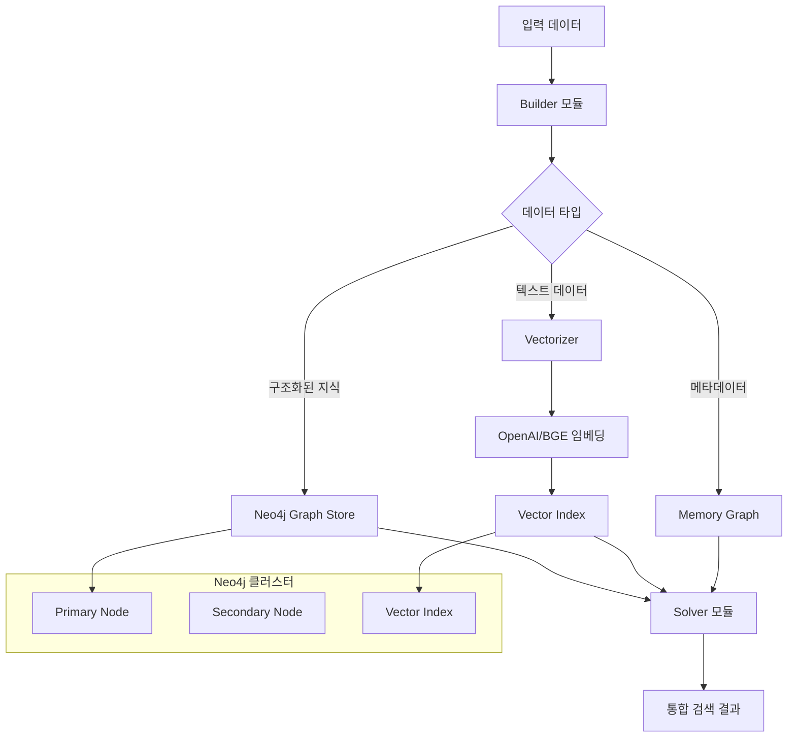

## 개요

이번 포스트에서는 **KAG 데이터베이스 통합 아키텍처**를 상세히 분석합니다. KAG는 지식 그래프 저장을 위한 Neo4j, 벡터 검색을 위한 임베딩 시스템, 그리고 다중 모달 데이터 처리를 통합한 복합 데이터베이스 아키텍처를 제공합니다.

## 1. KAG 데이터베이스 아키텍처 개요

### 1.1 다층 데이터 저장 전략

```python
# KAG 데이터베이스 통합 아키텍처
kag/common/
├── graphstore/           # 그래프 데이터 저장소
│   ├── neo4j_graph_store.py    # Neo4j 통합
│   ├── memory_graph.py         # 메모리 기반 그래프
│   └── rest/                   # REST API 인터페이스
├── vectorize_model/      # 벡터화 모델들
│   ├── openai_model.py         # OpenAI 임베딩
│   ├── local_bge_model.py      # 로컬 BGE 모델
│   └── mock_model.py           # 테스트용 모델
└── rerank_model/         # 재순위화 모델
```

**다층 저장 구조:**
- **그래프 레이어**: Neo4j를 통한 구조화된 지식 표현
- **벡터 레이어**: 의미적 검색을 위한 임베딩 저장
- **메모리 레이어**: 고속 접근을 위한 캐시 시스템
- **인덱스 레이어**: 전문 검색과 벡터 검색 최적화

### 1.2 데이터 흐름 아키텍처



## 2. Neo4j Graph Store - 구조화된 지식 저장

### 2.1 Neo4j 클라이언트 아키텍처

```python
class Neo4jClient(GraphStore, metaclass=SingletonMeta):
    """Thread-safe Singleton 패턴을 사용한 Neo4j 클라이언트"""
    
    def __init__(
        self,
        uri,
        user,
        password,
        database="neo4j",
        init_type="write",
        interval_minutes=10,
    ):
        self._driver = GraphDatabase.driver(uri, auth=(user, password))
        logger.info(f"init Neo4jClient uri: {uri} database: {database}")
        
        self._database = database
        self._lucene_special_chars = '\\+-!():^[]"{}~*?|&/'
        self._lucene_pattern = self._get_lucene_pattern()
        self._simple_ident = "[A-Za-z_][A-Za-z0-9_]*"
        self._simple_ident_pattern = re.compile(self._simple_ident)
        
        # 벡터 인덱스 메타데이터
        self._vec_meta = dict()
        self._vec_meta_ts = 0.0
        self._vec_meta_timeout = 60.0
        self._vectorizer = None
        
        # PageRank 그래프 관리
        self._allGraph = "allGraph_0"
        
        if init_type == "write":
            self._labels = self._create_unique_constraint()
            self._create_all_graph(self._allGraph)
        
        # 주기적 제약 조건 및 인덱스 업데이트
        self.schedule_constraint(interval_minutes)
        self.refresh_vector_index_meta(force=True)
```

**핵심 특징:**
- **Singleton 패턴**: 연결 재사용과 리소스 최적화
- **자동 인덱싱**: 라벨별 고유 제약조건 자동 생성
- **벡터 통합**: 그래프 노드에 임베딩 벡터 통합 저장
- **PageRank 지원**: 그래프 분석을 위한 알고리즘 내장

### 2.2 동적 스키마 초기화

```python
def initialize_schema(self, schema_types):
    """스키마 타입에 따른 동적 인덱스 생성"""
    
    for spg_type in schema_types:
        label = spg_type
        properties = schema_types[spg_type].properties
        
        if properties:
            for property_key in properties:
                # 기본 name 속성에 벡터 인덱스 생성
                if property_key == "name":
                    self.create_vector_index(label, property_key)
                
                # 인덱스 타입에 따른 처리
                index_type = properties[property_key].index_type
                if index_type:
                    if index_type == IndexTypeEnum.Text:
                        pass  # 텍스트 인덱스는 별도 처리
                    elif index_type == IndexTypeEnum.Vector:
                        self.create_vector_index(label, property_key)
                    elif index_type == IndexTypeEnum.TextAndVector:
                        self.create_vector_index(label, property_key)
                    else:
                        logger.info(f"Undefined IndexTypeEnum {index_type}")
    
    # 텍스트 인덱스 통합 생성
    labels, property_keys = self._collect_text_index_info(schema_types)
    self.create_text_index(labels, property_keys)
    
    # 기본 엔티티 벡터 인덱스
    self.create_vector_index("Entity", "name")
    self.create_vector_index("Entity", "desc")
    
    self.refresh_vector_index_meta(force=True)
```

### 2.3 노드 삽입 및 벡터 자동 생성

```python
def upsert_node(self, label, properties, id_key="id", extra_labels=("Entity",)):
    """벡터 자동 생성을 포함한 노드 업서트"""
    
    # 벡터 임베딩 자동 생성
    self._preprocess_node_properties(label, properties, extra_labels)
    
    with self._driver.session(database=self._database) as session:
        if label not in self._labels:
            self._create_unique_index_constraint(self, label, session)
        
        try:
            return session.execute_write(
                self._upsert_node, self, label, id_key, properties, extra_labels
            )
        except Exception as e:
            logger.error(f"upsert_node label:{label} properties:{properties} Exception: {e}")
            return None

def _preprocess_node_properties(self, label, properties, extra_labels):
    """노드 속성 전처리 - 벡터 임베딩 자동 생성"""
    
    if self._vectorizer is None:
        return
    
    self.refresh_vector_index_meta()
    vec_meta = self._vec_meta
    labels = [label]
    if extra_labels:
        labels.extend(extra_labels)
    
    # 각 라벨별로 벡터 필드 처리
    for label in labels:
        if label not in vec_meta:
            continue
        
        for vector_field in vec_meta[label]:
            if vector_field in properties:
                continue  # 이미 벡터가 있음
            
            # 텍스트 속성에서 벡터 생성
            embedding_vector = self._get_embedding_vector(properties, vector_field)
            if embedding_vector is not None:
                properties[vector_field] = embedding_vector

@staticmethod
def _upsert_node(tx, self, label, id_key, properties, extra_labels):
    """실제 노드 업서트 쿼리 실행"""
    
    if not label:
        logger.warning("label cannot be None or empty strings")
        return None
    
    query = (
        f"MERGE (n:{self._escape_neo4j(label)} {{{self._escape_neo4j(id_key)}: $properties.{self._escape_neo4j(id_key)}}}) "
        "SET n += $properties "
    )
    
    if extra_labels:
        query += f", n:{':'.join(self._escape_neo4j(extra_label) for extra_label in extra_labels)} "
    
    query += "RETURN n"
    result = tx.run(query, properties=properties)
    return result.single()[0]
```

## 3. 벡터 인덱스 시스템

### 3.1 다중 벡터 인덱스 지원

```python
def create_vector_index(
    self,
    label,
    property_key,
    index_name=None,
    vector_dimensions=768,
    metric_type="cosine",
    hnsw_m=None,
    hnsw_ef_construction=None,
):
    """HNSW 벡터 인덱스 생성"""
    
    if index_name is None:
        index_name = self._create_vector_index_name(label, property_key)
    
    if not property_key.lower().endswith("vector"):
        property_key = self._create_vector_field_name(property_key)
    
    with self._driver.session(database=self._database) as session:
        session.execute_write(
            self._create_vector_index,
            self,
            label,
            property_key,
            index_name,
            vector_dimensions,
            metric_type,
            hnsw_m,
            hnsw_ef_construction,
        )
    
    self.refresh_vector_index_meta(force=True)
    return index_name

@staticmethod
def _create_vector_index(
    tx,
    self,
    label,
    property_key,
    index_name,
    vector_dimensions,
    metric_type,
    hnsw_m,
    hnsw_ef_construction,
):
    """Neo4j 벡터 인덱스 생성 쿼리"""
    
    query = (
        f"CREATE VECTOR INDEX {self._escape_neo4j(index_name)} IF NOT EXISTS "
        f"FOR (n:{self._escape_neo4j(label)}) ON (n.{self._escape_neo4j(property_key)}) "
        "OPTIONS { indexConfig: {"
        "  `vector.dimensions`: $vector_dimensions,"
        "  `vector.similarity_function`: $metric_type"
    )
    
    # HNSW 파라미터 추가
    if hnsw_m is not None:
        query += ",  `vector.hnsw.m`: $hnsw_m"
    if hnsw_ef_construction is not None:
        query += ",  `vector.hnsw.ef_construction`: $hnsw_ef_construction"
    
    query += "}}"
    tx.run(
        query,
        vector_dimensions=vector_dimensions,
        metric_type=metric_type,
        hnsw_m=hnsw_m,
        hnsw_ef_construction=hnsw_ef_construction,
    )
```

### 3.2 벡터 검색 최적화

```python
def vector_search(
    self,
    label,
    property_key,
    query_text_or_vector,
    topk=10,
    index_name=None,
    ef_search=None,
):
    """최적화된 벡터 유사도 검색"""
    
    # ef_search 파라미터 검증
    if ef_search is not None:
        if ef_search < topk:
            message = f"ef_search must be >= topk; {ef_search!r} is invalid"
            raise ValueError(message)
    
    # 벡터 인덱스 메타데이터 갱신
    self.refresh_vector_index_meta()
    
    if index_name is None:
        vec_meta = self._vec_meta
        if label not in vec_meta:
            logger.warning(f"vector index not defined for label: {label}")
            return []
        
        vector_field = self._create_vector_field_name(property_key)
        if vector_field not in vec_meta[label]:
            logger.warning(f"vector index not defined for field: {property_key}")
            return []
        
        index_name = self._create_vector_index_name(label, property_key)
    
    # 텍스트를 벡터로 변환
    if isinstance(query_text_or_vector, str):
        query_vector = self.vectorizer.vectorize(query_text_or_vector)
    else:
        query_vector = query_text_or_vector
    
    def do_vector_search(tx):
        if ef_search is not None:
            # HNSW 고급 검색 파라미터 사용
            query = (
                "CALL db.index.vector.queryNodes($index_name, $ef_search, $query_vector) "
                "YIELD node, score "
                "RETURN node, score, labels(node) as __labels__ "
                f"LIMIT {topk}"
            )
            res = tx.run(
                query,
                query_vector=query_vector,
                ef_search=ef_search,
                index_name=index_name,
            )
        else:
            # 기본 벡터 검색
            query = (
                "CALL db.index.vector.queryNodes($index_name, $topk, $query_vector) "
                "YIELD node, score "
                "RETURN node, score, labels(node) as __labels__"
            )
            res = tx.run(
                query, query_vector=query_vector, topk=topk, index_name=index_name
            )
        
        data = res.data()
        for record in data:
            record["node"]["__labels__"] = record["__labels__"]
            del record["__labels__"]
        return data
    
    with self._driver.session(database=self._database) as session:
        return session.execute_read(do_vector_search)
```

## 4. 벡터화 모델 통합

### 4.1 OpenAI 임베딩 모델

```python
@VectorizeModelABC.register("openai")
class OpenAIVectorizeModel(VectorizeModelABC):
    """OpenAI 임베딩 서비스 통합"""
    
    def __init__(
        self,
        model: str = "text-embedding-3-small",
        api_key: str = "",
        base_url: str = "",
        vector_dimensions: int = None,
        timeout: float = None,
        max_rate: float = 1000,
        time_period: float = 1,
        **kwargs,
    ):
        name = kwargs.pop("name", None)
        if not name:
            name = f"{api_key}{base_url}{model}"
        
        super().__init__(name, vector_dimensions, max_rate, time_period)
        self.model = model
        self.timeout = timeout
        self.client = OpenAI(api_key=api_key, base_url=base_url)
        self.aclient = AsyncOpenAI(api_key=api_key, base_url=base_url)
    
    def vectorize(
        self, texts: Union[str, Iterable[str]]
    ) -> Union[EmbeddingVector, Iterable[EmbeddingVector]]:
        """배치 처리 지원 벡터화"""
        
        try:
            # 빈 문자열 처리 로직
            if isinstance(texts, list):
                # 빈 문자열 인덱스 추적
                empty_indices = {i: text.strip() == "" for i, text in enumerate(texts)}
                
                # 빈 문자열 필터링
                filtered_texts = [
                    text for i, text in enumerate(texts) if not empty_indices[i]
                ]
                
                if not filtered_texts:
                    return [[] for _ in texts]  # 모든 입력이 빈 문자열
                
                results = self.client.embeddings.create(
                    input=filtered_texts, model=self.model, timeout=self.timeout
                )
                
                # 결과 재구성 (빈 문자열 위치에 빈 벡터 삽입)
                embeddings = [item.embedding for item in results.data]
                full_results = []
                embedding_idx = 0
                
                for i in range(len(texts)):
                    if empty_indices[i]:
                        full_results.append([])  # 빈 임베딩
                    else:
                        full_results.append(embeddings[embedding_idx])
                        embedding_idx += 1
                
                return full_results
            
            elif isinstance(texts, str) and not texts.strip():
                return []  # 빈 문자열에 대한 빈 벡터
            else:
                results = self.client.embeddings.create(
                    input=texts, model=self.model, timeout=self.timeout
                )
        
        except Exception as e:
            logger.error(f"Error: {e}")
            logger.error(f"input: {texts}")
            logger.error(f"model: {self.model}")
            return None
        
        results = [item.embedding for item in results.data]
        if isinstance(texts, str):
            assert len(results) == 1
            return results[0]
        else:
            assert len(results) == len(texts)
            return results
    
    async def avectorize(
        self, texts: Union[str, Iterable[str]]
    ) -> Union[EmbeddingVector, Iterable[EmbeddingVector]]:
        """비동기 벡터화 (속도 제한 포함)"""
        
        async with self.limiter:
            results = await self.aclient.embeddings.create(
                input=texts, model=self.model, timeout=self.timeout
            )
        
        results = [item.embedding for item in results.data]
        if isinstance(texts, str):
            assert len(results) == 1
            return results[0]
        else:
            assert len(results) == len(texts)
            return results
```

### 4.2 배치 벡터화 최적화

```python
def batch_preprocess_node_properties(self, node_batch, extra_labels=("Entity",)):
    """배치 단위 벡터 전처리 최적화"""
    
    if self._vectorizer is None:
        return
    
    class EmbeddingVectorPlaceholder(object):
        """벡터 생성 지연 처리를 위한 플레이스홀더"""
        
        def __init__(
            self, number, properties, vector_field, property_key, property_value
        ):
            self._number = number
            self._properties = properties
            self._vector_field = vector_field
            self._property_key = property_key
            self._property_value = property_value
            self._embedding_vector = None
        
        def replace(self):
            """실제 벡터로 플레이스홀더 교체"""
            if self._embedding_vector is not None:
                self._properties[self._vector_field] = self._embedding_vector
    
    class EmbeddingVectorManager(object):
        """배치 벡터화 관리자"""
        
        def __init__(self):
            self._placeholders = []
        
        def get_placeholder(self, graph_store, properties, vector_field):
            """벡터 생성이 필요한 속성에 대한 플레이스홀더 생성"""
            
            for property_key, property_value in properties.items():
                field_name = graph_store._create_vector_field_name(property_key)
                if field_name != vector_field:
                    continue
                
                if not property_value:
                    return None
                
                if not isinstance(property_value, str):
                    message = f"property {property_key!r} must be string"
                    raise RuntimeError(message)
                
                num = len(self._placeholders)
                placeholder = EmbeddingVectorPlaceholder(
                    num, properties, vector_field, property_key, property_value
                )
                self._placeholders.append(placeholder)
                return placeholder
            
            return None
        
        def _get_text_batch(self):
            """중복 제거된 텍스트 배치 생성"""
            text_batch = dict()
            for placeholder in self._placeholders:
                property_value = placeholder._property_value
                if property_value not in text_batch:
                    text_batch[property_value] = list()
                text_batch[property_value].append(placeholder)
            return text_batch
        
        def batch_vectorize(self, vectorizer):
            """배치 벡터화 실행"""
            text_batch = self._get_text_batch()
            texts = list(text_batch)
            vectors = vectorizer.vectorize(texts)
            
            # 벡터를 플레이스홀더에 할당
            for vector, (_text, placeholders) in zip(vectors, text_batch.items()):
                for placeholder in placeholders:
                    placeholder._embedding_vector = vector
        
        def patch(self):
            """플레이스홀더를 실제 벡터로 교체"""
            for placeholder in self._placeholders:
                placeholder.replace()
    
    # 배치 처리 실행
    manager = EmbeddingVectorManager()
    self.refresh_vector_index_meta()
    vec_meta = self._vec_meta
    
    # 플레이스홀더 생성
    for node_item in node_batch:
        label, properties = node_item
        labels = [label]
        if extra_labels:
            labels.extend(extra_labels)
        
        for label in labels:
            if label not in vec_meta:
                continue
            
            for vector_field in vec_meta[label]:
                if vector_field in properties:
                    continue
                
                placeholder = manager.get_placeholder(self, properties, vector_field)
                if placeholder is not None:
                    properties[vector_field] = placeholder
    
    # 배치 벡터화 및 패치
    manager.batch_vectorize(self._vectorizer)
    manager.patch()
```

## 5. 통합 검색 시스템

### 5.1 하이브리드 검색 (텍스트 + 벡터)

```python
def text_search(
    self, query_string, label_constraints=None, topk=10, index_name=None
):
    """Lucene 기반 전문 검색"""
    
    if index_name is None:
        index_name = "_default_text_index"
    
    # 라벨 제약 조건 처리
    if label_constraints is None:
        pass
    elif isinstance(label_constraints, str):
        label_constraints = self._escape_neo4j(label_constraints)
    elif isinstance(label_constraints, (list, tuple)):
        label_constraints = "|".join(
            self._escape_neo4j(constraint) for constraint in label_constraints
        )
    
    # 쿼리 구성
    if label_constraints is None:
        query = (
            "CALL db.index.fulltext.queryNodes($index_name, $query_string) "
            "YIELD node AS node, score "
            "RETURN node, score"
        )
    else:
        query = (
            "CALL db.index.fulltext.queryNodes($index_name, $query_string) "
            "YIELD node AS node, score "
            f"WHERE (node:{label_constraints}) "
            "RETURN node, score"
        )
    
    query += " LIMIT $topk"
    query_string = self._make_lucene_query(query_string)
    
    def do_text_search(tx):
        res = tx.run(
            query, query_string=query_string, topk=topk, index_name=index_name
        )
        return res.data()
    
    with self._driver.session(database=self._database) as session:
        return session.execute_read(do_text_search)
```

### 5.2 PageRank 기반 그래프 분석

```python
def get_pagerank_scores(self, start_nodes, target_type):
    """PageRank 알고리즘을 사용한 노드 중요도 계산"""
    
    with self._driver.session(database=self._database) as session:
        all_graph = self._allGraph
        self._exists_all_graph(session, all_graph)
        
        data = session.execute_write(
            self._get_pagerank_scores, self, all_graph, start_nodes, target_type
        )
    return data

@staticmethod
def _get_pagerank_scores(tx, self, graph_name, start_nodes, return_type):
    """PageRank 계산 쿼리 실행"""
    
    # 시작 노드들에 대한 매치 절 생성
    match_clauses = []
    match_identify = []
    
    for index, node in enumerate(start_nodes):
        node_type, node_name = node["type"], node["name"]
        node_identify = f"node_{index}"
        match_clauses.append(
            f"MATCH ({node_identify}:{self._escape_neo4j(node_type)} "
            f"{{name: '{escape_single_quotes(node_name)}'}})"
        )
        match_identify.append(node_identify)
    
    match_query = " ".join(match_clauses)
    match_identify_str = ", ".join(match_identify)
    
    # PageRank 실행 쿼리
    pagerank_query = f"""
    {match_query}
    CALL gds.pageRank.stream('{graph_name}',{{
        maxIterations: 20,
        dampingFactor: 0.85,
        sourceNodes: [{match_identify_str}]
    }})
    YIELD nodeId, score
    MATCH (m:{return_type}) WHERE id(m) = nodeId
    RETURN id(m) AS g_id, gds.util.asNode(nodeId).id AS id, score
    ORDER BY score DESC
    """
    
    result = tx.run(pagerank_query)
    return [{"id": record["id"], "score": record["score"]} for record in result]
```

### 5.3 관계형 데이터 처리

```python
def upsert_relationship(
    self,
    start_node_label,
    start_node_id_value,
    end_node_label,
    end_node_id_value,
    rel_type,
    properties,
    upsert_nodes=True,
    start_node_id_key="id",
    end_node_id_key="id",
):
    """관계 업서트 (노드 자동 생성 지원)"""
    
    rel_type = self._escape_neo4j(rel_type)
    
    with self._driver.session(database=self._database) as session:
        try:
            return session.execute_write(
                self._upsert_relationship,
                self,
                start_node_label,
                start_node_id_key,
                start_node_id_value,
                end_node_label,
                end_node_id_key,
                end_node_id_value,
                rel_type,
                properties,
                upsert_nodes,
            )
        except Exception as e:
            logger.error(f"upsert_relationship error: {e}")
            return None

@staticmethod
def _upsert_relationship(
    tx,
    self,
    start_node_label,
    start_node_id_key,
    start_node_id_value,
    end_node_label,
    end_node_id_key,
    end_node_id_value,
    rel_type,
    properties,
    upsert_nodes,
):
    """관계 업서트 실행"""
    
    if upsert_nodes:
        # 노드가 없으면 자동 생성
        query = (
            f"MERGE (a:{self._escape_neo4j(start_node_label)} "
            f"{{{self._escape_neo4j(start_node_id_key)}: $start_node_id_value}}) "
            f"MERGE (b:{self._escape_neo4j(end_node_label)} "
            f"{{{self._escape_neo4j(end_node_id_key)}: $end_node_id_value}}) "
            f"MERGE (a)-[r:{self._escape_neo4j(rel_type)}]->(b) "
            "SET r += $properties RETURN r"
        )
    else:
        # 기존 노드만 연결
        query = (
            f"MATCH (a:{self._escape_neo4j(start_node_label)} "
            f"{{{self._escape_neo4j(start_node_id_key)}: $start_node_id_value}}), "
            f"(b:{self._escape_neo4j(end_node_label)} "
            f"{{{self._escape_neo4j(end_node_id_key)}: $end_node_id_value}}) "
            f"MERGE (a)-[r:{self._escape_neo4j(rel_type)}]->(b) "
            "SET r += $properties RETURN r"
        )
    
    result = tx.run(
        query,
        start_node_id_value=start_node_id_value,
        end_node_id_value=end_node_id_value,
        properties=properties,
    )
    return result.single()
```

## 6. 성능 최적화 및 확장성

### 6.1 인덱스 자동 관리

```python
def schedule_constraint(self, interval_minutes):
    """주기적 제약조건 및 인덱스 업데이트"""
    
    def job():
        try:
            # 제약조건 재생성
            self._labels = self._create_unique_constraint()
            
            # PageRank 그래프 업데이트
            self._update_pagerank_graph()
        except Exception as e:
            import traceback
            logger.error(f"Scheduled job error: {e}\n{traceback.format_exc()}")
    
    def run_scheduled_tasks():
        while True:
            schedule.run_pending()
            time.sleep(1)
    
    if interval_minutes > 0:
        schedule.every(interval_minutes).minutes.do(job)
        scheduler_thread = threading.Thread(target=run_scheduled_tasks, daemon=True)
        scheduler_thread.start()
```

### 6.2 벡터 인덱스 메타데이터 캐싱

```python
def refresh_vector_index_meta(self, force=False):
    """벡터 인덱스 메타데이터 캐시 갱신"""
    
    import time
    
    if not force and time.time() - self._vec_meta_ts < self._vec_meta_timeout:
        return  # 캐시 유효 기간 내
    
    def do_refresh_vector_index_meta(tx):
        query = "SHOW VECTOR INDEX"
        res = tx.run(query)
        data = res.data()
        meta = dict()
        
        for record in data:
            if record["entityType"] == "NODE":
                (label,) = record["labelsOrTypes"]
                (vector_field,) = record["properties"]
                
                # _xxx_vector 형태의 벡터 필드만 처리
                if vector_field.startswith("_") and vector_field.endswith("_vector"):
                    if label not in meta:
                        meta[label] = []
                    meta[label].append(vector_field)
        
        self._vec_meta = meta
        self._vec_meta_ts = time.time()
    
    with self._driver.session(database=self._database) as session:
        session.execute_read(do_refresh_vector_index_meta)
```

### 6.3 배치 처리 최적화

```python
def upsert_nodes(
    self, label, properties_list, id_key="id", extra_labels=("Entity",)
):
    """배치 노드 업서트"""
    
    # 배치 벡터 전처리
    self._preprocess_node_properties_list(label, properties_list, extra_labels)
    
    with self._driver.session(database=self._database) as session:
        if label not in self._labels:
            self._create_unique_index_constraint(self, label, session)
        
        try:
            return session.execute_write(
                self._upsert_nodes,
                self,
                label,
                properties_list,
                id_key,
                extra_labels,
            )
        except Exception as e:
            logger.error(f"upsert_nodes error: {e}")
            return None

@staticmethod
def _upsert_nodes(tx, self, label, properties_list, id_key, extra_labels):
    """배치 노드 업서트 실행"""
    
    query = (
        "UNWIND $properties_list AS properties "
        f"MERGE (n:{self._escape_neo4j(label)} "
        f"{{{self._escape_neo4j(id_key)}: properties.{self._escape_neo4j(id_key)}}}) "
        "SET n += properties "
    )
    
    if extra_labels:
        query += f", n:{':'.join(self._escape_neo4j(extra_label) for extra_label in extra_labels)} "
    
    query += "RETURN n"
    result = tx.run(query, properties_list=properties_list)
    return [record["n"] for record in result]
```

## 7. 실제 사용 예제

### 7.1 지식 그래프 구축

```python
# Neo4j 클라이언트 초기화
neo4j_client = Neo4jClient(
    uri="neo4j://localhost:7687",
    user="neo4j", 
    password="password",
    database="knowledge_graph"
)

# OpenAI 벡터화 모델 설정
vectorizer = OpenAIVectorizeModel(
    model="text-embedding-3-small",
    api_key="your-api-key",
    vector_dimensions=1536
)
neo4j_client.vectorizer = vectorizer

# 스키마 초기화
schema_types = {
    "Person": {
        "properties": {
            "name": {"index_type": IndexTypeEnum.TextAndVector},
            "description": {"index_type": IndexTypeEnum.TextAndVector}
        }
    },
    "Company": {
        "properties": {
            "name": {"index_type": IndexTypeEnum.TextAndVector},
            "industry": {"index_type": IndexTypeEnum.Text}
        }
    }
}
neo4j_client.initialize_schema(schema_types)

# 노드 생성 (벡터 자동 생성됨)
person_node = neo4j_client.upsert_node(
    label="Person",
    properties={
        "id": "person_1",
        "name": "John Smith",
        "description": "Software engineer with expertise in AI and machine learning"
    }
)

company_node = neo4j_client.upsert_node(
    label="Company", 
    properties={
        "id": "company_1",
        "name": "TechCorp",
        "industry": "Artificial Intelligence"
    }
)

# 관계 생성
neo4j_client.upsert_relationship(
    start_node_label="Person",
    start_node_id_value="person_1",
    end_node_label="Company", 
    end_node_id_value="company_1",
    rel_type="WORKS_FOR",
    properties={"position": "Senior Engineer", "since": "2020"}
)
```

### 7.2 하이브리드 검색

```python
# 텍스트 검색
text_results = neo4j_client.text_search(
    query_string="machine learning engineer",
    label_constraints=["Person"],
    topk=10
)

# 벡터 검색
vector_results = neo4j_client.vector_search(
    label="Person",
    property_key="name",
    query_text_or_vector="AI researcher",
    topk=10,
    ef_search=50
)

# PageRank 기반 추천
pagerank_results = neo4j_client.get_pagerank_scores(
    start_nodes=[{"type": "Person", "name": "John Smith"}],
    target_type="Company"
)
```

## 결론

KAG의 데이터베이스 통합 아키텍처는 **그래프 데이터베이스의 구조적 표현력**과 **벡터 검색의 의미적 이해력**을 결합하여 차세대 지식 관리 시스템을 구현합니다.

**핵심 혁신 포인트:**
- **멀티모달 통합**: 구조화/비구조화 데이터 통합 처리
- **자동 벡터화**: 텍스트 속성의 자동 임베딩 생성
- **하이브리드 검색**: 키워드 + 의미 + 그래프 통합 검색
- **실시간 최적화**: 동적 인덱싱과 성능 튜닝

다음 포스트에서는 KAG의 의존성 및 Python 패키지 생태계 활용 방안을 상세히 분석하겠습니다.

---

**연관 포스트:**
- [KAG (Knowledge Augmented Generation) 프로젝트 개요 및 아키텍처 심층 분석]()
- [KAG Docker 컨테이너 오케스트레이션 및 마이크로서비스 아키텍처 심층 분석]()
- [KAG Builder 모듈 아키텍처 심층 분석 - 지식 추출 및 그래프 구축 엔진]()
- [KAG Solver 모듈 심층 분석 - 지능형 추론 엔진과 질의 응답 시스템]()

**참고 자료:**
- [Neo4j Python Driver](https://neo4j.com/docs/python-manual/current/)
- [Neo4j Vector Search](https://neo4j.com/docs/cypher-manual/current/indexes-for-vector-search/)
- [OpenAI Embeddings API](https://platform.openai.com/docs/guides/embeddings)
- [Graph Data Science Library](https://neo4j.com/docs/graph-data-science/current/)