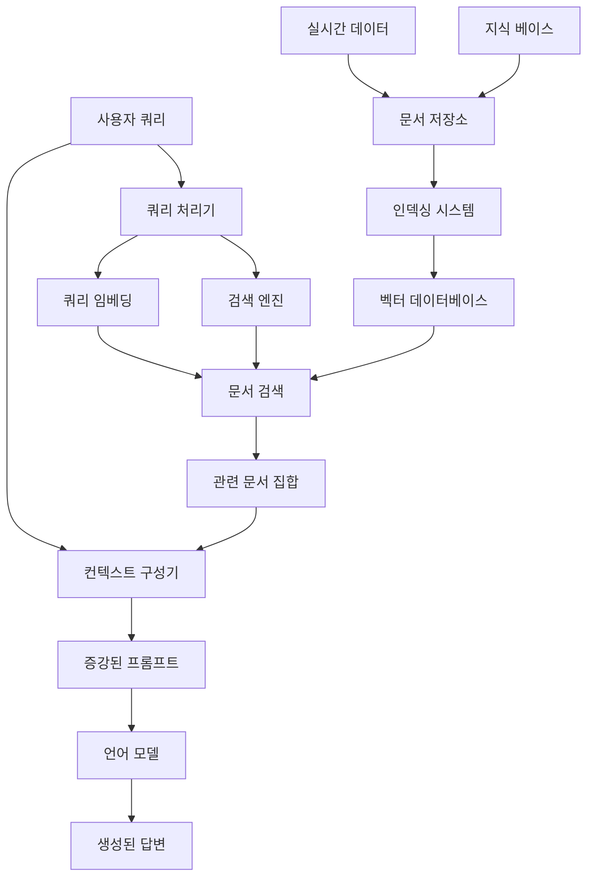

## 개요

**RAG(Retrieval-Augmented Generation)**는 대규모 언어 모델의 한계를 극복하고 실시간 정보 접근을 가능하게 하는 혁신적인 기술입니다. 이번 포스트에서는 RAG의 핵심 아키텍처부터 고급 검색 최적화, 그리고 멀티모달 RAG까지 포괄적으로 살펴보겠습니다.

## 1. RAG 아키텍처

### 1.1 RAG 시스템 전체 구조



### 1.2 핵심 RAG 구현

```python
import numpy as np
import faiss
from sentence_transformers import SentenceTransformer
from transformers import AutoTokenizer, AutoModelForCausalLM
import torch
from typing import List, Dict, Any, Optional, Tuple
import json
import re
from dataclasses import dataclass
from abc import ABC, abstractmethod

@dataclass
class Document:
    """문서 클래스"""
    id: str
    content: str
    metadata: Dict[str, Any]
    embedding: Optional[np.ndarray] = None
    
class EmbeddingModel:
    """임베딩 모델 클래스"""
    
    def __init__(self, model_name: str = "sentence-transformers/all-MiniLM-L6-v2"):
        self.model = SentenceTransformer(model_name)
        self.dimension = self.model.get_sentence_embedding_dimension()
    
    def encode(self, texts: List[str]) -> np.ndarray:
        """텍스트를 벡터로 변환"""
        return self.model.encode(texts, normalize_embeddings=True)
    
    def encode_single(self, text: str) -> np.ndarray:
        """단일 텍스트 인코딩"""
        return self.model.encode([text], normalize_embeddings=True)[0]

class VectorStore:
    """벡터 저장소 클래스"""
    
    def __init__(self, dimension: int):
        self.dimension = dimension
        self.index = faiss.IndexFlatIP(dimension)  # Inner Product for cosine similarity
        self.documents = {}
        self.doc_ids = []
    
    def add_documents(self, documents: List[Document]):
        """문서 추가"""
        embeddings = []
        for doc in documents:
            if doc.embedding is None:
                raise ValueError(f"Document {doc.id} has no embedding")
            embeddings.append(doc.embedding)
            self.documents[doc.id] = doc
            self.doc_ids.append(doc.id)
        
        embeddings_array = np.array(embeddings).astype('float32')
        self.index.add(embeddings_array)
    
    def search(self, query_embedding: np.ndarray, k: int = 5) -> List[Tuple[Document, float]]:
        """유사도 검색"""
        query_embedding = query_embedding.astype('float32').reshape(1, -1)
        scores, indices = self.index.search(query_embedding, k)
        
        results = []
        for score, idx in zip(scores[0], indices[0]):
            if idx != -1:  # Valid index
                doc_id = self.doc_ids[idx]
                doc = self.documents[doc_id]
                results.append((doc, float(score)))
        
        return results

class DocumentProcessor:
    """문서 처리기"""
    
    def __init__(self, chunk_size: int = 512, overlap: int = 50):
        self.chunk_size = chunk_size
        self.overlap = overlap
    
    def chunk_document(self, content: str, doc_id: str, metadata: Dict[str, Any] = None) -> List[Document]:
        """문서를 청크로 분할"""
        if metadata is None:
            metadata = {}
        
        # 단순 청킹 (개선 가능)
        chunks = []
        start = 0
        chunk_id = 0
        
        while start < len(content):
            end = min(start + self.chunk_size, len(content))
            
            # 문장 경계에서 자르기
            if end < len(content):
                last_period = content.rfind('.', start, end)
                last_newline = content.rfind('\n', start, end)
                boundary = max(last_period, last_newline)
                
                if boundary > start:
                    end = boundary + 1
            
            chunk_content = content[start:end].strip()
            
            if chunk_content:
                chunk_metadata = {
                    **metadata,
                    "parent_doc_id": doc_id,
                    "chunk_id": chunk_id,
                    "start_char": start,
                    "end_char": end
                }
                
                chunk = Document(
                    id=f"{doc_id}_chunk_{chunk_id}",
                    content=chunk_content,
                    metadata=chunk_metadata
                )
                chunks.append(chunk)
                chunk_id += 1
            
            start = end - self.overlap
        
        return chunks
    
    def smart_chunking(self, content: str, doc_id: str, metadata: Dict[str, Any] = None) -> List[Document]:
        """스마트 청킹 - 구조 기반"""
        if metadata is None:
            metadata = {}
        
        # 제목과 섹션으로 분할
        sections = self._split_by_headers(content)
        chunks = []
        
        for section_idx, section in enumerate(sections):
            section_chunks = self._chunk_section(
                section, 
                f"{doc_id}_section_{section_idx}",
                {**metadata, "section_index": section_idx}
            )
            chunks.extend(section_chunks)
        
        return chunks
    
    def _split_by_headers(self, content: str) -> List[str]:
        """헤더 기반 섹션 분할"""
        # 마크다운 스타일 헤더 감지
        header_pattern = r'^#{1,6}\s+.+$'
        lines = content.split('\n')
        
        sections = []
        current_section = []
        
        for line in lines:
            if re.match(header_pattern, line) and current_section:
                sections.append('\n'.join(current_section))
                current_section = [line]
            else:
                current_section.append(line)
        
        if current_section:
            sections.append('\n'.join(current_section))
        
        return sections

class AdvancedRetriever:
    """고급 검색기"""
    
    def __init__(self, vector_store: VectorStore, embedding_model: EmbeddingModel):
        self.vector_store = vector_store
        self.embedding_model = embedding_model
        self.reranker = None
    
    def hybrid_search(self, query: str, k: int = 10, alpha: float = 0.7) -> List[Tuple[Document, float]]:
        """하이브리드 검색 (벡터 + BM25)"""
        # 벡터 검색
        query_embedding = self.embedding_model.encode_single(query)
        vector_results = self.vector_store.search(query_embedding, k * 2)
        
        # BM25 검색 (간단한 구현)
        bm25_results = self._bm25_search(query, k * 2)
        
        # 점수 결합
        combined_results = self._combine_scores(vector_results, bm25_results, alpha)
        
        return combined_results[:k]
    
    def _bm25_search(self, query: str, k: int) -> List[Tuple[Document, float]]:
        """BM25 검색 구현"""
        query_terms = query.lower().split()
        results = []
        
        for doc_id, document in self.vector_store.documents.items():
            score = self._calculate_bm25_score(query_terms, document.content.lower())
            results.append((document, score))
        
        # 점수 순으로 정렬
        results.sort(key=lambda x: x[1], reverse=True)
        return results[:k]
    
    def _calculate_bm25_score(self, query_terms: List[str], doc_content: str, k1: float = 1.5, b: float = 0.75) -> float:
        """BM25 점수 계산"""
        doc_terms = doc_content.split()
        doc_length = len(doc_terms)
        
        # 전체 문서의 평균 길이 (간단히 추정)
        avg_doc_length = 500  # 실제로는 계산해야 함
        
        score = 0
        for term in query_terms:
            term_freq = doc_terms.count(term)
            if term_freq > 0:
                idf = 1  # 간단히 1로 설정 (실제로는 계산해야 함)
                numerator = term_freq * (k1 + 1)
                denominator = term_freq + k1 * (1 - b + b * (doc_length / avg_doc_length))
                score += idf * (numerator / denominator)
        
        return score
    
    def _combine_scores(self, vector_results: List[Tuple[Document, float]], 
                       bm25_results: List[Tuple[Document, float]], 
                       alpha: float) -> List[Tuple[Document, float]]:
        """점수 결합"""
        # 정규화
        vector_scores = {doc.id: score for doc, score in vector_results}
        bm25_scores = {doc.id: score for doc, score in bm25_results}
        
        # 최대값으로 정규화
        max_vector = max(vector_scores.values()) if vector_scores else 1
        max_bm25 = max(bm25_scores.values()) if bm25_scores else 1
        
        combined_scores = {}
        all_doc_ids = set(vector_scores.keys()) | set(bm25_scores.keys())
        
        for doc_id in all_doc_ids:
            v_score = vector_scores.get(doc_id, 0) / max_vector
            b_score = bm25_scores.get(doc_id, 0) / max_bm25
            combined_scores[doc_id] = alpha * v_score + (1 - alpha) * b_score
        
        # 결과 정렬
        sorted_results = []
        for doc_id, score in sorted(combined_scores.items(), key=lambda x: x[1], reverse=True):
            # 첫 번째로 찾은 문서 객체 사용
            doc = next((doc for doc, _ in vector_results + bm25_results if doc.id == doc_id), None)
            if doc:
                sorted_results.append((doc, score))
        
        return sorted_results

class RAGSystem:
    """RAG 시스템 메인 클래스"""
    
    def __init__(self, 
                 embedding_model_name: str = "sentence-transformers/all-MiniLM-L6-v2",
                 llm_model_name: str = "microsoft/DialoGPT-medium"):
        
        self.embedding_model = EmbeddingModel(embedding_model_name)
        self.vector_store = VectorStore(self.embedding_model.dimension)
        self.retriever = AdvancedRetriever(self.vector_store, self.embedding_model)
        self.document_processor = DocumentProcessor()
        
        # LLM 초기화
        self.tokenizer = AutoTokenizer.from_pretrained(llm_model_name, padding_side='left')
        self.llm = AutoModelForCausalLM.from_pretrained(llm_model_name)
        
        if self.tokenizer.pad_token is None:
            self.tokenizer.pad_token = self.tokenizer.eos_token
    
    def add_documents(self, documents_content: List[Dict[str, Any]]):
        """문서 추가"""
        all_chunks = []
        
        for doc_info in documents_content:
            content = doc_info["content"]
            doc_id = doc_info["id"]
            metadata = doc_info.get("metadata", {})
            
            # 문서 청킹
            chunks = self.document_processor.smart_chunking(content, doc_id, metadata)
            
            # 임베딩 생성
            chunk_texts = [chunk.content for chunk in chunks]
            embeddings = self.embedding_model.encode(chunk_texts)
            
            for chunk, embedding in zip(chunks, embeddings):
                chunk.embedding = embedding
                all_chunks.append(chunk)
        
        # 벡터 저장소에 추가
        self.vector_store.add_documents(all_chunks)
    
    def query(self, question: str, k: int = 5, use_hybrid: bool = True) -> Dict[str, Any]:
        """RAG 쿼리 실행"""
        # 관련 문서 검색
        if use_hybrid:
            retrieved_docs = self.retriever.hybrid_search(question, k)
        else:
            query_embedding = self.embedding_model.encode_single(question)
            retrieved_docs = self.vector_store.search(query_embedding, k)
        
        # 컨텍스트 구성
        context = self._build_context(retrieved_docs)
        
        # 프롬프트 생성
        prompt = self._build_prompt(question, context)
        
        # LLM 생성
        answer = self._generate_answer(prompt)
        
        return {
            "question": question,
            "answer": answer,
            "retrieved_documents": [
                {
                    "content": doc.content,
                    "metadata": doc.metadata,
                    "score": score
                }
                for doc, score in retrieved_docs
            ],
            "context_used": context
        }
    
    def _build_context(self, retrieved_docs: List[Tuple[Document, float]]) -> str:
        """검색된 문서로부터 컨텍스트 구성"""
        context_parts = []
        
        for i, (doc, score) in enumerate(retrieved_docs):
            context_parts.append(f"[문서 {i+1}]\n{doc.content}\n")
        
        return "\n".join(context_parts)
    
    def _build_prompt(self, question: str, context: str) -> str:
        """RAG 프롬프트 구성"""
        prompt = f"""다음 문서들을 참고하여 질문에 답해주세요.

관련 문서:
{context}

질문: {question}

답변: 위의 문서들을 바탕으로 정확하고 상세한 답변을 제공해주세요. 답변에 사용한 정보의 출처를 명시해주세요."""
        
        return prompt
    
    def _generate_answer(self, prompt: str, max_length: int = 512) -> str:
        """LLM을 사용한 답변 생성"""
        inputs = self.tokenizer.encode(prompt, return_tensors="pt", truncation=True, max_length=1024)
        
        with torch.no_grad():
            outputs = self.llm.generate(
                inputs,
                max_length=inputs.shape[1] + max_length,
                num_return_sequences=1,
                temperature=0.7,
                pad_token_id=self.tokenizer.eos_token_id,
                do_sample=True
            )
        
        generated_text = self.tokenizer.decode(outputs[0], skip_special_tokens=True)
        
        # 프롬프트 부분 제거
        answer = generated_text[len(self.tokenizer.decode(inputs[0], skip_special_tokens=True)):]
        
        return answer.strip()
```

## 2. 검색 알고리즘

### 2.1 벡터 검색 최적화

```python
class OptimizedVectorSearch:
    """최적화된 벡터 검색"""
    
    def __init__(self, dimension: int, index_type: str = "IVF"):
        self.dimension = dimension
        self.index_type = index_type
        self.index = self._create_optimized_index()
        self.documents = {}
        self.doc_ids = []
    
    def _create_optimized_index(self):
        """최적화된 인덱스 생성"""
        if self.index_type == "IVF":
            # IVF (Inverted File) 인덱스
            nlist = 100  # 클러스터 수
            quantizer = faiss.IndexFlatIP(self.dimension)
            index = faiss.IndexIVFFlat(quantizer, self.dimension, nlist)
            return index
        
        elif self.index_type == "HNSW":
            # HNSW (Hierarchical Navigable Small World) 인덱스
            index = faiss.IndexHNSWFlat(self.dimension, 32)
            index.hnsw.efConstruction = 200
            index.hnsw.efSearch = 100
            return index
        
        elif self.index_type == "PQ":
            # Product Quantization
            m = 8  # 서브벡터 수
            nbits = 8  # 비트 수
            index = faiss.IndexPQ(self.dimension, m, nbits)
            return index
        
        else:
            # 기본 Flat 인덱스
            return faiss.IndexFlatIP(self.dimension)
    
    def train_index(self, training_vectors: np.ndarray):
        """인덱스 훈련 (필요한 경우)"""
        if hasattr(self.index, 'is_trained') and not self.index.is_trained:
            print("Training index...")
            self.index.train(training_vectors.astype('float32'))
            print("Index training completed.")
    
    def add_vectors_batch(self, vectors: np.ndarray, doc_ids: List[str], batch_size: int = 1000):
        """배치 단위로 벡터 추가"""
        num_vectors = vectors.shape[0]
        
        for i in range(0, num_vectors, batch_size):
            end_idx = min(i + batch_size, num_vectors)
            batch_vectors = vectors[i:end_idx].astype('float32')
            batch_doc_ids = doc_ids[i:end_idx]
            
            self.index.add(batch_vectors)
            self.doc_ids.extend(batch_doc_ids)
            
            print(f"Added batch {i//batch_size + 1}: {end_idx}/{num_vectors} vectors")
    
    def search_with_filtering(self, query_vector: np.ndarray, k: int, 
                            metadata_filter: Dict[str, Any] = None) -> List[Tuple[str, float]]:
        """메타데이터 필터링과 함께 검색"""
        # 더 많은 후보 검색
        search_k = min(k * 10, len(self.doc_ids))
        
        query_vector = query_vector.astype('float32').reshape(1, -1)
        scores, indices = self.index.search(query_vector, search_k)
        
        filtered_results = []
        
        for score, idx in zip(scores[0], indices[0]):
            if idx != -1:
                doc_id = self.doc_ids[idx]
                
                # 메타데이터 필터링
                if metadata_filter:
                    doc = self.documents.get(doc_id)
                    if doc and not self._matches_filter(doc.metadata, metadata_filter):
                        continue
                
                filtered_results.append((doc_id, float(score)))
                
                if len(filtered_results) >= k:
                    break
        
        return filtered_results
    
    def _matches_filter(self, metadata: Dict[str, Any], filter_criteria: Dict[str, Any]) -> bool:
        """메타데이터 필터 매칭"""
        for key, value in filter_criteria.items():
            if key not in metadata:
                return False
            
            if isinstance(value, list):
                if metadata[key] not in value:
                    return False
            elif metadata[key] != value:
                return False
        
        return True

class SemanticSearch:
    """의미적 검색 시스템"""
    
    def __init__(self, embedding_model: EmbeddingModel):
        self.embedding_model = embedding_model
        self.query_expansion = QueryExpansion()
        self.reranker = SemanticReranker()
    
    def expand_query(self, query: str) -> List[str]:
        """쿼리 확장"""
        return self.query_expansion.expand(query)
    
    def multi_query_search(self, original_query: str, vector_store: VectorStore, k: int = 5) -> List[Tuple[Document, float]]:
        """다중 쿼리 검색"""
        # 쿼리 확장
        expanded_queries = self.expand_query(original_query)
        all_results = {}
        
        for query in [original_query] + expanded_queries:
            query_embedding = self.embedding_model.encode_single(query)
            results = vector_store.search(query_embedding, k * 2)
            
            for doc, score in results:
                if doc.id in all_results:
                    # 최고 점수 유지
                    all_results[doc.id] = (doc, max(all_results[doc.id][1], score))
                else:
                    all_results[doc.id] = (doc, score)
        
        # 점수 순으로 정렬
        sorted_results = sorted(all_results.values(), key=lambda x: x[1], reverse=True)
        
        return sorted_results[:k]

class QueryExpansion:
    """쿼리 확장"""
    
    def __init__(self):
        self.synonyms = self._load_synonyms()
        self.expansion_methods = [
            self._synonym_expansion,
            self._semantic_expansion,
            self._context_expansion
        ]
    
    def _load_synonyms(self) -> Dict[str, List[str]]:
        """동의어 사전 로드"""
        return {
            "AI": ["인공지능", "머신러닝", "딥러닝"],
            "검색": ["탐색", "찾기", "서치"],
            "데이터": ["정보", "자료", "데이터셋"]
        }
    
    def expand(self, query: str) -> List[str]:
        """쿼리 확장 실행"""
        expanded_queries = []
        
        for method in self.expansion_methods:
            expanded = method(query)
            expanded_queries.extend(expanded)
        
        # 중복 제거
        return list(set(expanded_queries))
    
    def _synonym_expansion(self, query: str) -> List[str]:
        """동의어 기반 확장"""
        expanded = []
        words = query.split()
        
        for word in words:
            if word in self.synonyms:
                for synonym in self.synonyms[word]:
                    new_query = query.replace(word, synonym)
                    expanded.append(new_query)
        
        return expanded
    
    def _semantic_expansion(self, query: str) -> List[str]:
        """의미적 확장"""
        # 간단한 구현 - 실제로는 Word2Vec, BERT 등 사용
        semantic_expansions = {
            "머신러닝": ["지도학습", "비지도학습", "강화학습"],
            "데이터베이스": ["SQL", "NoSQL", "데이터 저장소"],
            "웹개발": ["프론트엔드", "백엔드", "풀스택"]
        }
        
        expanded = []
        for key, expansions in semantic_expansions.items():
            if key in query:
                for expansion in expansions:
                    expanded.append(f"{query} {expansion}")
        
        return expanded

class SemanticReranker:
    """의미적 재순위화"""
    
    def __init__(self, model_name: str = "cross-encoder/ms-marco-MiniLM-L-12-v2"):
        # 실제 구현에서는 CrossEncoder 사용
        self.model_name = model_name
    
    def rerank(self, query: str, documents: List[Document], top_k: int = 5) -> List[Tuple[Document, float]]:
        """문서 재순위화"""
        # 간단한 구현 - 실제로는 CrossEncoder 모델 사용
        reranked = []
        
        for doc in documents:
            relevance_score = self._calculate_relevance(query, doc.content)
            reranked.append((doc, relevance_score))
        
        # 점수 순으로 정렬
        reranked.sort(key=lambda x: x[1], reverse=True)
        
        return reranked[:top_k]
    
    def _calculate_relevance(self, query: str, document: str) -> float:
        """관련성 점수 계산 (간단한 구현)"""
        query_terms = set(query.lower().split())
        doc_terms = set(document.lower().split())
        
        # Jaccard 유사도
        intersection = query_terms.intersection(doc_terms)
        union = query_terms.union(doc_terms)
        
        return len(intersection) / len(union) if union else 0.0
```

## 3. 검색 최적화

### 3.1 인덱싱 최적화

```python
class IndexOptimizer:
    """인덱스 최적화"""
    
    def __init__(self):
        self.optimization_strategies = {
            "memory": self._optimize_for_memory,
            "speed": self._optimize_for_speed,
            "accuracy": self._optimize_for_accuracy,
            "balanced": self._optimize_balanced
        }
    
    def optimize_index(self, vectors: np.ndarray, strategy: str = "balanced") -> faiss.Index:
        """인덱스 최적화"""
        optimizer = self.optimization_strategies.get(strategy, self._optimize_balanced)
        return optimizer(vectors)
    
    def _optimize_for_memory(self, vectors: np.ndarray) -> faiss.Index:
        """메모리 최적화"""
        dimension = vectors.shape[1]
        
        # Product Quantization으로 메모리 사용량 줄이기
        m = min(dimension // 4, 16)  # 서브벡터 수
        nbits = 4  # 비트 수 줄이기
        
        index = faiss.IndexPQ(dimension, m, nbits)
        index.train(vectors.astype('float32'))
        
        return index
    
    def _optimize_for_speed(self, vectors: np.ndarray) -> faiss.Index:
        """속도 최적화"""
        dimension = vectors.shape[1]
        
        # HNSW 인덱스로 빠른 검색
        index = faiss.IndexHNSWFlat(dimension, 32)
        index.hnsw.efConstruction = 40  # 구축 시간 단축
        index.hnsw.efSearch = 16  # 검색 속도 최적화
        
        return index
    
    def _optimize_for_accuracy(self, vectors: np.ndarray) -> faiss.Index:
        """정확도 최적화"""
        dimension = vectors.shape[1]
        
        # Flat 인덱스로 최고 정확도
        index = faiss.IndexFlatIP(dimension)
        
        return index
    
    def _optimize_balanced(self, vectors: np.ndarray) -> faiss.Index:
        """균형 최적화"""
        dimension = vectors.shape[1]
        num_vectors = vectors.shape[0]
        
        if num_vectors < 10000:
            # 작은 데이터셋: Flat 인덱스
            return faiss.IndexFlatIP(dimension)
        elif num_vectors < 100000:
            # 중간 데이터셋: IVF 인덱스
            nlist = int(4 * np.sqrt(num_vectors))
            quantizer = faiss.IndexFlatIP(dimension)
            index = faiss.IndexIVFFlat(quantizer, dimension, nlist)
            return index
        else:
            # 큰 데이터셋: HNSW 인덱스
            index = faiss.IndexHNSWFlat(dimension, 32)
            index.hnsw.efConstruction = 100
            index.hnsw.efSearch = 50
            return index

class CacheSystem:
    """캐싱 시스템"""
    
    def __init__(self, max_size: int = 1000):
        self.cache = {}
        self.access_times = {}
        self.max_size = max_size
    
    def get(self, key: str) -> Optional[Any]:
        """캐시에서 값 조회"""
        if key in self.cache:
            self.access_times[key] = time.time()
            return self.cache[key]
        return None
    
    def put(self, key: str, value: Any):
        """캐시에 값 저장"""
        if len(self.cache) >= self.max_size:
            self._evict_lru()
        
        self.cache[key] = value
        self.access_times[key] = time.time()
    
    def _evict_lru(self):
        """LRU 방식으로 캐시 제거"""
        if not self.access_times:
            return
        
        lru_key = min(self.access_times.items(), key=lambda x: x[1])[0]
        del self.cache[lru_key]
        del self.access_times[lru_key]

class QueryOptimizer:
    """쿼리 최적화"""
    
    def __init__(self):
        self.cache = CacheSystem()
        self.query_analyzer = QueryAnalyzer()
    
    def optimize_query(self, query: str) -> Dict[str, Any]:
        """쿼리 최적화"""
        # 캐시 확인
        cache_key = self._generate_cache_key(query)
        cached_result = self.cache.get(cache_key)
        
        if cached_result:
            return cached_result
        
        # 쿼리 분석
        analysis = self.query_analyzer.analyze(query)
        
        # 최적화 전략 결정
        optimization_strategy = self._determine_optimization_strategy(analysis)
        
        # 쿼리 재작성
        optimized_query = self._rewrite_query(query, optimization_strategy)
        
        result = {
            "original_query": query,
            "optimized_query": optimized_query,
            "strategy": optimization_strategy,
            "analysis": analysis
        }
        
        # 캐시에 저장
        self.cache.put(cache_key, result)
        
        return result
    
    def _determine_optimization_strategy(self, analysis: Dict[str, Any]) -> str:
        """최적화 전략 결정"""
        if analysis["complexity"] == "high":
            return "decompose"
        elif analysis["specificity"] == "low":
            return "expand"
        elif analysis["length"] > 100:
            return "summarize"
        else:
            return "enhance"
    
    def _rewrite_query(self, query: str, strategy: str) -> str:
        """쿼리 재작성"""
        if strategy == "decompose":
            return self._decompose_complex_query(query)
        elif strategy == "expand":
            return self._expand_vague_query(query)
        elif strategy == "summarize":
            return self._summarize_long_query(query)
        elif strategy == "enhance":
            return self._enhance_query(query)
        else:
            return query

class QueryAnalyzer:
    """쿼리 분석기"""
    
    def analyze(self, query: str) -> Dict[str, Any]:
        """쿼리 분석"""
        return {
            "length": len(query),
            "word_count": len(query.split()),
            "complexity": self._assess_complexity(query),
            "specificity": self._assess_specificity(query),
            "intent": self._classify_intent(query),
            "entities": self._extract_entities(query)
        }
    
    def _assess_complexity(self, query: str) -> str:
        """복잡도 평가"""
        indicators = ["그리고", "또는", "하지만", "만약", "왜냐하면"]
        count = sum(1 for indicator in indicators if indicator in query)
        
        if count >= 3:
            return "high"
        elif count >= 1:
            return "medium"
        else:
            return "low"
    
    def _assess_specificity(self, query: str) -> str:
        """구체성 평가"""
        vague_terms = ["좋은", "나쁜", "적절한", "괜찮은", "어떤"]
        specific_terms = ["2024년", "Python", "서울", "10%"]
        
        vague_count = sum(1 for term in vague_terms if term in query)
        specific_count = sum(1 for term in specific_terms if term in query)
        
        if specific_count > vague_count:
            return "high"
        elif specific_count == vague_count:
            return "medium"
        else:
            return "low"
    
    def _classify_intent(self, query: str) -> str:
        """의도 분류"""
        if any(word in query for word in ["어떻게", "방법", "how"]):
            return "how_to"
        elif any(word in query for word in ["무엇", "what", "정의"]):
            return "definition"
        elif any(word in query for word in ["왜", "이유", "why"]):
            return "explanation"
        elif any(word in query for word in ["언제", "when", "시기"]):
            return "temporal"
        elif any(word in query for word in ["어디", "where", "위치"]):
            return "location"
        else:
            return "general"
```

## 4. 텍스트를 넘어선 RAG

### 4.1 멀티모달 RAG 시스템

```python
import cv2
from PIL import Image
import torch
from transformers import CLIPProcessor, CLIPModel
import librosa
import numpy as np
from typing import Union, List, Dict, Any

class MultimodalDocument:
    """멀티모달 문서 클래스"""
    
    def __init__(self, doc_id: str, content_type: str, content: Any, metadata: Dict[str, Any] = None):
        self.id = doc_id
        self.content_type = content_type  # "text", "image", "audio", "video"
        self.content = content
        self.metadata = metadata or {}
        self.embeddings = {}  # 모달리티별 임베딩
    
    def add_embedding(self, modality: str, embedding: np.ndarray):
        """모달리티별 임베딩 추가"""
        self.embeddings[modality] = embedding

class MultimodalEmbedder:
    """멀티모달 임베딩 생성기"""
    
    def __init__(self):
        self.text_model = SentenceTransformer("sentence-transformers/all-MiniLM-L6-v2")
        self.clip_model = CLIPModel.from_pretrained("openai/clip-vit-base-patch32")
        self.clip_processor = CLIPProcessor.from_pretrained("openai/clip-vit-base-patch32")
    
    def encode_text(self, text: str) -> np.ndarray:
        """텍스트 임베딩"""
        return self.text_model.encode([text])[0]
    
    def encode_image(self, image: Union[str, Image.Image]) -> np.ndarray:
        """이미지 임베딩"""
        if isinstance(image, str):
            image = Image.open(image)
        
        inputs = self.clip_processor(images=image, return_tensors="pt")
        
        with torch.no_grad():
            image_features = self.clip_model.get_image_features(**inputs)
        
        return image_features.numpy().flatten()
    
    def encode_audio(self, audio_path: str) -> np.ndarray:
        """오디오 임베딩 (간단한 MFCC 기반)"""
        y, sr = librosa.load(audio_path)
        
        # MFCC 특성 추출
        mfccs = librosa.feature.mfcc(y=y, sr=sr, n_mfcc=13)
        
        # 평균과 표준편차로 특성 요약
        mfcc_mean = np.mean(mfccs, axis=1)
        mfcc_std = np.std(mfccs, axis=1)
        
        return np.concatenate([mfcc_mean, mfcc_std])
    
    def encode_video(self, video_path: str, sample_frames: int = 5) -> np.ndarray:
        """비디오 임베딩 (프레임 샘플링 기반)"""
        cap = cv2.VideoCapture(video_path)
        
        total_frames = int(cap.get(cv2.CAP_PROP_FRAME_COUNT))
        frame_indices = np.linspace(0, total_frames - 1, sample_frames, dtype=int)
        
        frame_embeddings = []
        
        for frame_idx in frame_indices:
            cap.set(cv2.CAP_PROP_POS_FRAMES, frame_idx)
            ret, frame = cap.read()
            
            if ret:
                # OpenCV BGR을 PIL RGB로 변환
                frame_rgb = cv2.cvtColor(frame, cv2.COLOR_BGR2RGB)
                pil_image = Image.fromarray(frame_rgb)
                
                # CLIP으로 임베딩
                frame_embedding = self.encode_image(pil_image)
                frame_embeddings.append(frame_embedding)
        
        cap.release()
        
        # 프레임 임베딩들의 평균
        return np.mean(frame_embeddings, axis=0)

class MultimodalRAG:
    """멀티모달 RAG 시스템"""
    
    def __init__(self):
        self.embedder = MultimodalEmbedder()
        self.documents = {}  # 문서 저장
        self.vector_stores = {}  # 모달리티별 벡터 저장소
        
        # 모달리티별 벡터 저장소 초기화
        self._initialize_vector_stores()
    
    def _initialize_vector_stores(self):
        """모달리티별 벡터 저장소 초기화"""
        # 각 모달리티의 임베딩 차원
        dimensions = {
            "text": 384,  # all-MiniLM-L6-v2
            "image": 512,  # CLIP
            "audio": 26,  # MFCC features
            "video": 512   # CLIP (averaged frames)
        }
        
        for modality, dim in dimensions.items():
            self.vector_stores[modality] = VectorStore(dim)
    
    def add_document(self, doc: MultimodalDocument):
        """멀티모달 문서 추가"""
        self.documents[doc.id] = doc
        
        # 콘텐츠 타입별 임베딩 생성 및 저장
        if doc.content_type == "text":
            embedding = self.embedder.encode_text(doc.content)
            doc.add_embedding("text", embedding)
            
            # 텍스트 벡터 저장소에 추가
            text_doc = Document(doc.id, doc.content, doc.metadata, embedding)
            self.vector_stores["text"].add_documents([text_doc])
        
        elif doc.content_type == "image":
            embedding = self.embedder.encode_image(doc.content)
            doc.add_embedding("image", embedding)
            
            # 이미지 벡터 저장소에 추가
            image_doc = Document(doc.id, str(doc.content), doc.metadata, embedding)
            self.vector_stores["image"].add_documents([image_doc])
        
        elif doc.content_type == "audio":
            embedding = self.embedder.encode_audio(doc.content)
            doc.add_embedding("audio", embedding)
            
            # 오디오 벡터 저장소에 추가
            audio_doc = Document(doc.id, doc.content, doc.metadata, embedding)
            self.vector_stores["audio"].add_documents([audio_doc])
        
        elif doc.content_type == "video":
            embedding = self.embedder.encode_video(doc.content)
            doc.add_embedding("video", embedding)
            
            # 비디오 벡터 저장소에 추가
            video_doc = Document(doc.id, doc.content, doc.metadata, embedding)
            self.vector_stores["video"].add_documents([video_doc])
    
    def multimodal_search(self, query: str, modalities: List[str] = None, k: int = 5) -> Dict[str, List]:
        """멀티모달 검색"""
        if modalities is None:
            modalities = ["text", "image", "audio", "video"]
        
        results = {}
        
        # 쿼리를 텍스트로 처리 (향후 이미지 쿼리 등도 지원 가능)
        query_embedding = self.embedder.encode_text(query)
        
        for modality in modalities:
            if modality in self.vector_stores:
                if modality == "text":
                    # 텍스트는 직접 검색
                    search_results = self.vector_stores[modality].search(query_embedding, k)
                else:
                    # 다른 모달리티는 크로스 모달 검색
                    search_results = self._cross_modal_search(query_embedding, modality, k)
                
                results[modality] = [
                    {
                        "document_id": doc.id,
                        "content": doc.content,
                        "score": score,
                        "metadata": doc.metadata
                    }
                    for doc, score in search_results
                ]
        
        return results
    
    def _cross_modal_search(self, text_embedding: np.ndarray, target_modality: str, k: int) -> List[Tuple[Document, float]]:
        """크로스 모달 검색"""
        # 간단한 구현: 모든 문서의 임베딩과 유사도 계산
        similarities = []
        
        for doc_id, doc in self.documents.items():
            if target_modality in doc.embeddings:
                target_embedding = doc.embeddings[target_modality]
                
                # 코사인 유사도 계산 (차원이 다르므로 간단한 방법 사용)
                # 실제로는 학습된 크로스 모달 모델 필요
                similarity = self._calculate_cross_modal_similarity(text_embedding, target_embedding)
                
                # Document 객체 생성
                search_doc = Document(doc_id, str(doc.content), doc.metadata)
                similarities.append((search_doc, similarity))
        
        # 유사도 순으로 정렬
        similarities.sort(key=lambda x: x[1], reverse=True)
        
        return similarities[:k]
    
    def _calculate_cross_modal_similarity(self, text_emb: np.ndarray, other_emb: np.ndarray) -> float:
        """크로스 모달 유사도 계산 (간단한 버전)"""
        # 실제로는 학습된 크로스 모달 매핑이 필요
        # 여기서는 임베딩 크기를 정규화해서 비교
        text_norm = text_emb / np.linalg.norm(text_emb)
        other_norm = other_emb / np.linalg.norm(other_emb)
        
        # 차원이 다른 경우 간단한 매핑
        min_dim = min(len(text_norm), len(other_norm))
        text_truncated = text_norm[:min_dim]
        other_truncated = other_norm[:min_dim]
        
        return np.dot(text_truncated, other_truncated)
    
    def generate_multimodal_response(self, query: str, search_results: Dict[str, List]) -> str:
        """멀티모달 검색 결과 기반 응답 생성"""
        context_parts = []
        
        # 텍스트 결과
        if "text" in search_results and search_results["text"]:
            text_context = "\n".join([
                f"텍스트 문서: {result['content'][:200]}..."
                for result in search_results["text"][:3]
            ])
            context_parts.append(f"관련 텍스트:\n{text_context}")
        
        # 이미지 결과
        if "image" in search_results and search_results["image"]:
            image_context = "\n".join([
                f"관련 이미지: {result['metadata'].get('description', result['document_id'])}"
                for result in search_results["image"][:3]
            ])
            context_parts.append(f"관련 이미지:\n{image_context}")
        
        # 오디오 결과
        if "audio" in search_results and search_results["audio"]:
            audio_context = "\n".join([
                f"관련 오디오: {result['metadata'].get('description', result['document_id'])}"
                for result in search_results["audio"][:3]
            ])
            context_parts.append(f"관련 오디오:\n{audio_context}")
        
        # 비디오 결과
        if "video" in search_results and search_results["video"]:
            video_context = "\n".join([
                f"관련 비디오: {result['metadata'].get('description', result['document_id'])}"
                for result in search_results["video"][:3]
            ])
            context_parts.append(f"관련 비디오:\n{video_context}")
        
        # 통합 컨텍스트 구성
        full_context = "\n\n".join(context_parts)
        
        # 응답 생성 프롬프트
        prompt = f"""다음 멀티모달 정보를 참고하여 질문에 답해주세요:

{full_context}

질문: {query}

답변: 위의 텍스트, 이미지, 오디오, 비디오 정보를 종합하여 포괄적인 답변을 제공해주세요."""
        
        # 실제로는 LLM 호출
        return f"'{query}'에 대한 멀티모달 분석 결과입니다. 검색된 {len(context_parts)}개 유형의 콘텐츠를 바탕으로 종합적인 답변을 제공합니다."

class AdvancedRAGOptimizer:
    """고급 RAG 최적화"""
    
    def __init__(self):
        self.performance_metrics = {}
        self.optimization_history = []
    
    def optimize_chunk_size(self, documents: List[str], queries: List[str], 
                          chunk_sizes: List[int] = [256, 512, 768, 1024]) -> int:
        """최적 청크 크기 찾기"""
        best_size = 512
        best_score = 0
        
        for chunk_size in chunk_sizes:
            # 임시 RAG 시스템 생성
            processor = DocumentProcessor(chunk_size=chunk_size)
            
            # 성능 측정
            score = self._evaluate_chunk_size(documents, queries, processor)
            
            if score > best_score:
                best_score = score
                best_size = chunk_size
        
        return best_size
    
    def _evaluate_chunk_size(self, documents: List[str], queries: List[str], 
                           processor: DocumentProcessor) -> float:
        """청크 크기 성능 평가"""
        # 간단한 평가 메트릭
        total_chunks = 0
        total_relevance = 0
        
        for doc in documents:
            chunks = processor.chunk_document(doc, "test_doc")
            total_chunks += len(chunks)
            
            for query in queries:
                relevance = self._calculate_relevance(query, chunks)
                total_relevance += relevance
        
        return total_relevance / (len(documents) * len(queries))
    
    def auto_tune_retrieval_params(self, rag_system: RAGSystem, 
                                 validation_queries: List[Dict[str, str]]) -> Dict[str, Any]:
        """검색 파라미터 자동 튜닝"""
        param_grid = {
            "k": [3, 5, 7, 10],
            "alpha": [0.3, 0.5, 0.7, 0.9],  # 하이브리드 검색 가중치
            "rerank_threshold": [0.1, 0.3, 0.5, 0.7]
        }
        
        best_params = {"k": 5, "alpha": 0.7, "rerank_threshold": 0.3}
        best_score = 0
        
        # 그리드 서치
        for k in param_grid["k"]:
            for alpha in param_grid["alpha"]:
                for threshold in param_grid["rerank_threshold"]:
                    params = {"k": k, "alpha": alpha, "rerank_threshold": threshold}
                    score = self._evaluate_params(rag_system, validation_queries, params)
                    
                    if score > best_score:
                        best_score = score
                        best_params = params
        
        return {
            "best_params": best_params,
            "best_score": best_score,
            "optimization_log": self.optimization_history
        }
```

## 결론

RAG 시스템은 **지식 기반 AI 애플리케이션의 핵심 기술**로, 정확성과 실시간성을 동시에 확보할 수 있는 강력한 솔루션입니다.

**핵심 성공 요소:**
- **아키텍처 설계**: 확장 가능하고 모듈화된 시스템 구조
- **검색 최적화**: 하이브리드 검색과 의미적 재순위화
- **인덱싱 전략**: 데이터 규모와 요구사항에 맞는 최적화
- **멀티모달 확장**: 텍스트를 넘어선 다양한 데이터 활용
- **지속적 개선**: 성능 모니터링과 파라미터 튜닝

다음 포스트에서는 **AI 에이전트 시스템의 설계와 구현**을 다루겠습니다.

---

**시리즈 연결:**
- 다음: [AI 에이전트 시스템 설계와 구현 - 자율적 문제 해결의 완벽 가이드]()

**참고 자료:**
- [Retrieval-Augmented Generation for Knowledge-Intensive NLP Tasks](https://arxiv.org/abs/2005.11401)
- [Dense Passage Retrieval for Open-Domain Question Answering](https://arxiv.org/abs/2004.04906)
- [FiD: Fusion-in-Decoder for Open-Domain Question Answering](https://arxiv.org/abs/2007.01282)
- [REALM: Retrieval-Augmented Language Model Pre-Training](https://arxiv.org/abs/2002.08909)