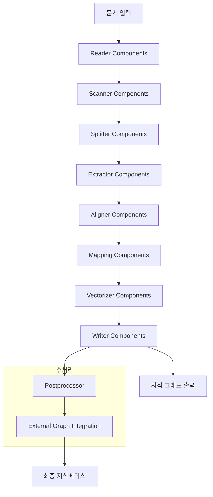

## 개요

이번 포스트에서는 **KAG Builder 모듈**의 상세한 아키텍처를 분석합니다. Builder는 KAG 프레임워크의 핵심 구성 요소로, 다양한 문서 소스에서 지식을 추출하고 구조화된 지식 그래프를 구축하는 역할을 담당합니다.

## 1. KAG Builder 개요

### 1.1 Builder 모듈의 역할

```python
# KAG Builder의 핵심 기능
kag/builder/
├── main_builder.py     # 메인 빌더 진입점
├── runner.py           # 실행 엔진 및 파이프라인
├── default_chain.py    # 기본 처리 체인
└── component/          # 핵심 처리 컴포넌트들
```

**Builder의 주요 임무:**
- **문서 수집**: 다양한 형식의 문서 읽기 및 파싱
- **지식 추출**: 텍스트에서 엔티티 및 관계 추출
- **그래프 구축**: 추출된 지식을 그래프 구조로 변환
- **인덱싱**: 검색 및 추론을 위한 인덱스 생성

### 1.2 전체 처리 파이프라인



## 2. 핵심 컴포넌트 아키텍처

### 2.1 컴포넌트 구조 개요

```python
kag/builder/component/
├── reader/              # 문서 읽기 및 파싱
├── scanner/             # 문서 스캔 및 메타데이터 추출
├── splitter/            # 문서 분할 및 청킹
├── extractor/           # 지식 추출 (NER, 관계 추출)
├── aligner/             # 엔티티 정렬 및 정규화
├── mapping/             # 스키마 매핑 및 변환
├── vectorizer/          # 벡터 임베딩 생성
├── writer/              # 결과 저장 및 출력
├── postprocessor/       # 후처리 및 검증
└── external_graph/      # 외부 그래프 통합
```

### 2.2 컴포넌트 간 데이터 플로우

```python
# 빌더 체인에서의 데이터 전달 구조
class BuilderComponentData:
    """컴포넌트 간 전달되는 데이터 구조"""
    
    def __init__(self):
        self.chunks = []           # 텍스트 청크들
        self.sub_graphs = []       # 서브 그래프들
        self.entities = []         # 추출된 엔티티들
        self.relationships = []    # 추출된 관계들
        self.embeddings = {}       # 벡터 임베딩들
        self.metadata = {}         # 메타데이터
```

## 3. Reader 컴포넌트 - 문서 입력 처리

### 3.1 다양한 문서 형식 지원

```python
kag/builder/component/reader/
├── pdf_reader.py        # PDF 문서 처리
├── docx_reader.py       # Word 문서 처리
├── txt_reader.py        # 텍스트 파일 처리
├── markdown_reader.py   # Markdown 처리
├── dict_reader.py       # 딕셔너리 데이터 처리
├── mix_reader.py        # 혼합 형식 처리
└── markdown_to_graph.py # Markdown → Graph 직접 변환
```

### 3.2 PDF Reader 상세 분석

```python
class PDFReader(ReaderABC):
    """PDF 문서 전문 리더"""
    
    def __init__(self, config: dict):
        self.llm_client = LLMClient.from_config(config)
        self.outline_prompt = OutlinePrompt()
        self.length_splitter = LengthSplitter()
    
    def invoke(self, input: Input) -> Output:
        """PDF 처리 메인 로직"""
        # 1. PDF 메타데이터 추출
        metadata = self._extract_pdf_metadata(input.file_path)
        
        # 2. 텍스트 추출
        pages = self._extract_text_from_pdf(input.file_path)
        
        # 3. 구조화 (목차, 섹션 분석)
        structure = self._analyze_document_structure(pages)
        
        # 4. 청크 생성
        chunks = self._create_chunks(pages, structure)
        
        return Output(chunks=chunks, metadata=metadata)
    
    def _extract_text_from_pdf(self, file_path: str) -> List[LTPage]:
        """PDF에서 텍스트 추출"""
        pages = []
        for page_layout in extract_pages(file_path):
            page_text = ""
            for element in page_layout:
                if isinstance(element, LTTextContainer):
                    page_text += element.get_text()
            pages.append(page_text)
        return pages
    
    def _analyze_document_structure(self, pages: List[str]) -> Dict:
        """LLM을 활용한 문서 구조 분석"""
        combined_text = "\n".join(pages[:5])  # 처음 5페이지 분석
        
        prompt = self.outline_prompt.build_prompt(combined_text)
        structure_response = self.llm_client.invoke(prompt)
        
        return self._parse_structure_response(structure_response)
```

### 3.3 지능형 문서 구조 인식

```python
class OutlinePrompt:
    """문서 구조 분석을 위한 프롬프트"""
    
    def build_prompt(self, document_text: str) -> str:
        return f"""
        다음 문서의 구조를 분석하고 목차를 추출하세요:
        
        문서 내용:
        {document_text}
        
        분석 결과를 다음 JSON 형식으로 반환하세요:
        {{
            "title": "문서 제목",
            "sections": [
                {{"level": 1, "title": "섹션 제목", "page": 1}},
                ...
            ],
            "document_type": "논문|보고서|매뉴얼|기타"
        }}
        """
```

## 4. Extractor 컴포넌트 - 지식 추출

### 4.1 추출기 유형별 분류

```python
kag/builder/component/extractor/
├── entity_extractor.py     # 개체명 인식 (NER)
├── relation_extractor.py   # 관계 추출
├── concept_extractor.py    # 개념 추출
├── event_extractor.py      # 이벤트 추출
├── llm_extractor.py        # LLM 기반 통합 추출
└── schema_extractor.py     # 스키마 기반 추출
```

### 4.2 LLM 기반 지식 추출기

```python
class LLMKnowledgeExtractor:
    """LLM을 활용한 통합 지식 추출기"""
    
    def __init__(self, config: dict):
        self.llm_client = LLMClient.from_config(config)
        self.extraction_prompt = self._load_extraction_prompts()
    
    async def extract_knowledge(self, chunk: Chunk) -> SubGraph:
        """텍스트 청크에서 지식 추출"""
        
        # 1. 엔티티 추출
        entities = await self._extract_entities(chunk.content)
        
        # 2. 관계 추출  
        relationships = await self._extract_relationships(
            chunk.content, entities
        )
        
        # 3. 서브그래프 구성
        sub_graph = SubGraph()
        
        # 노드 추가
        for entity in entities:
            node = Node(
                id=generate_hash_id(entity['name']),
                type=entity['type'],
                properties=entity['properties']
            )
            sub_graph.add_node(node)
        
        # 엣지 추가
        for rel in relationships:
            edge = Edge(
                source_id=rel['source'],
                target_id=rel['target'],
                type=rel['type'],
                properties=rel['properties']
            )
            sub_graph.add_edge(edge)
        
        return sub_graph
    
    async def _extract_entities(self, text: str) -> List[Dict]:
        """엔티티 추출"""
        prompt = f"""
        다음 텍스트에서 주요 엔티티를 추출하세요:
        
        텍스트: {text}
        
        다음 형식으로 반환하세요:
        [
            {{
                "name": "엔티티 이름",
                "type": "PERSON|ORGANIZATION|LOCATION|CONCEPT|EVENT",
                "properties": {{"description": "설명", "category": "카테고리"}}
            }}
        ]
        """
        
        response = await self.llm_client.invoke(prompt)
        return self._parse_entities(response)
    
    async def _extract_relationships(self, text: str, entities: List[Dict]) -> List[Dict]:
        """관계 추출"""
        entity_names = [e['name'] for e in entities]
        
        prompt = f"""
        다음 텍스트에서 엔티티들 간의 관계를 추출하세요:
        
        텍스트: {text}
        엔티티들: {entity_names}
        
        관계를 다음 형식으로 반환하세요:
        [
            {{
                "source": "소스 엔티티",
                "target": "타겟 엔티티", 
                "type": "관계 유형",
                "properties": {{"confidence": 0.9, "context": "관계 컨텍스트"}}
            }}
        ]
        """
        
        response = await self.llm_client.invoke(prompt)
        return self._parse_relationships(response)
```

### 4.3 스키마 기반 추출

```python
class SchemaBasedExtractor:
    """도메인 특화 스키마 기반 추출기"""
    
    def __init__(self, schema_config: Dict):
        self.entity_schema = schema_config['entities']
        self.relation_schema = schema_config['relations']
        self.extraction_rules = schema_config['rules']
    
    def extract_with_schema(self, text: str) -> SubGraph:
        """스키마에 따른 구조화된 추출"""
        
        sub_graph = SubGraph()
        
        # 스키마 정의된 엔티티 타입별 추출
        for entity_type, schema in self.entity_schema.items():
            entities = self._extract_typed_entities(text, entity_type, schema)
            
            for entity in entities:
                node = self._create_schema_node(entity, schema)
                sub_graph.add_node(node)
        
        # 스키마 정의된 관계 추출
        for relation_type, schema in self.relation_schema.items():
            relations = self._extract_typed_relations(text, relation_type, schema)
            
            for relation in relations:
                edge = self._create_schema_edge(relation, schema)
                sub_graph.add_edge(edge)
        
        return sub_graph
```

## 5. Splitter 컴포넌트 - 텍스트 분할

### 5.1 다양한 분할 전략

```python
kag/builder/component/splitter/
├── length_splitter.py      # 길이 기반 분할
├── semantic_splitter.py    # 의미 기반 분할
├── sentence_splitter.py    # 문장 단위 분할
├── paragraph_splitter.py   # 단락 단위 분할
└── hybrid_splitter.py      # 하이브리드 분할
```

### 5.2 의미 기반 지능형 분할

```python
class SemanticSplitter:
    """의미 단위 기반 텍스트 분할기"""
    
    def __init__(self, config: dict):
        self.max_chunk_size = config.get('max_chunk_size', 1000)
        self.overlap_size = config.get('overlap_size', 100)
        self.embedding_model = config.get('embedding_model')
        self.similarity_threshold = config.get('similarity_threshold', 0.7)
    
    def split_text(self, text: str) -> List[Chunk]:
        """의미 기반 텍스트 분할"""
        
        # 1. 문장 단위로 1차 분할
        sentences = self._split_into_sentences(text)
        
        # 2. 문장들의 임베딩 계산
        embeddings = self._compute_embeddings(sentences)
        
        # 3. 의미적 유사도 기반 클러스터링
        clusters = self._semantic_clustering(sentences, embeddings)
        
        # 4. 클러스터를 청크로 변환
        chunks = []
        for cluster in clusters:
            chunk_text = " ".join(cluster['sentences'])
            
            if len(chunk_text) <= self.max_chunk_size:
                chunks.append(Chunk(
                    content=chunk_text,
                    metadata={
                        'semantic_cluster_id': cluster['id'],
                        'coherence_score': cluster['coherence'],
                        'sentence_count': len(cluster['sentences'])
                    }
                ))
            else:
                # 너무 큰 클러스터는 재분할
                sub_chunks = self._split_large_cluster(cluster)
                chunks.extend(sub_chunks)
        
        return chunks
    
    def _semantic_clustering(self, sentences: List[str], embeddings: List) -> List[Dict]:
        """의미적 유사도 기반 문장 클러스터링"""
        clusters = []
        current_cluster = {'sentences': [sentences[0]], 'embeddings': [embeddings[0]]}
        
        for i in range(1, len(sentences)):
            # 현재 클러스터와의 평균 유사도 계산
            avg_similarity = self._calculate_cluster_similarity(
                embeddings[i], current_cluster['embeddings']
            )
            
            if avg_similarity >= self.similarity_threshold:
                # 현재 클러스터에 추가
                current_cluster['sentences'].append(sentences[i])
                current_cluster['embeddings'].append(embeddings[i])
            else:
                # 새 클러스터 시작
                clusters.append(self._finalize_cluster(current_cluster))
                current_cluster = {
                    'sentences': [sentences[i]], 
                    'embeddings': [embeddings[i]]
                }
        
        clusters.append(self._finalize_cluster(current_cluster))
        return clusters
```

## 6. Vectorizer 컴포넌트 - 임베딩 생성

### 6.1 다중 임베딩 전략

```python
class MultiModalVectorizer:
    """다중 모달 벡터화 엔진"""
    
    def __init__(self, config: dict):
        self.text_embedder = self._init_text_embedder(config)
        self.graph_embedder = self._init_graph_embedder(config)
        self.fusion_strategy = config.get('fusion_strategy', 'concatenation')
    
    def vectorize_knowledge(self, sub_graph: SubGraph) -> Dict[str, np.ndarray]:
        """지식 그래프의 다중 임베딩 생성"""
        
        embeddings = {}
        
        # 1. 텍스트 임베딩
        for node in sub_graph.nodes:
            text_emb = self.text_embedder.encode(node.properties.get('description', ''))
            embeddings[f"text_{node.id}"] = text_emb
        
        # 2. 그래프 구조 임베딩
        graph_emb = self.graph_embedder.encode_graph(sub_graph)
        embeddings['graph_structure'] = graph_emb
        
        # 3. 노드 임베딩 (GraphSAGE, Node2Vec 등)
        node_embeddings = self._compute_node_embeddings(sub_graph)
        for node_id, emb in node_embeddings.items():
            embeddings[f"node_{node_id}"] = emb
        
        # 4. 관계 임베딩
        relation_embeddings = self._compute_relation_embeddings(sub_graph)
        embeddings.update(relation_embeddings)
        
        return embeddings
    
    def _compute_node_embeddings(self, sub_graph: SubGraph) -> Dict[str, np.ndarray]:
        """노드 임베딩 계산 (Graph Neural Network 기반)"""
        
        # NetworkX 그래프로 변환
        nx_graph = self._to_networkx(sub_graph)
        
        # Node2Vec 임베딩
        from node2vec import Node2Vec
        
        node2vec = Node2Vec(
            nx_graph, 
            dimensions=128,
            walk_length=30,
            num_walks=200,
            workers=4
        )
        
        model = node2vec.fit(window=10, min_count=1, batch_words=4)
        
        embeddings = {}
        for node_id in nx_graph.nodes():
            try:
                embeddings[node_id] = model.wv[node_id]
            except KeyError:
                # 임베딩이 없는 경우 영벡터
                embeddings[node_id] = np.zeros(128)
        
        return embeddings
```

## 7. Writer 컴포넌트 - 결과 저장

### 7.1 다중 저장 백엔드 지원

```python
class MultiBackendWriter:
    """다중 백엔드 동시 저장"""
    
    def __init__(self, config: dict):
        self.neo4j_writer = Neo4jGraphWriter(config['neo4j'])
        self.es_writer = ElasticsearchWriter(config['elasticsearch'])
        self.vector_writer = VectorDBWriter(config['vector_db'])
    
    async def write_knowledge(self, sub_graphs: List[SubGraph], embeddings: Dict):
        """지식을 다중 백엔드에 동시 저장"""
        
        tasks = []
        
        # 1. Neo4j에 그래프 구조 저장
        tasks.append(self._write_to_neo4j(sub_graphs))
        
        # 2. Elasticsearch에 검색 인덱스 저장  
        tasks.append(self._write_to_elasticsearch(sub_graphs))
        
        # 3. 벡터 DB에 임베딩 저장
        tasks.append(self._write_to_vector_db(embeddings))
        
        # 병렬 실행
        results = await asyncio.gather(*tasks, return_exceptions=True)
        
        # 결과 검증 및 오류 처리
        self._handle_write_results(results)
    
    async def _write_to_neo4j(self, sub_graphs: List[SubGraph]):
        """Neo4j 그래프 저장"""
        for sub_graph in sub_graphs:
            # 노드 저장
            for node in sub_graph.nodes:
                await self.neo4j_writer.create_node(
                    labels=[node.type],
                    properties=node.properties
                )
            
            # 관계 저장
            for edge in sub_graph.edges:
                await self.neo4j_writer.create_relationship(
                    source_id=edge.source_id,
                    target_id=edge.target_id,
                    relation_type=edge.type,
                    properties=edge.properties
                )
```

## 8. Builder 실행 엔진

### 8.1 파이프라인 실행기

```python
class BuilderChainStreamRunner:
    """스트림 기반 빌더 체인 실행기"""
    
    def __init__(self, components: List[BuilderComponent]):
        self.components = components
        self.checkpointer = CheckpointerManager()
        self.progress_tracker = tqdm()
    
    async def run_pipeline(self, input_data: Input) -> Output:
        """전체 파이프라인 실행"""
        
        current_data = BuilderComponentData()
        current_data.input = input_data
        
        for i, component in enumerate(self.components):
            try:
                # 체크포인트 복원
                checkpoint_key = f"component_{i}_{component.__class__.__name__}"
                if self.checkpointer.has_checkpoint(checkpoint_key):
                    current_data = self.checkpointer.restore(checkpoint_key)
                else:
                    # 컴포넌트 실행
                    current_data = await self._run_component(component, current_data)
                    
                    # 체크포인트 저장
                    self.checkpointer.save(checkpoint_key, current_data)
                
                # 진행 상황 업데이트
                self.progress_tracker.update(1)
                
            except Exception as e:
                logger.error(f"Component {component.__class__.__name__} failed: {e}")
                await self._handle_component_failure(component, e, current_data)
        
        return self._finalize_output(current_data)
    
    async def _run_component(self, component: BuilderComponent, data: BuilderComponentData):
        """개별 컴포넌트 실행"""
        
        # 컴포넌트별 병렬 처리
        if component.supports_parallel:
            return await self._run_parallel(component, data)
        else:
            return await component.invoke(data)
    
    async def _run_parallel(self, component: BuilderComponent, data: BuilderComponentData):
        """병렬 처리 실행"""
        
        # 입력 데이터 분할
        batches = self._split_data_for_parallel(data, component.batch_size)
        
        # 병렬 실행
        with ProcessPoolExecutor(max_workers=component.max_workers) as executor:
            tasks = []
            for batch in batches:
                task = executor.submit(component.invoke, batch)
                tasks.append(task)
            
            results = []
            for future in as_completed(tasks):
                try:
                    result = await asyncio.wrap_future(future)
                    results.append(result)
                except Exception as e:
                    logger.error(f"Batch processing failed: {e}")
                    results.append(None)
        
        # 결과 병합
        return self._merge_parallel_results(results)
```

## 9. 성능 최적화 및 확장성

### 9.1 메모리 효율적 스트림 처리

```python
class StreamProcessor:
    """메모리 효율적인 스트림 처리"""
    
    def __init__(self, buffer_size: int = 1000):
        self.buffer_size = buffer_size
        self.processing_queue = asyncio.Queue(maxsize=buffer_size)
    
    async def process_stream(self, data_stream):
        """스트림 데이터 처리"""
        
        # 생산자-소비자 패턴
        producer_task = asyncio.create_task(
            self._produce_chunks(data_stream)
        )
        
        consumer_tasks = [
            asyncio.create_task(self._consume_chunks())
            for _ in range(4)  # 4개 소비자
        ]
        
        # 모든 작업 완료 대기
        await asyncio.gather(producer_task, *consumer_tasks)
    
    async def _produce_chunks(self, data_stream):
        """데이터 청크 생산"""
        async for chunk in data_stream:
            await self.processing_queue.put(chunk)
        
        # 종료 신호
        for _ in range(4):
            await self.processing_queue.put(None)
    
    async def _consume_chunks(self):
        """데이터 청크 소비 및 처리"""
        while True:
            chunk = await self.processing_queue.get()
            if chunk is None:
                break
            
            # 청크 처리
            await self._process_chunk(chunk)
            self.processing_queue.task_done()
```

### 9.2 분산 처리 지원

```python
class DistributedBuilder:
    """분산 빌더 처리"""
    
    def __init__(self, cluster_config: dict):
        self.worker_nodes = cluster_config['workers']
        self.coordinator = cluster_config['coordinator']
        self.task_scheduler = DistributedTaskScheduler()
    
    async def distributed_build(self, large_dataset):
        """대규모 데이터셋 분산 처리"""
        
        # 1. 데이터 파티셔닝
        partitions = self._partition_dataset(large_dataset)
        
        # 2. 워커 노드에 작업 분배
        tasks = []
        for partition in partitions:
            worker = self.task_scheduler.get_available_worker()
            task = self._submit_partition_task(worker, partition)
            tasks.append(task)
        
        # 3. 분산 실행 및 결과 수집
        partial_results = await asyncio.gather(*tasks)
        
        # 4. 결과 병합 및 후처리
        final_result = await self._merge_distributed_results(partial_results)
        
        return final_result
```

## 결론

KAG Builder 모듈은 **모듈화된 컴포넌트 아키텍처**와 **지능형 처리 파이프라인**을 통해 복잡한 지식 추출 및 그래프 구축 작업을 효율적으로 수행합니다.

**핵심 혁신 포인트:**
- **다형성 지원**: 다양한 문서 형식과 데이터 소스 처리
- **LLM 통합**: 대규모 언어 모델을 활용한 지능형 추출
- **병렬 처리**: 고성능 분산 처리 아키텍처
- **확장성**: 플러그인 방식의 컴포넌트 확장

다음 포스트에서는 KAG Solver 모듈의 추론 엔진과 질의 처리 시스템을 상세히 분석하겠습니다.

---

**연관 포스트:**
- [KAG (Knowledge Augmented Generation) 프로젝트 개요 및 아키텍처 심층 분석]()
- [KAG Docker 컨테이너 오케스트레이션 및 마이크로서비스 아키텍처 심층 분석]()

**참고 자료:**
- [LangChain 문서 처리](https://python.langchain.com/docs/modules/data_connection/document_loaders/)
- [NetworkX 그래프 라이브러리](https://networkx.org/)
- [Node2Vec 그래프 임베딩](https://github.com/aditya-grover/node2vec)
- [PDFMiner Python 라이브러리](https://github.com/pdfminer/pdfminer.six)