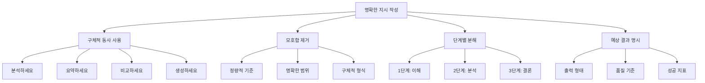

## 개요

효과적인 **프롬프트 엔지니어링**은 단순한 지시문 작성을 넘어서 체계적인 설계 원칙과 반복적 개선 과정을 필요로 합니다. 이번 포스트에서는 실전에서 바로 적용할 수 있는 프롬프트 엔지니어링 모범 사례들을 상세히 살펴보겠습니다.

## 1. 명확하고 명시적인 지시 작성하기

### 1.1 명확성 원칙



### 1.2 명확성 향상 기법

```python
class ClarityEnhancer:
    """명확성 향상 도구"""
    
    def __init__(self):
        self.clarity_patterns = {
            "vague_verbs": {
                "해주세요": "구체적으로 분석해주세요",
                "알려주세요": "다음 형식으로 설명해주세요",
                "만들어주세요": "명시된 기준에 따라 생성해주세요"
            },
            "ambiguous_terms": {
                "좋은": "정확하고 유용한",
                "적절한": "다음 기준에 맞는",
                "간단한": "3문장 이하의",
                "자세한": "각 항목별로 구체적인"
            },
            "quantitative_specifiers": {
                "몇 개": "정확히 5개",
                "약간": "20% 정도",
                "많이": "10개 이상",
                "조금": "3개 이하"
            }
        }
    
    def enhance_clarity(self, prompt):
        """프롬프트 명확성 향상"""
        enhanced_prompt = prompt
        improvements = []
        
        # 모호한 동사 개선
        for vague, specific in self.clarity_patterns["vague_verbs"].items():
            if vague in enhanced_prompt:
                enhanced_prompt = enhanced_prompt.replace(vague, specific)
                improvements.append(f"동사 명확화: '{vague}' → '{specific}'")
        
        # 모호한 용어 구체화
        for ambiguous, specific in self.clarity_patterns["ambiguous_terms"].items():
            if ambiguous in enhanced_prompt:
                enhanced_prompt = enhanced_prompt.replace(ambiguous, specific)
                improvements.append(f"용어 구체화: '{ambiguous}' → '{specific}'")
        
        # 정량적 표현 추가
        enhanced_prompt = self._add_quantitative_specifications(enhanced_prompt)
        
        # 출력 형식 명시
        if "형식" not in enhanced_prompt and "포맷" not in enhanced_prompt:
            format_specification = self._generate_format_specification(enhanced_prompt)
            enhanced_prompt += f"\n\n{format_specification}"
            improvements.append("출력 형식 명시 추가")
        
        return {
            "enhanced_prompt": enhanced_prompt,
            "improvements": improvements,
            "clarity_score": self._calculate_clarity_score(enhanced_prompt)
        }
    
    def _add_quantitative_specifications(self, prompt):
        """정량적 명세 추가"""
        specifications = {
            "목록": "정확히 5개 항목의 목록",
            "예시": "구체적인 3개의 예시",
            "단계": "명확한 순서의 단계별 과정",
            "비교": "최소 3가지 기준에 따른 체계적 비교"
        }
        
        enhanced = prompt
        for general, specific in specifications.items():
            if general in prompt and specific not in prompt:
                enhanced = enhanced.replace(general, specific)
        
        return enhanced
    
    def create_instruction_template(self, task_type):
        """작업 유형별 지시 템플릿"""
        templates = {
            "analysis": """
다음 데이터를 체계적으로 분석해주세요:

분석 대상: {input_data}

분석 요구사항:
1. 핵심 패턴과 트렌드 식별
2. 정량적 지표 계산 (평균, 증감률, 분포 등)
3. 주목할 만한 이상치나 특이사항 발견
4. 비즈니스 임팩트 관점에서의 해석

출력 형식:
- 요약 (2-3문장)
- 주요 발견사항 (번호 매긴 목록)
- 정량적 지표 (표 형태)
- 권장사항 (실행 가능한 3가지)

제약 조건:
- 객관적 사실에 기반한 분석
- 불확실한 부분은 명시적으로 표현
- 전문 용어 사용 시 간단한 설명 포함
""",
            
            "creation": """
다음 요구사항에 맞는 {output_type}을 생성해주세요:

생성 조건:
- 목적: {purpose}
- 대상 청중: {audience}
- 톤앤매너: {tone}
- 길이: {length}

필수 포함 요소:
{required_elements}

품질 기준:
- 창의성과 독창성
- 논리적 구조와 흐름
- 대상 청중에 적합한 언어 수준
- 목적 달성을 위한 설득력

출력 형식:
{output_format}
""",
            
            "comparison": """
다음 대상들을 체계적으로 비교 분석해주세요:

비교 대상: {comparison_items}

비교 기준:
{comparison_criteria}

분석 방법:
1. 각 기준별 정량적/정성적 평가
2. 상대적 장단점 분석
3. 사용 상황별 적합성 평가
4. 종합적 순위 및 추천

출력 형식:
- 비교 표 (기준별 점수)
- 기준별 상세 분석
- 상황별 추천 매트릭스
- 최종 결론 및 권고사항
"""
        }
        
        return templates.get(task_type, templates["analysis"])

class ContextProvider:
    """컨텍스트 제공 최적화기"""
    
    def __init__(self):
        self.context_categories = {
            "background": "배경 정보",
            "constraints": "제약 조건",
            "goals": "목표와 기대 결과",
            "audience": "대상 청중",
            "format": "출력 형식",
            "examples": "참고 예시"
        }
    
    def build_comprehensive_context(self, base_prompt, context_data):
        """종합적 컨텍스트 구성"""
        context_sections = []
        
        # 배경 정보 추가
        if "background" in context_data:
            background_section = f"""
배경 정보:
{context_data['background']}
이 배경을 고려하여 다음 작업을 수행해주세요.
"""
            context_sections.append(background_section)
        
        # 목표 명시
        if "goals" in context_data:
            goals_section = f"""
달성 목표:
{self._format_goals(context_data['goals'])}
"""
            context_sections.append(goals_section)
        
        # 제약 조건
        if "constraints" in context_data:
            constraints_section = f"""
제약 조건:
{self._format_constraints(context_data['constraints'])}
"""
            context_sections.append(constraints_section)
        
        # 대상 청중 고려사항
        if "audience" in context_data:
            audience_section = f"""
대상 청중: {context_data['audience']}
이 청중에게 적합한 언어 수준과 설명 방식을 사용해주세요.
"""
            context_sections.append(audience_section)
        
        # 전체 프롬프트 구성
        full_context = "\n".join(context_sections)
        
        return f"""
{full_context}

주요 작업:
{base_prompt}

{self._add_output_specifications(context_data)}
"""
    
    def _format_goals(self, goals):
        """목표 형식화"""
        if isinstance(goals, list):
            return "\n".join(f"- {goal}" for goal in goals)
        return str(goals)
    
    def _add_output_specifications(self, context_data):
        """출력 명세 추가"""
        specifications = []
        
        if "format" in context_data:
            specifications.append(f"출력 형식: {context_data['format']}")
        
        if "length" in context_data:
            specifications.append(f"길이 요구사항: {context_data['length']}")
        
        if "style" in context_data:
            specifications.append(f"작성 스타일: {context_data['style']}")
        
        if specifications:
            return f"""
출력 요구사항:
{chr(10).join(f"- {spec}" for spec in specifications)}
"""
        return ""

class TaskDecomposer:
    """복잡한 작업 분해기"""
    
    def __init__(self):
        self.decomposition_strategies = {
            "sequential": self._sequential_decomposition,
            "hierarchical": self._hierarchical_decomposition,
            "parallel": self._parallel_decomposition,
            "iterative": self._iterative_decomposition
        }
    
    def decompose_complex_task(self, complex_prompt, strategy="sequential"):
        """복잡한 작업 분해"""
        decomposer = self.decomposition_strategies.get(strategy)
        if not decomposer:
            raise ValueError(f"Unknown decomposition strategy: {strategy}")
        
        return decomposer(complex_prompt)
    
    def _sequential_decomposition(self, complex_prompt):
        """순차적 분해"""
        # 작업의 자연스러운 순서 파악
        task_analysis = self._analyze_task_components(complex_prompt)
        
        sequential_steps = [
            {
                "step": 1,
                "title": "정보 수집 및 이해",
                "instruction": "주어진 정보를 정리하고 핵심 요소를 파악하세요.",
                "output": "구조화된 정보 요약"
            },
            {
                "step": 2,
                "title": "분석 및 처리",
                "instruction": "1단계에서 정리한 정보를 바탕으로 요구된 분석을 수행하세요.",
                "output": "분석 결과 및 인사이트"
            },
            {
                "step": 3,
                "title": "결론 도출 및 제안",
                "instruction": "분석 결과를 바탕으로 결론을 도출하고 실행 가능한 제안을 만드세요.",
                "output": "최종 결론 및 권장사항"
            }
        ]
        
        return {
            "strategy": "sequential",
            "total_steps": len(sequential_steps),
            "steps": sequential_steps,
            "execution_prompt": self._create_execution_prompt(sequential_steps)
        }
    
    def _hierarchical_decomposition(self, complex_prompt):
        """계층적 분해"""
        hierarchy = {
            "main_task": complex_prompt,
            "sub_tasks": [
                {
                    "level": 1,
                    "task": "고수준 개요 작성",
                    "description": "전체 작업의 구조와 접근 방법 계획",
                    "sub_sub_tasks": [
                        "요구사항 명확화",
                        "작업 범위 정의",
                        "성공 기준 설정"
                    ]
                },
                {
                    "level": 1,
                    "task": "세부 분석 수행",
                    "description": "각 구성 요소에 대한 상세 분석",
                    "sub_sub_tasks": [
                        "데이터 수집 및 정리",
                        "패턴 및 트렌드 분석",
                        "예외 사항 및 특이점 식별"
                    ]
                },
                {
                    "level": 1,
                    "task": "통합 및 결론",
                    "description": "분석 결과를 통합하여 최종 결론 도출",
                    "sub_sub_tasks": [
                        "결과 종합",
                        "인사이트 도출",
                        "실행 계획 수립"
                    ]
                }
            ]
        }
        
        return hierarchy
    
    def create_step_by_step_prompt(self, original_task):
        """단계별 프롬프트 생성"""
        decomposed = self.decompose_complex_task(original_task, "sequential")
        
        step_prompts = []
        
        for step in decomposed["steps"]:
            step_prompt = f"""
=== 단계 {step['step']}: {step['title']} ===

이전 단계 결과를 바탕으로 다음 작업을 수행하세요:

{step['instruction']}

기대 출력: {step['output']}

출력 형식:
- 명확하고 구조화된 형태
- 다음 단계에서 활용 가능한 정보 포함
- 현재 단계의 핵심 성과 요약
"""
            step_prompts.append(step_prompt)
        
        return step_prompts
```

## 2. 모델에게 생각할 시간 주기

### 2.1 사고 시간 확보 기법

```python
class ThinkingTimeProvider:
    """사고 시간 제공기"""
    
    def __init__(self):
        self.thinking_techniques = {
            "chain_of_thought": self._chain_of_thought_prompt,
            "step_by_step": self._step_by_step_prompt,
            "reflection": self._reflection_prompt,
            "verification": self._verification_prompt
        }
    
    def add_thinking_time(self, base_prompt, technique="chain_of_thought"):
        """사고 시간 추가"""
        thinking_enhancer = self.thinking_techniques.get(technique)
        if not thinking_enhancer:
            raise ValueError(f"Unknown thinking technique: {technique}")
        
        return thinking_enhancer(base_prompt)
    
    def _chain_of_thought_prompt(self, base_prompt):
        """사고 연쇄 프롬프트"""
        return f"""
{base_prompt}

다음과 같이 단계별로 생각해보세요:

1. 문제 이해: 주어진 문제나 작업을 명확히 이해하고 핵심 요소를 파악하세요.

2. 접근 방법: 이 문제를 해결하기 위한 최적의 접근 방법을 선택하세요.

3. 단계별 분석: 각 단계별로 차근차근 분석을 진행하세요.

4. 중간 검증: 각 단계의 결과가 논리적으로 타당한지 검증하세요.

5. 최종 결론: 모든 분석을 종합하여 최종 답안을 도출하세요.

사고 과정을 모두 보여주신 후 최종 답안을 제시해주세요.
"""
    
    def _step_by_step_prompt(self, base_prompt):
        """단계별 사고 프롬프트"""
        return f"""
{base_prompt}

이 문제를 단계별로 해결해보겠습니다:

단계 1: 주어진 정보 정리
- 

단계 2: 핵심 문제 식별
- 

단계 3: 해결 방법 탐색
- 

단계 4: 솔루션 구현
- 

단계 5: 결과 검증
- 

각 단계를 완료한 후 다음 단계로 진행해주세요.
"""
    
    def _reflection_prompt(self, base_prompt):
        """성찰적 사고 프롬프트"""
        return f"""
{base_prompt}

이 문제에 대해 깊이 생각해보겠습니다:

첫 번째 접근:
[문제에 대한 첫 번째 해결 시도]

성찰과 재검토:
- 이 접근법의 장점은 무엇인가?
- 놓친 부분이나 개선할 점은 없는가?
- 다른 관점에서 본다면 어떨까?

개선된 접근:
[성찰을 바탕으로 한 개선된 해결책]

최종 답안:
[가장 적절하다고 판단되는 최종 결론]
"""
    
    def create_deliberative_prompt(self, complex_problem):
        """숙고적 프롬프트 생성"""
        return f"""
다음 복잡한 문제에 대해 신중하게 생각해보겠습니다:

{complex_problem}

=== 숙고 과정 ===

1. 문제의 복잡성 파악:
   - 이 문제의 핵심은 무엇인가?
   - 어떤 요소들이 복잡성을 만들고 있는가?
   - 어떤 가정들이 필요한가?

2. 다양한 관점 고려:
   - 관점 A: [첫 번째 관점에서의 접근]
   - 관점 B: [두 번째 관점에서의 접근]  
   - 관점 C: [세 번째 관점에서의 접근]

3. 각 관점의 장단점 평가:
   - 관점 A의 강점/약점:
   - 관점 B의 강점/약점:
   - 관점 C의 강점/약점:

4. 통합적 해결책 모색:
   - 각 관점의 장점을 어떻게 결합할 수 있는가?
   - 약점들을 어떻게 보완할 수 있는가?

5. 최종 판단:
   - 가장 적절한 해결책은 무엇인가?
   - 이 결론의 근거는 무엇인가?
   - 잠재적 한계나 위험은 무엇인가?

신중한 숙고를 통해 도달한 최종 답안을 제시해주세요.
"""

class IterativeImprovement:
    """반복적 개선 시스템"""
    
    def __init__(self, model):
        self.model = model
        self.improvement_history = []
        self.evaluation_criteria = {
            "accuracy": 0.3,
            "completeness": 0.25,
            "clarity": 0.25,
            "usefulness": 0.2
        }
    
    def iterative_prompt_refinement(self, initial_prompt, target_task, max_iterations=5):
        """반복적 프롬프트 개선"""
        current_prompt = initial_prompt
        iteration_results = []
        
        for iteration in range(max_iterations):
            # 현재 프롬프트로 실행
            response = self.model.generate(current_prompt)
            
            # 응답 평가
            evaluation = self._evaluate_response(response, target_task)
            
            # 개선점 식별
            improvement_suggestions = self._identify_improvements(
                current_prompt, 
                response, 
                evaluation
            )
            
            # 결과 저장
            iteration_result = {
                "iteration": iteration + 1,
                "prompt": current_prompt,
                "response": response,
                "evaluation": evaluation,
                "improvements": improvement_suggestions
            }
            iteration_results.append(iteration_result)
            
            # 만족스러운 결과인 경우 종료
            overall_score = sum(
                evaluation[criterion] * weight 
                for criterion, weight in self.evaluation_criteria.items()
            )
            
            if overall_score >= 0.85:  # 85% 이상 점수
                break
            
            # 프롬프트 개선
            current_prompt = self._improve_prompt(current_prompt, improvement_suggestions)
        
        return {
            "final_prompt": current_prompt,
            "final_response": iteration_results[-1]["response"],
            "improvement_journey": iteration_results,
            "total_iterations": len(iteration_results)
        }
    
    def _evaluate_response(self, response, target_task):
        """응답 평가"""
        evaluation = {}
        
        # 정확성 평가
        evaluation["accuracy"] = self._evaluate_accuracy(response, target_task)
        
        # 완전성 평가
        evaluation["completeness"] = self._evaluate_completeness(response, target_task)
        
        # 명확성 평가
        evaluation["clarity"] = self._evaluate_clarity(response)
        
        # 유용성 평가
        evaluation["usefulness"] = self._evaluate_usefulness(response, target_task)
        
        return evaluation
    
    def _identify_improvements(self, prompt, response, evaluation):
        """개선점 식별"""
        improvements = []
        
        # 낮은 점수 영역별 개선 제안
        for criterion, score in evaluation.items():
            if score < 0.7:  # 70% 미만인 경우 개선 필요
                improvement = self._generate_improvement_suggestion(criterion, prompt, response)
                improvements.append(improvement)
        
        return improvements
    
    def _improve_prompt(self, current_prompt, improvement_suggestions):
        """프롬프트 개선"""
        improved_prompt = current_prompt
        
        for suggestion in improvement_suggestions:
            if suggestion["type"] == "add_constraint":
                improved_prompt += f"\n\n추가 제약 조건: {suggestion['content']}"
            
            elif suggestion["type"] == "clarify_instruction":
                # 기존 지시를 더 명확하게 수정
                improved_prompt = suggestion["content"](improved_prompt)
            
            elif suggestion["type"] == "add_example":
                improved_prompt += f"\n\n참고 예시:\n{suggestion['content']}"
            
            elif suggestion["type"] == "restructure":
                improved_prompt = self._restructure_prompt(improved_prompt, suggestion["content"])
        
        return improved_prompt

class PromptVersionControl:
    """프롬프트 버전 관리 시스템"""
    
    def __init__(self):
        self.versions = {}
        self.performance_history = {}
        self.branching_history = {}
    
    def create_version(self, prompt_id, prompt_content, metadata=None):
        """새 프롬프트 버전 생성"""
        if prompt_id not in self.versions:
            self.versions[prompt_id] = []
            self.performance_history[prompt_id] = []
        
        version_number = len(self.versions[prompt_id]) + 1
        timestamp = datetime.now().isoformat()
        
        version_data = {
            "version": version_number,
            "content": prompt_content,
            "timestamp": timestamp,
            "metadata": metadata or {},
            "parent_version": version_number - 1 if version_number > 1 else None
        }
        
        self.versions[prompt_id].append(version_data)
        
        return {
            "prompt_id": prompt_id,
            "version": version_number,
            "created_at": timestamp
        }
    
    def track_performance(self, prompt_id, version, performance_metrics):
        """성능 추적"""
        performance_record = {
            "prompt_id": prompt_id,
            "version": version,
            "metrics": performance_metrics,
            "timestamp": datetime.now().isoformat()
        }
        
        if prompt_id not in self.performance_history:
            self.performance_history[prompt_id] = []
        
        self.performance_history[prompt_id].append(performance_record)
    
    def get_best_performing_version(self, prompt_id, metric="overall_score"):
        """최고 성능 버전 조회"""
        if prompt_id not in self.performance_history:
            return None
        
        performance_records = self.performance_history[prompt_id]
        
        if not performance_records:
            return None
        
        best_record = max(
            performance_records,
            key=lambda x: x["metrics"].get(metric, 0)
        )
        
        return {
            "best_version": best_record["version"],
            "performance": best_record["metrics"],
            "prompt_content": self._get_version_content(prompt_id, best_record["version"])
        }
    
    def create_branch(self, prompt_id, base_version, branch_name, modification):
        """프롬프트 브랜치 생성"""
        base_content = self._get_version_content(prompt_id, base_version)
        
        if not base_content:
            raise ValueError(f"Base version {base_version} not found for prompt {prompt_id}")
        
        # 브랜치 프롬프트 생성
        branch_prompt_id = f"{prompt_id}_{branch_name}"
        modified_content = self._apply_modification(base_content, modification)
        
        # 브랜치 기록
        branch_info = {
            "parent_prompt_id": prompt_id,
            "parent_version": base_version,
            "branch_name": branch_name,
            "modification": modification,
            "created_at": datetime.now().isoformat()
        }
        
        self.branching_history[branch_prompt_id] = branch_info
        
        # 새 프롬프트 버전 생성
        return self.create_version(
            branch_prompt_id, 
            modified_content,
            {"branch_info": branch_info}
        )
    
    def compare_versions(self, prompt_id, version1, version2):
        """버전 간 비교"""
        content1 = self._get_version_content(prompt_id, version1)
        content2 = self._get_version_content(prompt_id, version2)
        
        if not content1 or not content2:
            return {"error": "One or both versions not found"}
        
        # 성능 비교
        perf1 = self._get_version_performance(prompt_id, version1)
        perf2 = self._get_version_performance(prompt_id, version2)
        
        # 텍스트 차이 분석
        diff_analysis = self._analyze_text_differences(content1, content2)
        
        return {
            "version1": {"content": content1, "performance": perf1},
            "version2": {"content": content2, "performance": perf2},
            "differences": diff_analysis,
            "performance_comparison": self._compare_performance(perf1, perf2)
        }
```

## 3. 프롬프트 엔지니어링 도구 평가하기

### 3.1 도구 평가 프레임워크

```python
class PromptEngineeringToolEvaluator:
    """프롬프트 엔지니어링 도구 평가기"""
    
    def __init__(self):
        self.evaluation_dimensions = {
            "functionality": {
                "prompt_generation": 0.25,
                "optimization": 0.25,
                "testing": 0.2,
                "version_control": 0.15,
                "analytics": 0.15
            },
            "usability": {
                "ease_of_use": 0.3,
                "learning_curve": 0.25,
                "interface_design": 0.2,
                "documentation": 0.25
            },
            "performance": {
                "speed": 0.3,
                "accuracy": 0.4,
                "scalability": 0.3
            },
            "integration": {
                "api_compatibility": 0.4,
                "workflow_integration": 0.35,
                "export_options": 0.25
            }
        }
    
    def evaluate_tool(self, tool_name, tool_features, test_scenarios):
        """도구 종합 평가"""
        evaluation_results = {}
        
        for dimension, criteria in self.evaluation_dimensions.items():
            dimension_score = 0
            dimension_details = {}
            
            for criterion, weight in criteria.items():
                criterion_score = self._evaluate_criterion(
                    tool_features, 
                    criterion, 
                    test_scenarios
                )
                dimension_details[criterion] = criterion_score
                dimension_score += criterion_score * weight
            
            evaluation_results[dimension] = {
                "score": dimension_score,
                "details": dimension_details
            }
        
        # 종합 점수 계산
        overall_score = sum(
            evaluation_results[dim]["score"] * 0.25 
            for dim in evaluation_results
        )
        
        return {
            "tool_name": tool_name,
            "overall_score": overall_score,
            "dimension_scores": evaluation_results,
            "recommendation": self._generate_recommendation(overall_score, evaluation_results)
        }
    
    def benchmark_tools(self, tools_list, standard_test_suite):
        """도구 벤치마킹"""
        benchmark_results = {}
        
        for tool in tools_list:
            tool_results = []
            
            for test_case in standard_test_suite:
                result = self._run_benchmark_test(tool, test_case)
                tool_results.append(result)
            
            benchmark_results[tool["name"]] = {
                "individual_results": tool_results,
                "aggregate_metrics": self._calculate_aggregate_metrics(tool_results),
                "ranking_score": self._calculate_ranking_score(tool_results)
            }
        
        # 순위 매기기
        ranked_tools = sorted(
            benchmark_results.items(),
            key=lambda x: x[1]["ranking_score"],
            reverse=True
        )
        
        return {
            "benchmark_results": benchmark_results,
            "tool_rankings": ranked_tools,
            "best_tool": ranked_tools[0][0] if ranked_tools else None
        }
    
    def create_evaluation_checklist(self):
        """평가 체크리스트 생성"""
        return {
            "기능성 평가": [
                "프롬프트 자동 생성 기능이 있는가?",
                "A/B 테스팅을 지원하는가?",
                "성능 메트릭을 제공하는가?",
                "버전 관리 기능이 있는가?",
                "템플릿 라이브러리를 제공하는가?"
            ],
            "사용성 평가": [
                "직관적인 인터페이스를 제공하는가?",
                "학습 자료가 충분한가?",
                "온보딩 과정이 원활한가?",
                "사용자 지원이 적절한가?",
                "커스터마이징이 가능한가?"
            ],
            "성능 평가": [
                "응답 시간이 적절한가?",
                "대용량 처리가 가능한가?",
                "안정성이 보장되는가?",
                "정확도가 만족스러운가?",
                "리소스 사용량이 적절한가?"
            ],
            "통합성 평가": [
                "기존 워크플로우와 통합되는가?",
                "API가 잘 설계되어 있는가?",
                "다양한 형식으로 내보내기가 가능한가?",
                "다른 도구와의 호환성은 어떤가?",
                "클라우드 서비스와 연동되는가?"
            ]
        }

class PromptTestingFramework:
    """프롬프트 테스팅 프레임워크"""
    
    def __init__(self, model):
        self.model = model
        self.test_cases = []
        self.evaluation_metrics = {
            "accuracy": self._calculate_accuracy,
            "consistency": self._calculate_consistency,
            "robustness": self._calculate_robustness,
            "efficiency": self._calculate_efficiency
        }
    
    def create_test_suite(self, prompt_template, test_scenarios):
        """테스트 스위트 생성"""
        test_suite = {
            "template": prompt_template,
            "test_cases": [],
            "expected_outputs": [],
            "evaluation_criteria": []
        }
        
        for scenario in test_scenarios:
            test_case = {
                "input_data": scenario["input"],
                "expected_output": scenario["expected"],
                "evaluation_criteria": scenario.get("criteria", ["accuracy"]),
                "difficulty_level": scenario.get("difficulty", "medium")
            }
            test_suite["test_cases"].append(test_case)
        
        return test_suite
    
    def run_comprehensive_test(self, test_suite, num_runs=3):
        """종합 테스트 실행"""
        test_results = {
            "test_suite_info": {
                "total_cases": len(test_suite["test_cases"]),
                "num_runs": num_runs
            },
            "individual_results": [],
            "aggregate_metrics": {},
            "consistency_analysis": {}
        }
        
        for test_case in test_suite["test_cases"]:
            case_results = []
            
            # 여러 번 실행하여 일관성 확인
            for run in range(num_runs):
                prompt = test_suite["template"].format(**test_case["input_data"])
                response = self.model.generate(prompt, temperature=0.1)
                
                # 응답 평가
                evaluation = self._evaluate_response(
                    response,
                    test_case["expected_output"],
                    test_case["evaluation_criteria"]
                )
                
                case_result = {
                    "run": run + 1,
                    "prompt": prompt,
                    "response": response,
                    "evaluation": evaluation
                }
                case_results.append(case_result)
            
            # 케이스별 일관성 분석
            consistency_score = self._analyze_case_consistency(case_results)
            
            test_results["individual_results"].append({
                "test_case": test_case,
                "runs": case_results,
                "consistency_score": consistency_score
            })
        
        # 전체 메트릭 계산
        test_results["aggregate_metrics"] = self._calculate_aggregate_metrics(
            test_results["individual_results"]
        )
        
        return test_results
    
    def automated_prompt_testing(self, prompt_variations, benchmark_dataset):
        """자동화된 프롬프트 테스팅"""
        testing_results = {}
        
        for variation_name, prompt_template in prompt_variations.items():
            variation_results = []
            
            for benchmark_item in benchmark_dataset:
                try:
                    # 프롬프트 생성
                    formatted_prompt = prompt_template.format(**benchmark_item["input"])
                    
                    # 모델 실행
                    response = self.model.generate(formatted_prompt)
                    
                    # 자동 평가
                    auto_evaluation = self._automated_evaluation(
                        response,
                        benchmark_item["expected"],
                        benchmark_item.get("evaluation_type", "exact_match")
                    )
                    
                    variation_results.append({
                        "input": benchmark_item["input"],
                        "expected": benchmark_item["expected"],
                        "actual": response,
                        "evaluation": auto_evaluation
                    })
                    
                except Exception as e:
                    variation_results.append({
                        "input": benchmark_item["input"],
                        "error": str(e),
                        "evaluation": {"score": 0, "error": True}
                    })
            
            # 변형별 성능 요약
            testing_results[variation_name] = {
                "individual_results": variation_results,
                "summary_metrics": self._calculate_variation_metrics(variation_results),
                "success_rate": self._calculate_success_rate(variation_results)
            }
        
        # 최고 성능 변형 식별
        best_variation = self._identify_best_variation(testing_results)
        
        return {
            "testing_results": testing_results,
            "best_variation": best_variation,
            "comparison_analysis": self._generate_comparison_analysis(testing_results)
        }
```

## 4. 프롬프트 정리 및 버전 관리

### 4.1 프롬프트 조직화 시스템

```python
class PromptOrganizationSystem:
    """프롬프트 조직화 시스템"""
    
    def __init__(self):
        self.prompt_library = {
            "categories": {},
            "tags": {},
            "templates": {},
            "snippets": {}
        }
        self.metadata_schema = {
            "required": ["name", "category", "purpose", "created_date"],
            "optional": ["tags", "author", "version", "performance_metrics", "usage_notes"]
        }
    
    def organize_prompt_library(self):
        """프롬프트 라이브러리 조직화"""
        organization_structure = {
            "by_domain": {
                "business": {
                    "analysis": ["market_analysis", "competitor_analysis", "swot_analysis"],
                    "strategy": ["business_plan", "risk_assessment", "opportunity_evaluation"],
                    "operations": ["process_optimization", "quality_control", "performance_review"]
                },
                "technical": {
                    "development": ["code_review", "architecture_design", "debugging"],
                    "analysis": ["data_analysis", "system_analysis", "performance_analysis"],
                    "documentation": ["technical_writing", "api_documentation", "user_guides"]
                },
                "creative": {
                    "writing": ["content_creation", "storytelling", "copywriting"],
                    "design": ["concept_development", "design_brief", "creative_brief"],
                    "marketing": ["campaign_development", "brand_messaging", "content_strategy"]
                }
            },
            "by_complexity": {
                "simple": "단일 단계, 직접적인 지시",
                "medium": "다단계 프로세스, 중간 복잡도",
                "complex": "다중 단계, 고도의 추론 필요"
            },
            "by_output_type": {
                "structured": ["lists", "tables", "json", "xml"],
                "narrative": ["essays", "stories", "reports", "summaries"],
                "analytical": ["comparisons", "evaluations", "recommendations"],
                "creative": ["ideas", "concepts", "designs", "proposals"]
            }
        }
        
        return organization_structure
    
    def create_prompt_template(self, template_config):
        """프롬프트 템플릿 생성"""
        template = {
            "metadata": {
                "name": template_config["name"],
                "category": template_config["category"],
                "purpose": template_config["purpose"],
                "complexity": template_config.get("complexity", "medium"),
                "version": "1.0",
                "created_date": datetime.now().isoformat(),
                "tags": template_config.get("tags", [])
            },
            "structure": {
                "system_prompt": template_config.get("system_prompt", ""),
                "instruction_template": template_config["instruction_template"],
                "context_placeholders": template_config.get("context_placeholders", []),
                "output_format": template_config.get("output_format", ""),
                "constraints": template_config.get("constraints", [])
            },
            "usage": {
                "parameters": template_config.get("parameters", {}),
                "examples": template_config.get("examples", []),
                "best_practices": template_config.get("best_practices", []),
                "common_pitfalls": template_config.get("common_pitfalls", [])
            }
        }
        
        return template
    
    def standardize_prompt_format(self, raw_prompt):
        """프롬프트 형식 표준화"""
        standardized = {
            "header": self._extract_header(raw_prompt),
            "main_instruction": self._extract_main_instruction(raw_prompt),
            "context_section": self._extract_context(raw_prompt),
            "examples_section": self._extract_examples(raw_prompt),
            "output_specifications": self._extract_output_specs(raw_prompt),
            "constraints": self._extract_constraints(raw_prompt)
        }
        
        # 표준 형식으로 재구성
        formatted_prompt = self._reconstruct_prompt(standardized)
        
        return {
            "original": raw_prompt,
            "standardized": formatted_prompt,
            "components": standardized,
            "improvements": self._suggest_improvements(standardized)
        }

class AdvancedVersionControl:
    """고급 버전 관리 시스템"""
    
    def __init__(self):
        self.repositories = {}
        self.global_config = {
            "auto_versioning": True,
            "performance_tracking": True,
            "collaborative_editing": True,
            "backup_frequency": "daily"
        }
    
    def initialize_repository(self, repo_name, config=None):
        """저장소 초기화"""
        repo_config = config or {}
        
        self.repositories[repo_name] = {
            "config": {**self.global_config, **repo_config},
            "branches": {"main": []},
            "tags": {},
            "collaborators": [],
            "access_log": [],
            "metadata": {
                "created": datetime.now().isoformat(),
                "last_modified": datetime.now().isoformat(),
                "total_commits": 0
            }
        }
        
        return f"Repository '{repo_name}' initialized successfully"
    
    def commit_changes(self, repo_name, branch_name, changes, commit_message, author):
        """변경사항 커밋"""
        if repo_name not in self.repositories:
            raise ValueError(f"Repository '{repo_name}' not found")
        
        repo = self.repositories[repo_name]
        
        if branch_name not in repo["branches"]:
            repo["branches"][branch_name] = []
        
        commit_data = {
            "commit_id": self._generate_commit_id(),
            "timestamp": datetime.now().isoformat(),
            "author": author,
            "message": commit_message,
            "changes": changes,
            "parent_commit": self._get_latest_commit(repo, branch_name),
            "performance_metrics": None  # 나중에 추가됨
        }
        
        repo["branches"][branch_name].append(commit_data)
        repo["metadata"]["total_commits"] += 1
        repo["metadata"]["last_modified"] = commit_data["timestamp"]
        
        # 접근 로그 기록
        self._log_access(repo, "commit", author, commit_data["commit_id"])
        
        return commit_data["commit_id"]
    
    def create_merge_request(self, repo_name, source_branch, target_branch, title, description, author):
        """병합 요청 생성"""
        merge_request = {
            "id": self._generate_merge_request_id(),
            "title": title,
            "description": description,
            "author": author,
            "source_branch": source_branch,
            "target_branch": target_branch,
            "status": "open",
            "created_at": datetime.now().isoformat(),
            "reviewers": [],
            "comments": [],
            "changes_summary": self._analyze_branch_differences(
                repo_name, source_branch, target_branch
            )
        }
        
        return merge_request
    
    def tag_version(self, repo_name, branch_name, tag_name, tag_message, performance_data=None):
        """버전 태그 생성"""
        repo = self.repositories[repo_name]
        latest_commit = self._get_latest_commit(repo, branch_name)
        
        if not latest_commit:
            raise ValueError(f"No commits found in branch '{branch_name}'")
        
        tag_data = {
            "tag_name": tag_name,
            "commit_id": latest_commit["commit_id"],
            "message": tag_message,
            "created_at": datetime.now().isoformat(),
            "performance_data": performance_data,
            "stability_score": self._calculate_stability_score(repo, branch_name)
        }
        
        repo["tags"][tag_name] = tag_data
        
        return tag_data
    
    def generate_release_notes(self, repo_name, from_tag, to_tag):
        """릴리스 노트 생성"""
        repo = self.repositories[repo_name]
        
        from_commit = repo["tags"][from_tag]["commit_id"] if from_tag else None
        to_commit = repo["tags"][to_tag]["commit_id"]
        
        # 태그 간 변경사항 수집
        changes = self._collect_changes_between_tags(repo, from_commit, to_commit)
        
        release_notes = {
            "version": to_tag,
            "release_date": datetime.now().date().isoformat(),
            "summary": self._generate_change_summary(changes),
            "new_features": self._extract_new_features(changes),
            "improvements": self._extract_improvements(changes),
            "bug_fixes": self._extract_bug_fixes(changes),
            "performance_changes": self._analyze_performance_changes(repo, from_tag, to_tag),
            "breaking_changes": self._identify_breaking_changes(changes),
            "migration_guide": self._generate_migration_guide(changes)
        }
        
        return release_notes
    
    def backup_repository(self, repo_name, backup_location):
        """저장소 백업"""
        repo = self.repositories[repo_name]
        
        backup_data = {
            "repository_name": repo_name,
            "backup_timestamp": datetime.now().isoformat(),
            "repository_data": copy.deepcopy(repo),
            "backup_metadata": {
                "total_size": self._calculate_repo_size(repo),
                "compression_used": True,
                "encryption_used": True
            }
        }
        
        # 실제 환경에서는 파일 시스템이나 클라우드에 저장
        backup_id = self._save_backup(backup_data, backup_location)
        
        return {
            "backup_id": backup_id,
            "backup_size": backup_data["backup_metadata"]["total_size"],
            "backup_location": backup_location
        }
```

## 결론

효과적인 프롬프트 엔지니어링은 **체계적인 접근과 지속적인 개선**을 통해 달성됩니다.

**핵심 모범 사례:**
- **명확성 우선**: 구체적이고 명시적인 지시로 모호함 제거
- **충분한 컨텍스트**: 배경 정보와 제약 조건을 명확히 제공
- **단계적 분해**: 복잡한 작업을 관리 가능한 단위로 분할
- **사고 시간 제공**: 모델이 충분히 추론할 수 있는 구조 설계
- **반복적 개선**: 지속적인 테스트와 피드백을 통한 최적화
- **체계적 관리**: 버전 관리와 성능 추적을 통한 품질 보장

다음 포스트에서는 **방어적 프롬프트 엔지니어링과 보안 대응 전략**을 다루겠습니다.

---

**시리즈 연결:**
- 이전: [프롬프트 엔지니어링 기초와 인컨텍스트 학습 완벽 가이드]()
- 다음: [방어적 프롬프트 엔지니어링과 보안 대응 전략]()

**참고 자료:**
- [Prompt Engineering Guide](https://www.promptingguide.ai/)
- [OpenAI Best Practices for Prompt Engineering](https://platform.openai.com/docs/guides/prompt-engineering)
- [Constitutional AI: Harmlessness from AI Feedback](https://arxiv.org/abs/2212.08073)