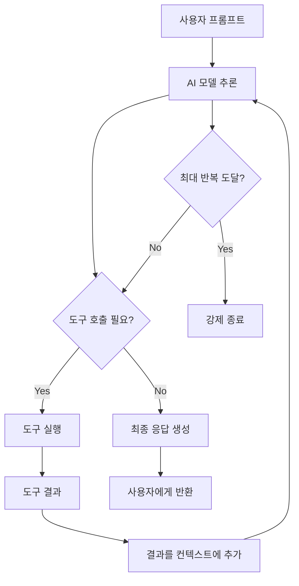

## 개요

이번 포스트에서는 Oxy 프레임워크의 핵심인 **AI 에이전트 시스템**을 심층 분석합니다. Oxy의 에이전트 시스템은 ReACT(Reasoning and Acting) 패턴을 구현하여 AI 모델이 도구를 활용해 복잡한 작업을 수행할 수 있도록 설계되었습니다.

## 1. 에이전트 시스템 개요

### 1.1 에이전트 입력 구조

```rust
#[derive(Debug, Clone)]
pub struct AgentInput {
    pub agent_ref: String,
    pub prompt: String,
}

impl From<&AgentTask> for AgentInput {
    fn from(task: &AgentTask) -> Self {
        Self {
            agent_ref: task.agent_ref.clone(),
            prompt: task.prompt.clone(),
        }
    }
}
```

**에이전트 입력의 구성 요소:**
- **agent_ref**: 실행할 에이전트의 참조 ID
- **prompt**: 에이전트에게 전달할 사용자 프롬프트

### 1.2 에이전트 런처 시스템

```rust
pub struct AgentLauncher {
    execution_context: Option<ExecutionContext>,
    buf_writer: BufWriter,
}

impl AgentLauncher {
    pub fn new() -> Self {
        Self {
            execution_context: None,
            buf_writer: BufWriter::new(),
        }
    }

    pub async fn launch<H: EventHandler + Send + 'static>(
        self,
        agent_input: AgentInput,
        event_handler: H,
    ) -> Result<OutputContainer, OxyError> {
        let execution_context = self
            .execution_context
            .ok_or(OxyError::RuntimeError(
                "ExecutionContext is required".to_string(),
            ))?
            .with_child_source(agent_input.agent_ref.to_string(), AGENT_SOURCE.to_string());
        
        let handle = tokio::spawn(async move {
            AgentExecutable
                .execute(&execution_context, agent_input)
                .await
        });

        let buf_writer = self.buf_writer;
        let event_handle =
            tokio::spawn(async move { buf_writer.write_to_handler(event_handler).await });
        
        let response = handle.await?;
        event_handle.await??;
        response
    }
}
```

#### 에이전트 런처의 핵심 기능:

1. **컨텍스트 관리**: 로컬/외부 실행 컨텍스트 지원
2. **비동기 실행**: Tokio 기반 병렬 처리
3. **이벤트 핸들링**: 실시간 결과 스트리밍
4. **에러 처리**: 견고한 에러 복구 메커니즘

## 2. 에이전트 실행 아키텍처

### 2.1 메인 에이전트 실행기

```rust
#[derive(Debug, Clone)]
pub struct AgentExecutable;

#[async_trait::async_trait]
impl Executable<AgentInput> for AgentExecutable {
    type Response = OutputContainer;

    async fn execute(
        &mut self,
        execution_context: &ExecutionContext,
        input: AgentInput,
    ) -> Result<Self::Response, OxyError> {
        let AgentInput { agent_ref, prompt } = input;
        let agent_config = execution_context.config.resolve_agent(&agent_ref).await?;
        let source_id = short_uuid::short!();
        
        let handler = AgentReferencesHandler::new(
            execution_context.writer.clone(),
            Some(source_id.to_string()),
        );
        
        let references = handler.references.clone();
        let metadata = HashMap::from_iter([
            (AGENT_SOURCE_TYPE.to_string(), agent_config.r#type.to_string()),
            (AGENT_SOURCE_PROMPT.to_string(), prompt.to_string()),
        ]);
        
        let routing_context =
            execution_context.with_child_source(source_id.to_string(), AGENT_SOURCE.to_string());
        
        let output_container = match agent_config.r#type {
            AgentType::Default(default_agent) => {
                // Default 에이전트 실행
            }
            AgentType::Routing(routing_agent) => {
                // Routing 에이전트 실행
            }
        }?;

        let references = Arc::try_unwrap(references)
            .map_err(|_| OxyError::RuntimeError("Failed to unwrap agent references".to_string()))?
            .into_inner()?;
            
        Ok(OutputContainer::Metadata {
            value: Metadata {
                output: Box::new(output_container),
                references,
                metadata,
            },
        })
    }
}
```

### 2.2 에이전트 타입별 실행

Oxy는 두 가지 주요 에이전트 타입을 지원합니다:

1. **Default Agent**: 단일 AI 모델 기반 에이전트
2. **Routing Agent**: 다중 에이전트 라우팅 시스템

## 3. Default 에이전트 심층 분석

### 3.1 Default 에이전트 구조

```rust
#[derive(Debug, Clone)]
pub struct DefaultAgentInput {
    pub agent_name: String,
    pub model: String,
    pub default_agent: DefaultAgent,
    pub contexts: Option<Vec<AgentContext>>,
    pub prompt: String,
}

#[derive(Debug, Clone)]
pub(super) struct DefaultAgentExecutable;
```

### 3.2 Default 에이전트 실행 로직

```rust
#[async_trait::async_trait]
impl Executable<DefaultAgentInput> for DefaultAgentExecutable {
    type Response = Output;

    async fn execute(
        &mut self,
        execution_context: &ExecutionContext,
        input: DefaultAgentInput,
    ) -> Result<Self::Response, OxyError> {
        let DefaultAgentInput {
            agent_name,
            model,
            prompt,
            contexts: _,
            default_agent:
                DefaultAgent {
                    system_instructions,
                    tools_config:
                        AgentToolsConfig {
                            tools,
                            max_tool_calls,
                            max_tool_concurrency,
                        },
                },
        } = input;

        // 1. AI 모델 클라이언트 생성
        let model_config = execution_context.config.resolve_model(&model)?;
        let client = OpenAIClient::with_config(model_config.try_into()?);
        
        // 2. 시스템 지침 렌더링
        let system_instructions = execution_context
            .renderer
            .render_async(&system_instructions)
            .await?;
        
        // 3. 메시지 구성
        let messages: Vec<ChatCompletionRequestMessage> = vec![
            ChatCompletionRequestSystemMessageArgs::default()
                .content(system_instructions)
                .build()?
                .into(),
            ChatCompletionRequestUserMessageArgs::default()
                .content(prompt.clone())
                .build()?
                .into(),
        ];
        
        // 4. 프롬프트 청크 기록
        execution_context
            .write_chunk(Chunk {
                key: Some(AGENT_SOURCE_PROMPT.to_string()),
                delta: Prompt::new(prompt.clone()).into(),
                finished: true,
            })
            .await?;
        
        // 5. ReACT 루프 실행
        let mut react_executable = build_react_loop(
            agent_name,
            tools,
            max_tool_concurrency,
            client,
            model_config.model_name().to_string(),
            max_tool_calls,
        ).await;
        
        let response = react_executable
            .execute(execution_context, messages)
            .await?;
            
        Ok(response.content)
    }
}
```

#### Default 에이전트 실행 단계:

1. **모델 설정**: 설정된 AI 모델 클라이언트 생성
2. **지침 렌더링**: 템플릿 엔진으로 동적 시스템 지침 생성
3. **메시지 구성**: 시스템 메시지와 사용자 메시지 구성
4. **프롬프트 로깅**: 실행 추적을 위한 프롬프트 기록
5. **ReACT 실행**: 도구 사용이 가능한 추론-행동 루프 시작

## 4. ReACT (Reasoning and Acting) 패턴

### 4.1 ReACT 루프 구축

```rust
async fn build_react_loop(
    agent_name: String,
    tool_configs: Vec<ToolType>,
    max_concurrency: usize,
    client: OpenAIClient,
    model: String,
    max_iterations: usize,
) -> impl Executable<Vec<ChatCompletionRequestMessage>, Response = OpenAIExecutableResponse> {
    
    // 1. 도구 변환
    let tools: Vec<ChatCompletionTool> =
        futures::future::join_all(tool_configs.iter().map(ChatCompletionTool::from_tool_async))
            .await
            .into_iter()
            .collect();
    
    // 2. ReACT 실행기 구축
    ExecutableBuilder::new()
        .react(
            OpenAITool::new(agent_name, tool_configs, max_concurrency),
            |response: &OpenAIExecutableResponse,
             new_response: Option<&OpenAIExecutableResponse>| {
                // 응답 병합 로직
                match new_response {
                    Some(new_response) => OpenAIExecutableResponse {
                        content: response.content.merge(&new_response.content),
                        tool_calls: response
                            .tool_calls
                            .iter()
                            .chain(new_response.tool_calls.iter())
                            .cloned()
                            .collect(),
                    },
                    None => OpenAIExecutableResponse {
                        content: response.content.clone(),
                        tool_calls: response.tool_calls.clone(),
                    },
                }
            },
            |input: &Vec<ChatCompletionRequestMessage>,
             new_input: &Vec<ChatCompletionRequestMessage>| {
                // 입력 병합 로직
                input.iter().chain(new_input.iter()).cloned().collect()
            },
            max_iterations,
        )
        .executable(OpenAIExecutable::new(client, model, tools))
}
```

### 4.2 ReACT 패턴의 핵심 구조

**ReACT 루프의 구성 요소:**

1. **도구 등록**: 사용 가능한 도구들을 OpenAI Function Call 형식으로 변환
2. **응답 병합**: 여러 도구 호출 결과를 단일 응답으로 통합
3. **입력 병합**: 이전 대화 히스토리와 새로운 메시지 결합
4. **반복 제한**: 무한 루프 방지를 위한 최대 반복 횟수 설정

### 4.3 ReACT 실행 흐름



## 5. 글로벌 컨텍스트 시스템

### 5.1 컨텍스트 빌더

```rust
fn build_global_context(
    execution_context: &ExecutionContext,
    agent_name: &str,
    default_agent: &DefaultAgent,
    contexts: Vec<AgentContext>,
    prompt: &str,
) -> Result<Value, OxyError> {
    let contexts = Contexts::new(contexts, execution_context.config.clone());
    let databases = DatabasesContext::new(execution_context.config.clone());
    let tools = ToolsContext::from_execution_context(
        execution_context,
        agent_name.to_string(),
        default_agent.tools_config.tools.clone(),
        prompt.to_string(),
    );
    
    Ok(context! {
        context => Value::from_object(contexts),
        databases => Value::from_object(databases),
        tools => Value::from_object(tools)
    })
}
```

### 5.2 컨텍스트 구성 요소

**글로벌 컨텍스트의 세 가지 핵심 요소:**

1. **Contexts**: 에이전트별 사용자 정의 컨텍스트
   - 파일 컨텍스트 (코드, 문서 등)
   - 시맨틱 모델 컨텍스트 (데이터 스키마)
   - 커스텀 컨텍스트 (도메인 지식)

2. **Databases**: 데이터베이스 연결 정보
   - 사용 가능한 데이터소스 목록
   - 연결 파라미터 및 스키마 정보

3. **Tools**: 사용 가능한 도구 목록
   - SQL 실행 도구
   - 파일 조작 도구
   - API 호출 도구

## 6. 파라미터 매핑 시스템

### 6.1 Default 에이전트 매퍼

```rust
#[derive(Clone)]
pub struct DefaultAgentMapper;

#[async_trait::async_trait]
impl ParamMapper<DefaultAgentInput, DefaultAgentInput> for DefaultAgentMapper {
    async fn map(
        &self,
        execution_context: &ExecutionContext,
        input: DefaultAgentInput,
    ) -> Result<(DefaultAgentInput, Option<ExecutionContext>), OxyError> {
        let default_agent = &input.default_agent;
        
        let global_context = build_global_context(
            &execution_context,
            &input.agent_name,
            default_agent,
            input.contexts.clone().unwrap_or_default(),
            &input.prompt,
        )?;
        
        let renderer = Renderer::from_template(
            global_context,
            &input.default_agent.system_instructions.as_str(),
        )?;
        
        let execution_context = execution_context.wrap_renderer(renderer);
        Ok((input, Some(execution_context)))
    }
}
```

### 6.2 매퍼의 역할

**파라미터 매퍼의 핵심 기능:**

1. **컨텍스트 주입**: 글로벌 컨텍스트를 렌더러에 주입
2. **템플릿 준비**: 시스템 지침 템플릿 사전 처리
3. **실행 컨텍스트 래핑**: 새로운 렌더러로 컨텍스트 확장
4. **동적 설정**: 런타임 시 에이전트 동작 커스터마이징

## 7. 에이전트 빌더 패턴

### 7.1 실행 가능한 빌더

```rust
pub(super) fn build_default_agent_executable()
-> impl Executable<DefaultAgentInput, Response = Output> {
    ExecutableBuilder::new()
        .map(DefaultAgentMapper)
        .executable(DefaultAgentExecutable)
}
```

### 7.2 빌더 패턴의 장점

**ExecutableBuilder의 이점:**

1. **조합성**: 여러 실행 단계를 조합하여 복잡한 파이프라인 구성
2. **재사용성**: 공통 매퍼와 실행기를 다양한 컨텍스트에서 재사용
3. **테스트 용이성**: 각 단계를 독립적으로 테스트 가능
4. **확장성**: 새로운 매퍼나 실행기를 쉽게 추가

## 8. 에이전트 시스템의 혁신적 특징

### 8.1 동적 도구 시스템

- **런타임 도구 등록**: 에이전트 실행 시점에 도구 동적 로드
- **도구 동시성**: 여러 도구를 병렬로 실행하여 성능 향상
- **도구 체이닝**: 한 도구의 결과를 다른 도구의 입력으로 사용

### 8.2 컨텍스트 인식 시스템

- **시맨틱 모델 통합**: 데이터 스키마를 AI가 이해할 수 있는 형태로 제공
- **파일 컨텍스트**: 코드베이스나 문서를 에이전트가 참조
- **데이터베이스 인식**: 사용 가능한 데이터소스를 자동 인식

### 8.3 확장 가능한 아키텍처

- **플러그인 시스템**: 새로운 도구나 컨텍스트 타입 쉽게 추가
- **모델 추상화**: OpenAI 외 다른 AI 모델 제공자 지원
- **실행 추적**: 전체 실행 과정 로깅 및 디버깅

## 결론

Oxy의 AI 에이전트 시스템은 **모듈러 아키텍처**와 **ReACT 패턴**을 결합하여 강력하고 유연한 AI 에이전트 플랫폼을 제공합니다. 특히 동적 컨텍스트 주입과 도구 시스템을 통해 AI가 실제 작업을 수행할 수 있는 실용적인 환경을 구현했습니다.

**핵심 혁신 포인트:**
- **컨텍스트 인식**: 데이터 스키마와 코드베이스를 AI가 이해
- **도구 중심 설계**: AI가 실제 작업을 수행할 수 있는 도구 생태계
- **확장 가능성**: 플러그인 아키텍처로 무한한 확장 가능
- **실행 추적**: 전체 추론 과정의 투명성 제공

다음 포스트에서는 Oxy의 데이터베이스 시스템과 Sea-ORM 통합을 상세히 분석하겠습니다.

---

**연관 포스트:**
- [Oxy Custom 프로젝트 개요 분석]()
- [Oxy Custom - Rust 애플리케이션 진입점 및 CLI 시스템 심층 분석]()
- [Oxy Custom - CLI Make 명령어와 프로젝트 자동 생성 시스템 심층 분석]()

**참고 자료:**
- [ReACT: Reasoning and Acting in Language Models](https://arxiv.org/abs/2210.03629)
- [OpenAI Function Calling](https://platform.openai.com/docs/guides/function-calling)
- [Async-trait Rust Crate](https://github.com/dtolnay/async-trait)