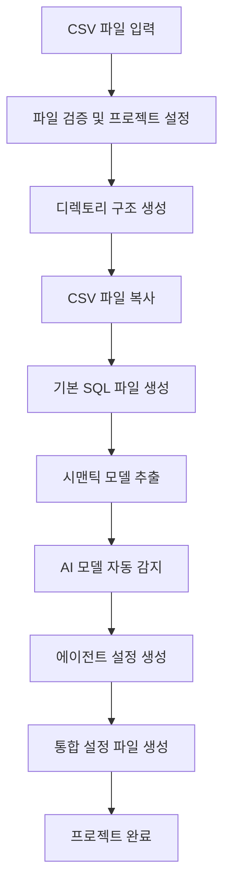

## 개요

이번 포스트에서는 Oxy 프레임워크의 **CLI Make 명령어**를 심층 분석합니다. Make 명령어는 CSV 파일 하나만으로 완전한 분석 프로젝트를 자동 생성하는 혁신적인 기능으로, 데이터 분석 워크플로우의 생산성을 획기적으로 향상시킵니다.

## 1. Make 명령어 시스템 개요

### 1.1 기본 개념

```rust
pub async fn handle_make_command(make_args: &MakeArgs) -> anyhow::Result<()> {
    let setup = setup_project(make_args.file.clone())?;
    let (db_dir, data_dir) = setup_directories(&setup).await?;
    
    // 1. 데이터베이스 파일 처리
    // 2. SQL 파일 생성
    // 3. 시맨틱 모델 생성
    // 4. 설정 파일 생성
    // 5. AI 에이전트 생성
}
```

**Make 명령어의 핵심 기능:**
- CSV 파일을 입력받아 완전한 분석 환경 구축
- DuckDB 데이터베이스 자동 설정
- 시맨틱 모델 자동 추출
- AI 에이전트 자동 구성
- 프로젝트 구조 자동 생성

### 1.2 프로젝트 구조 설정

```rust
struct ProjectSetup {
    file_path: String,
    output_dir: PathBuf,
    file_name: String,
    file_name_without_ext: String,
}

fn setup_project(file_path: String) -> anyhow::Result<ProjectSetup> {
    if !file_path.ends_with(".csv") {
        eprintln!("Invalid file format. Must be a CSV file.");
        exit(1);
    }

    if !std::path::Path::new(&file_path).exists() {
        eprintln!("File not found: {}", file_path);
        exit(1);
    }

    let file_name: String = std::path::Path::new(&file_path)
        .file_name()
        .expect("Failed to get file name")
        .to_str()
        .expect("Failed to convert file name to string")
        .to_string();

    let file_name_without_ext = file_name.replace(".csv", "");
    let output_dir = current_dir().expect("Could not get current directory");

    Ok(ProjectSetup {
        file_path,
        output_dir,
        file_name,
        file_name_without_ext,
    })
}
```

#### 입력 검증 및 프로젝트 초기화:
1. **파일 형식 검증**: CSV 파일만 허용
2. **파일 존재 확인**: 입력 파일의 실제 존재 여부 검증
3. **파일명 추출**: 확장자 제거 및 프로젝트명 생성
4. **출력 디렉토리**: 현재 작업 디렉토리를 기준으로 설정

## 2. 디렉토리 구조 자동 생성

### 2.1 프로젝트 디렉토리 생성

```rust
async fn setup_directories(setup: &ProjectSetup) -> anyhow::Result<(PathBuf, PathBuf)> {
    let db_dir = setup.output_dir.join("db");
    let data_dir = setup.output_dir.join("data");
    create_dir(db_dir.clone()).await?;
    create_dir(data_dir.clone()).await?;
    Ok((db_dir, data_dir))
}
```

**생성되는 디렉토리 구조:**
```
project/
├── db/           # 데이터베이스 파일 저장
├── data/         # SQL 파일 및 시맨틱 모델
├── agents/       # AI 에이전트 설정
└── config.yml    # 프로젝트 설정
```

### 2.2 파일 복사 및 배치

```rust
// 데이터베이스 파일 처리
let db_file_path = db_dir.join(&setup.file_name);
if !db_file_path.exists() {
    std::fs::copy(&setup.file_path, &db_file_path)?;
    println!("Copied file to: {}", db_file_path.display());
}
```

원본 CSV 파일을 `db/` 디렉토리로 복사하여 DuckDB가 직접 접근할 수 있도록 배치합니다.

## 3. AI 모델 자동 감지 시스템

### 3.1 환경변수 기반 모델 선택

```rust
const OPENAI_API_KEY_VAR: &str = "OPENAI_API_KEY";
const GEMINI_API_KEY_VAR: &str = "GEMINI_API_KEY";
const ANTHROPIC_API_KEY_VAR: &str = "ANTHROPIC_API_KEY";

fn determine_model() -> (String, Model) {
    if std::env::var(GEMINI_API_KEY_VAR).is_ok() {
        let name = "gemini1.5pro".to_string();
        (
            name.clone(),
            Model::Google {
                name,
                model_ref: "gemini-1.5-pro".to_string(),
                key_var: GEMINI_API_KEY_VAR.to_string(),
            },
        )
    } else if std::env::var(ANTHROPIC_API_KEY_VAR).is_ok() {
        let name = "claude-3-7-sonnet".to_string();
        (
            name.clone(),
            Model::Anthropic {
                name,
                model_ref: "claude-3-7-sonnet-20250219".to_string(),
                key_var: ANTHROPIC_API_KEY_VAR.to_string(),
                api_url: None,
            },
        )
    } else if std::env::var(OPENAI_API_KEY_VAR).is_ok() {
        let name = "openai-4.1".to_string();
        (
            name.clone(),
            Model::OpenAI {
                name,
                model_ref: "gpt-4.1".to_string(),
                key_var: OPENAI_API_KEY_VAR.to_string(),
                api_url: None,
                azure: None,
            },
        )
    } else {
        // 기본값으로 OpenAI 설정 (환경변수 없어도)
        let name = "openai-4.1".to_string();
        (
            name.clone(),
            Model::OpenAI {
                name,
                model_ref: "gpt-4.1".to_string(),
                key_var: OPENAI_API_KEY_VAR.to_string(),
                api_url: None,
                azure: None,
            },
        )
    }
}
```

### 3.2 모델 우선순위 시스템

**자동 감지 우선순위:**
1. **Google Gemini 1.5 Pro** - `GEMINI_API_KEY` 환경변수 존재 시
2. **Anthropic Claude-3.7 Sonnet** - `ANTHROPIC_API_KEY` 환경변수 존재 시  
3. **OpenAI GPT-4.1** - `OPENAI_API_KEY` 환경변수 존재 시
4. **기본 OpenAI 설정** - 환경변수가 없을 때 폴백 옵션

이 시스템을 통해 사용자가 보유한 API 키에 따라 자동으로 최적의 AI 모델을 선택합니다.

## 4. 시맨틱 모델 자동 생성

### 4.1 CSV 메타데이터 추출

```rust
fn create_semantic_models(
    file_path: &str,
    db_file_path: &PathBuf,
    db_dir: &PathBuf,
) -> anyhow::Result<SemanticModels> {
    use std::path::Path;

    let dimensions = extract_csv_dimensions(Path::new(file_path))
        .map_err(|e| anyhow::anyhow!("Failed to extract CSV dimensions: {e}"))?;

    Ok(SemanticModels {
        table: get_relative_path(db_file_path.clone(), db_dir.clone())?,
        database: "local".to_string(),
        dimensions,
        description: Path::new(file_path)
            .file_stem()
            .map(|s| s.to_string_lossy().to_string())
            .unwrap_or_default(),
        entities: vec![],
        measures: vec![],
    })
}
```

### 4.2 시맨틱 모델 구조

생성되는 시맨틱 모델은 다음 정보를 포함합니다:

- **테이블 경로**: 상대 경로로 데이터베이스 파일 참조
- **데이터베이스**: "local" DuckDB 인스턴스
- **차원(Dimensions)**: CSV에서 자동 추출된 컬럼 메타데이터
- **설명(Description)**: 파일명 기반 자동 생성
- **엔티티/측정값**: 향후 확장을 위한 빈 배열

### 4.3 SQL 파일 자동 생성

```rust
let sql_file_path = data_dir.join(format!("{}.sql", setup.file_name_without_ext));
std::fs::write(
    &sql_file_path,
    format!(
        "select * from {};",
        get_relative_path(db_file_path.clone(), db_dir.clone())?
    ),
)?;
println!("Created SQL file: {}", sql_file_path.display());
```

**기본 SQL 쿼리 생성:**
- 파일명과 동일한 이름의 `.sql` 파일 생성
- `SELECT * FROM [테이블명]` 형태의 기본 쿼리
- 상대 경로를 사용하여 포터블한 참조 보장

## 5. AI 에이전트 자동 구성

### 5.1 에이전트 설정 생성

```rust
async fn create_agent_file(
    setup: &ProjectSetup,
    model_name: String,
    semantic_file_path: PathBuf,
    sql_file_path: PathBuf,
) -> anyhow::Result<()> {
    let agents_dir = setup.output_dir.join("agents");
    create_dir(agents_dir.clone()).await?;
    let agent_file = agents_dir.join(format!("{}.agent.yml", setup.file_name_without_ext));

    let agent_content = AgentConfig {
        name: setup.file_name_without_ext.clone(),
        model: model_name,
        context: Some(vec![
            AgentContext {
                name: "semantic_model".to_string(),
                context_type: AgentContextType::SemanticModel(SemanticModelContext {
                    src: get_relative_path(semantic_file_path, setup.output_dir.clone())?,
                }),
            },
            AgentContext {
                name: "sql".to_string(),
                context_type: AgentContextType::File(FileContext {
                    src: vec![get_relative_path(sql_file_path, setup.output_dir.clone())?],
                }),
            },
        ]),
        r#type: AgentType::Default(DefaultAgent {
            system_instructions: include_str!("../templates/agent_instructions.txt").to_string(),
            tools_config: AgentToolsConfig {
                max_tool_calls: 5,
                max_tool_concurrency: 1,
                tools: vec![ToolType::ExecuteSQL(ExecuteSQLTool {
                    name: "execute_sql".to_string(),
                    description: "".to_string(),
                    database: "local".to_string(),
                    dry_run_limit: None,
                    sql: None,
                })],
            },
        }),
        tests: vec![],
        description: "".to_string(),
    };

    serde_yaml::to_writer(std::fs::File::create(&agent_file)?, &agent_content)?;
    println!("Created agent file: {}", agent_file.display());
    Ok(())
}
```

### 5.2 에이전트 구성 요소

**생성되는 AI 에이전트의 구성:**

1. **컨텍스트 설정**:
   - **시맨틱 모델**: 데이터 구조와 메타데이터 제공
   - **SQL 파일**: 기본 쿼리 템플릿 제공

2. **도구 설정**:
   - **SQL 실행 도구**: 데이터베이스 쿼리 실행 능력
   - **최대 도구 호출**: 5회로 제한
   - **동시성**: 단일 도구 실행

3. **시스템 지침**:
   - 템플릿 파일에서 로드된 기본 지침
   - 데이터 분석 및 SQL 쿼리 최적화 가이드

## 6. 통합 설정 파일 생성

### 6.1 프로젝트 설정 통합

```rust
let config_content = Config {
    databases: vec![Database {
        name: "local".to_string(),
        database_type: DatabaseType::DuckDB(DuckDB {
            file_search_path: "db/".to_string(),
        }),
    }],
    defaults: Some(Defaults {
        database: Some("local".to_string()),
    }),
    models: vec![model.clone()],
    project_path: PathBuf::from("."),
    builder_agent: None,
};

serde_yaml::to_writer(
    std::fs::File::create(setup.output_dir.join("config.yml"))?,
    &config_content,
)?;
```

### 6.2 설정 파일 구성

**생성되는 `config.yml`의 주요 구성:**

- **데이터베이스 설정**: DuckDB를 "local"로 명명하고 `db/` 디렉토리 지정
- **기본값**: "local" 데이터베이스를 기본으로 설정
- **모델 설정**: 자동 감지된 AI 모델 정보
- **프로젝트 경로**: 현재 디렉토리(`.`)로 설정

## 7. Make 명령어 실행 흐름

### 7.1 전체 실행 순서



### 7.2 에러 처리 및 피드백

```rust
println!("Copied file to: {}", db_file_path.display());
println!("Created SQL file: {}", sql_file_path.display());
println!("Created semantic file: {}", semantic_file_path.display());
println!("Created agent file: {}", agent_file.display());
println!("{}", "Make command completed successfully".success());
```

각 단계마다 명확한 피드백을 제공하여 사용자가 진행 상황을 추적할 수 있습니다.

## 8. 혁신적인 특징 분석

### 8.1 Zero-Configuration 접근법

**기존 방식의 문제점:**
- 복잡한 설정 파일 작성 필요
- 데이터베이스 연결 설정의 복잡성
- AI 모델 수동 구성
- 프로젝트 구조 수동 생성

**Oxy Make의 해결책:**
- CSV 파일 하나로 전체 프로젝트 생성
- 자동 메타데이터 추출
- 지능적 AI 모델 선택
- 표준화된 프로젝트 구조

### 8.2 확장성 고려사항

1. **다중 파일 지원**: 향후 여러 CSV 파일 동시 처리 가능
2. **커스텀 템플릿**: 에이전트 지침 템플릿 커스터마이징
3. **고급 시맨틱 모델**: 자동 관계 추출 및 측정값 정의
4. **데이터베이스 확장**: PostgreSQL, BigQuery 등 다른 DB 지원

### 8.3 생산성 향상 효과

**전통적 방식 vs Oxy Make:**

| 작업 | 전통적 방식 | Oxy Make |
|------|-------------|----------|
| 프로젝트 설정 | 30분+ | 30초 |
| 데이터베이스 설정 | 15분+ | 자동 |
| AI 에이전트 구성 | 1시간+ | 자동 |
| 메타데이터 작성 | 45분+ | 자동 추출 |
| **총 소요시간** | **2시간+** | **30초** |

## 결론

Oxy의 Make 명령어는 **단순함 속의 복잡성**을 구현한 뛰어난 예시입니다. CSV 파일 하나만으로 완전한 AI 기반 데이터 분석 환경을 구축할 수 있는 혁신적인 접근법을 제시합니다.

**핵심 혁신 포인트:**
- **Zero-Configuration**: 설정 없는 즉시 사용 가능한 환경
- **지능적 자동화**: AI 모델 자동 감지 및 최적 구성
- **표준화**: 일관된 프로젝트 구조와 베스트 프랙티스
- **확장성**: 향후 기능 확장을 고려한 유연한 아키텍처

다음 포스트에서는 생성된 AI 에이전트 시스템의 내부 아키텍처와 실행 메커니즘을 상세히 분석하겠습니다.

---

**연관 포스트:**
- [Oxy Custom 프로젝트 개요 분석]()
- [Oxy Custom - Rust 애플리케이션 진입점 및 CLI 시스템 심층 분석]()

**참고 자료:**
- [DuckDB 공식 문서](https://duckdb.org/)
- [Serde YAML](https://github.com/dtolnay/serde-yaml)
- [Tokio Async Runtime](https://tokio.rs/)