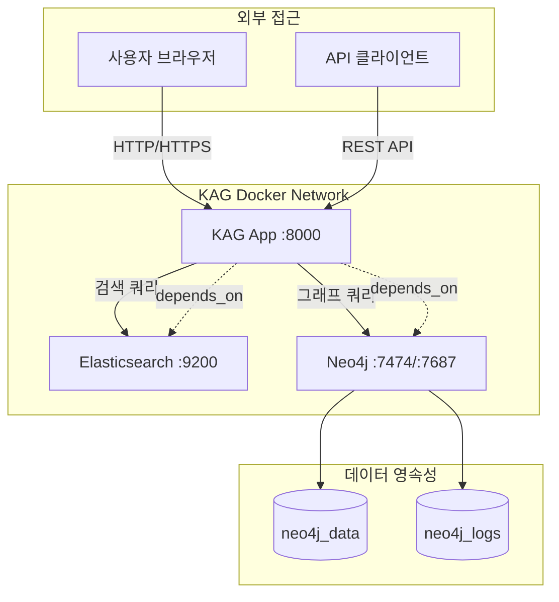
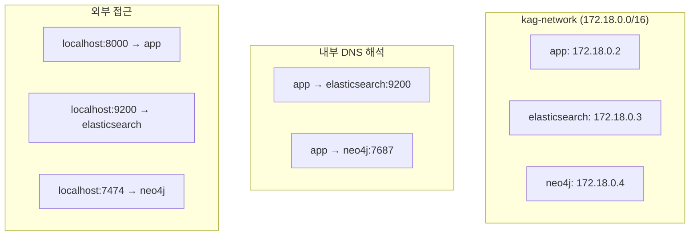
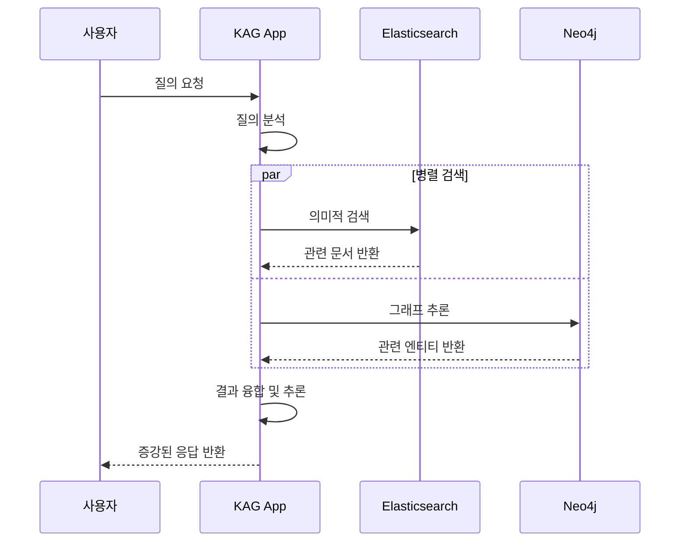
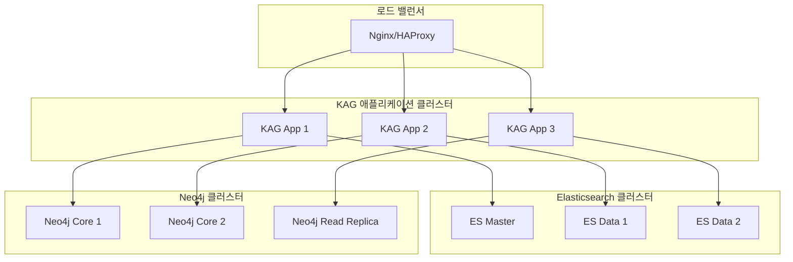

## 개요

이번 포스트에서는 **KAG 프로젝트의 Docker 컨테이너 오케스트레이션**을 심층 분석합니다. KAG는 마이크로서비스 아키텍처를 기반으로 웹 애플리케이션, Elasticsearch, Neo4j를 독립적인 컨테이너로 구성하여 확장성과 유지보수성을 극대화했습니다.

## 1. Docker Compose 아키텍처 개요

### 1.1 전체 서비스 구성

```yaml
# KAG 마이크로서비스 구성
services:
  app:              # KAG 메인 애플리케이션
  elasticsearch:    # 검색 엔진 서비스
  neo4j:           # 그래프 데이터베이스 서비스

networks:
  kag-network:     # 전용 브리지 네트워크

volumes:
  neo4j_data:      # Neo4j 데이터 영속성
  neo4j_logs:      # Neo4j 로그 영속성
```

### 1.2 서비스 간 의존성 그래프



## 2. KAG 메인 애플리케이션 컨테이너

### 2.1 애플리케이션 서비스 구성

```yaml
app:
  build:
    context: .
    dockerfile: Dockerfile
  volumes:
    - .:/app                    # 개발 시 코드 동기화
  ports:
    - "8000:8000"              # HTTP 서비스 포트
  depends_on:
    - elasticsearch            # ES 서비스 의존성
    - neo4j                    # Neo4j 서비스 의존성
  environment:
    - ELASTICSEARCH_HOST=elasticsearch
    - NEO4J_HOST=neo4j
    - NEO4J_USER=neo4j
    - NEO4J_PASSWORD=password
  networks:
    - kag-network             # 전용 네트워크 사용
```

### 2.2 환경 변수 기반 서비스 디스커버리

**내부 DNS 해석:**
```bash
# 컨테이너 내부에서의 서비스 접근
http://elasticsearch:9200    # Elasticsearch 내부 접근
bolt://neo4j:7687           # Neo4j Bolt 프로토콜
http://neo4j:7474           # Neo4j HTTP 인터페이스
```

**환경 변수 주입 방식:**
```python
import os

# KAG 애플리케이션에서의 설정
ELASTICSEARCH_HOST = os.getenv('ELASTICSEARCH_HOST', 'localhost')
NEO4J_HOST = os.getenv('NEO4J_HOST', 'localhost')
NEO4J_USER = os.getenv('NEO4J_USER', 'neo4j')
NEO4J_PASSWORD = os.getenv('NEO4J_PASSWORD', 'neo4j')

# 연결 URL 구성
elasticsearch_url = f"http://{ELASTICSEARCH_HOST}:9200"
neo4j_url = f"bolt://{NEO4J_HOST}:7687"
```

### 2.3 볼륨 마운팅 전략

```yaml
volumes:
  - .:/app    # 호스트 코드 → 컨테이너 /app 디렉토리
```

**개발 워크플로우 최적화:**
- **코드 변경 시 즉시 반영**: 컨테이너 재빌드 불필요
- **Hot Reload 지원**: Python 개발 서버의 자동 재시작
- **디버깅 편의성**: 호스트에서 직접 코드 수정 가능

## 3. Elasticsearch 검색 엔진 컨테이너

### 3.1 Elasticsearch 서비스 구성

```yaml
elasticsearch:
  image: docker.elastic.co/elasticsearch/elasticsearch:8.10.0
  environment:
    - discovery.type=single-node      # 단일 노드 클러스터
    - xpack.security.enabled=false    # 보안 기능 비활성화
    - "ES_JAVA_OPTS=-Xms512m -Xmx512m" # JVM 메모리 설정
  ports:
    - "9200:9200"                    # HTTP API 포트
  networks:
    - kag-network
```

### 3.2 Elasticsearch 구성 분석

#### 3.2.1 클러스터 설정

```yaml
# 단일 노드 모드 설정
discovery.type=single-node
```

**단일 노드 모드의 특징:**
- **개발/테스트 최적화**: 프로덕션 복잡성 제거
- **리소스 효율성**: 클러스터 오버헤드 최소화
- **빠른 시작**: 노드 디스커버리 과정 생략
- **제한사항**: 고가용성 및 샤딩 기능 제한

#### 3.2.2 보안 설정

```yaml
# X-Pack 보안 비활성화
xpack.security.enabled=false
```

**보안 비활성화 이유:**
- **개발 환경 단순화**: 인증/인가 복잡성 제거
- **빠른 프로토타이핑**: 보안 설정 없이 즉시 사용
- **내부 네트워크**: Docker 네트워크 내부에서만 접근

#### 3.2.3 JVM 메모리 최적화

```yaml
"ES_JAVA_OPTS=-Xms512m -Xmx512m"
```

**메모리 설정 전략:**
- **힙 크기 고정**: 512MB로 최소/최대 동일 설정
- **컨테이너 최적화**: 제한된 리소스 환경 고려
- **GC 최적화**: 고정 힙으로 가비지 컬렉션 안정화

### 3.3 KAG에서의 Elasticsearch 활용

```python
# KAG에서의 Elasticsearch 클라이언트 구성 예시
from elasticsearch import Elasticsearch

class KAGSearchEngine:
    def __init__(self):
        self.es = Elasticsearch([{
            'host': os.getenv('ELASTICSEARCH_HOST', 'localhost'),
            'port': 9200,
            'scheme': 'http'
        }])
    
    async def index_knowledge(self, documents):
        """지식 문서 인덱싱"""
        for doc in documents:
            await self.es.index(
                index="kag_knowledge",
                id=doc['id'],
                body={
                    'content': doc['content'],
                    'embeddings': doc['embeddings'],
                    'metadata': doc['metadata']
                }
            )
    
    async def semantic_search(self, query, size=10):
        """의미적 검색 수행"""
        search_body = {
            "query": {
                "multi_match": {
                    "query": query,
                    "fields": ["content^2", "metadata.title"]
                }
            },
            "size": size
        }
        return await self.es.search(index="kag_knowledge", body=search_body)
```

## 4. Neo4j 그래프 데이터베이스 컨테이너

### 4.1 Neo4j 서비스 구성

```yaml
neo4j:
  image: neo4j:5.13.0
  environment:
    - NEO4J_AUTH=neo4j/password      # 인증 정보
  ports:
    - "7474:7474"                    # HTTP 브라우저 인터페이스
    - "7687:7687"                    # Bolt 프로토콜
  volumes:
    - neo4j_data:/data               # 데이터 영속성
    - neo4j_logs:/logs               # 로그 영속성
  networks:
    - kag-network
```

### 4.2 Neo4j 구성 세부 분석

#### 4.2.1 인증 및 보안

```yaml
NEO4J_AUTH=neo4j/password
```

**인증 설정:**
- **사용자명**: `neo4j` (기본 관리자)
- **비밀번호**: `password` (개발용 단순 비밀번호)
- **보안 고려사항**: 프로덕션 환경에서는 강력한 비밀번호 필요

#### 4.2.2 포트 구성

```yaml
ports:
  - "7474:7474"    # Neo4j Browser (웹 인터페이스)
  - "7687:7687"    # Bolt 프로토콜 (애플리케이션 연결)
```

**포트별 용도:**
- **7474 (HTTP)**: 웹 기반 Neo4j Browser 인터페이스
- **7687 (Bolt)**: 고성능 바이너리 프로토콜

#### 4.2.3 데이터 영속성 전략

```yaml
volumes:
  - neo4j_data:/data    # 그래프 데이터베이스 파일
  - neo4j_logs:/logs    # 트랜잭션 로그 및 시스템 로그
```

**볼륨 마운팅 이점:**
- **데이터 보존**: 컨테이너 재시작 시 데이터 유지
- **백업 용이성**: 호스트 파일시스템에서 백업 가능
- **성능 최적화**: 영속 볼륨을 통한 I/O 성능 향상

### 4.3 KAG에서의 Neo4j 활용

```python
# KAG에서의 Neo4j 연동 예시
from neo4j import GraphDatabase

class KAGKnowledgeGraph:
    def __init__(self):
        self.driver = GraphDatabase.driver(
            f"bolt://{os.getenv('NEO4J_HOST', 'localhost')}:7687",
            auth=(
                os.getenv('NEO4J_USER', 'neo4j'),
                os.getenv('NEO4J_PASSWORD', 'neo4j')
            )
        )
    
    async def create_knowledge_node(self, entity_data):
        """지식 엔티티 노드 생성"""
        with self.driver.session() as session:
            query = """
            CREATE (e:Entity {
                name: $name,
                type: $type,
                properties: $properties
            })
            RETURN e
            """
            return session.run(query, **entity_data)
    
    async def create_relationship(self, from_entity, to_entity, relation):
        """엔티티 간 관계 생성"""
        with self.driver.session() as session:
            query = """
            MATCH (a:Entity {name: $from_name})
            MATCH (b:Entity {name: $to_name})
            CREATE (a)-[r:RELATES {type: $relation_type}]->(b)
            RETURN r
            """
            return session.run(query,
                from_name=from_entity,
                to_name=to_entity,
                relation_type=relation
            )
    
    async def knowledge_reasoning(self, start_entity, max_depth=3):
        """지식 그래프 추론 쿼리"""
        with self.driver.session() as session:
            query = f"""
            MATCH path = (start:Entity {{name: $entity_name}})
            -[*1..{max_depth}]-(connected:Entity)
            RETURN path, connected
            ORDER BY length(path)
            """
            return session.run(query, entity_name=start_entity)
```

## 5. 네트워크 아키텍처

### 5.1 브리지 네트워크 구성

```yaml
networks:
  kag-network:
    driver: bridge
```

**브리지 네트워크 특징:**
- **격리성**: 외부 네트워크와 분리된 내부 통신
- **DNS 해석**: 컨테이너 이름으로 서비스 디스커버리
- **보안성**: 내부 트래픽만 허용

### 5.2 서비스 디스커버리 메커니즘



**내부 통신 플로우:**
1. **서비스 이름 해석**: Docker의 내장 DNS 서버 사용
2. **IP 주소 할당**: 동적 IP 주소 자동 할당
3. **포트 매핑**: 컨테이너 간 직접 통신

## 6. 데이터 플로우 및 상호작용

### 6.1 전체 데이터 플로우



### 6.2 서비스별 역할 분담

#### KAG 애플리케이션 (포트 8000)
```yaml
역할:
  - 사용자 인터페이스 제공
  - 질의 분석 및 처리
  - 검색 결과 융합
  - 응답 생성 및 반환

주요 기능:
  - REST API 서버
  - 웹 UI 제공
  - 비즈니스 로직 처리
  - 외부 서비스 조정
```

#### Elasticsearch (포트 9200)
```yaml
역할:
  - 문서 인덱싱
  - 의미적 검색
  - 벡터 검색 지원
  - 검색 결과 랭킹

주요 기능:
  - 전문 검색 (Full-text Search)
  - 벡터 유사도 검색
  - 집계 및 분석
  - 실시간 인덱싱
```

#### Neo4j (포트 7474/7687)
```yaml
역할:
  - 지식 그래프 저장
  - 그래프 쿼리 처리
  - 관계 추론
  - 경로 탐색

주요 기능:
  - Cypher 쿼리 언어
  - 그래프 알고리즘
  - 관계 데이터 모델링
  - 트랜잭션 처리
```

## 7. 개발 및 배포 워크플로우

### 7.1 개발 환경 설정

```bash
# 1. 프로젝트 클론
git clone <kag-repository>
cd kag-docker

# 2. 컨테이너 빌드 및 실행
docker-compose up --build

# 3. 서비스 확인
curl http://localhost:8000/health
curl http://localhost:9200/_cluster/health
curl http://localhost:7474/
```

### 7.2 개발 중 디버깅

```bash
# 개별 서비스 로그 확인
docker-compose logs -f app
docker-compose logs -f elasticsearch
docker-compose logs -f neo4j

# 컨테이너 내부 접근
docker-compose exec app bash
docker-compose exec elasticsearch bash
docker-compose exec neo4j cypher-shell
```

### 7.3 데이터 관리

```bash
# 데이터 볼륨 백업
docker run --rm -v kag-docker_neo4j_data:/data \
  -v $(pwd):/backup alpine \
  tar czf /backup/neo4j_backup.tar.gz -C /data .

# 데이터 볼륨 복원
docker run --rm -v kag-docker_neo4j_data:/data \
  -v $(pwd):/backup alpine \
  tar xzf /backup/neo4j_backup.tar.gz -C /data
```

## 8. 프로덕션 배포 고려사항

### 8.1 보안 강화

```yaml
# 프로덕션용 환경 변수
environment:
  - NEO4J_AUTH=admin/${STRONG_PASSWORD}
  - ELASTICSEARCH_USERNAME=${ES_USERNAME}
  - ELASTICSEARCH_PASSWORD=${ES_PASSWORD}
  - SSL_ENABLED=true
```

### 8.2 성능 튜닝

```yaml
# Elasticsearch 메모리 증설
"ES_JAVA_OPTS=-Xms2g -Xmx2g"

# Neo4j 성능 설정
NEO4J_dbms_memory_heap_initial__size=1g
NEO4J_dbms_memory_heap_max__size=2g
NEO4J_dbms_memory_pagecache_size=1g
```

### 8.3 모니터링 및 로깅

```yaml
# 로깅 드라이버 설정
logging:
  driver: "json-file"
  options:
    max-size: "100m"
    max-file: "3"

# 헬스체크 추가
healthcheck:
  test: ["CMD", "curl", "-f", "http://localhost:8000/health"]
  interval: 30s
  timeout: 10s
  retries: 3
```

## 9. 확장성 및 고가용성

### 9.1 수평 확장 전략



### 9.2 Docker Swarm/Kubernetes 마이그레이션

```yaml
# Docker Swarm용 설정 예시
version: '3.8'
services:
  app:
    image: kag:latest
    deploy:
      replicas: 3
      update_config:
        parallelism: 1
        delay: 10s
      restart_policy:
        condition: on-failure
```

## 결론

KAG의 Docker 컨테이너 오케스트레이션은 **마이크로서비스 아키텍처의 모범 사례**를 보여줍니다. 각 서비스가 독립적으로 확장 가능하면서도 유기적으로 연결된 구조를 통해 높은 가용성과 성능을 제공합니다.

**핵심 아키텍처 장점:**
- **서비스 분리**: 각 컴포넌트의 독립적 관리 및 확장
- **개발 효율성**: Docker Compose를 통한 간편한 환경 구성
- **데이터 영속성**: 볼륨을 통한 안정적인 데이터 보존
- **네트워크 격리**: 보안성과 성능을 고려한 네트워크 설계

다음 포스트에서는 KAG Builder 모듈의 상세한 아키텍처와 지식 추출 프로세스를 분석하겠습니다.

---

**연관 포스트:**
- [KAG (Knowledge Augmented Generation) 프로젝트 개요 및 아키텍처 심층 분석]()

**참고 자료:**
- [Docker Compose 공식 문서](https://docs.docker.com/compose/)
- [Elasticsearch Docker 설정](https://www.elastic.co/guide/en/elasticsearch/reference/current/docker.html)
- [Neo4j Docker 설정](https://neo4j.com/docs/operations-manual/current/docker/)
- [마이크로서비스 패턴](https://microservices.io/patterns/)