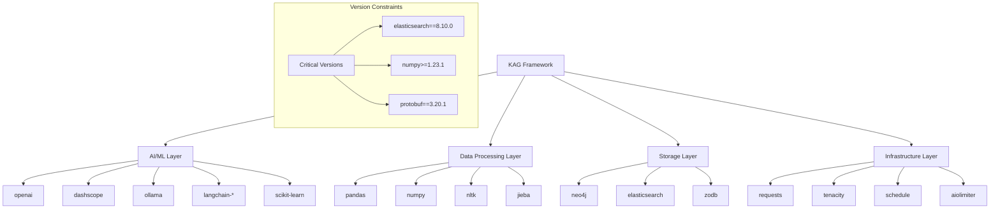

## 개요

이번 포스트에서는 **KAG 프레임워크의 의존성 구조**와 **Python 패키지 생태계 활용**을 종합적으로 분석합니다. KAG는 58개의 핵심 라이브러리를 통해 지식 그래프, 자연어 처리, 머신러닝, 웹 개발까지 아우르는 통합 AI 플랫폼을 구축합니다.

## 1. 의존성 아키텍처 개요

### 1.1 카테고리별 패키지 분류

```python
# KAG 의존성 58개 패키지 분류
DEPENDENCY_CATEGORIES = {
    "AI/ML 코어": [
        "openai", "dashscope", "ollama", "langchain-text-splitters", 
        "langchain-community", "scikit-learn", "numpy>=1.23.1"
    ],
    "자연어 처리": [
        "jieba==0.42.1", "nltk==3.8.1", "charset_normalizer==3.3.2",
        "docstring_parser", "json_repair"
    ],
    "데이터베이스": [
        "elasticsearch==8.10.0", "neo4j", "zodb", "pyodps==0.12.2"
    ],
    "문서 처리": [
        "pypdf", "PyPDF2", "pdfminer.six==20231228", "python-docx",
        "markdown", "bs4"
    ],
    "데이터 분석": [
        "pandas", "networkx==3.1", "matplotlib", "pyvis"
    ],
    "웹 및 HTTP": [
        "requests==2.31.0", "urllib3==1.26.16", "httpx", "aiofiles"
    ],
    "개발 도구": [
        "pytest==7.4.2", "setuptools==60.2.0", "gitpython", "tqdm==4.66.1"
    ],
    "시스템 및 유틸리티": [
        "psutil", "cachetools==5.3.2", "click==8.1.7", "schedule"
    ]
}
```

### 1.2 의존성 레벨별 구조



## 2. AI/ML 핵심 라이브러리 생태계

### 2.1 대규모 언어 모델 통합

```python
# LLM 제공자별 라이브러리 분석
LLM_PROVIDERS = {
    "openai": {
        "purpose": "OpenAI GPT 모델 API 통합",
        "features": ["Chat Completion", "Embeddings", "Fine-tuning"],
        "integration": "KAG Solver, Vectorizer 모듈",
        "version": "Latest (1.x)",
        "key_usage": "Primary LLM provider for reasoning and generation"
    },
    
    "dashscope": {
        "purpose": "Alibaba Cloud 통합 AI 서비스",
        "features": ["Qwen 모델", "Multi-modal AI", "Chinese NLP"],
        "integration": "Alternative LLM provider",
        "version": "Latest",
        "key_usage": "Chinese language processing and Alibaba ecosystem"
    },
    
    "ollama": {
        "purpose": "로컬 LLM 서빙 플랫폼",
        "features": ["Local deployment", "Privacy-focused", "Open source models"],
        "integration": "On-premise LLM deployment",
        "version": "Latest",
        "key_usage": "Privacy-sensitive environments and offline processing"
    }
}

# LangChain 생태계 통합
LANGCHAIN_ECOSYSTEM = {
    "langchain-text-splitters": {
        "purpose": "텍스트 분할 및 청킹",
        "components": ["RecursiveCharacterTextSplitter", "TokenTextSplitter"],
        "usage_in_kag": "Document processing in Builder module",
        "key_features": ["Semantic chunking", "Token-aware splitting"]
    },
    
    "langchain-community": {
        "purpose": "커뮤니티 제공 통합 모듈",
        "components": ["Vector stores", "Document loaders", "Retrievers"],
        "usage_in_kag": "Extended integrations and connectors",
        "key_features": ["Third-party integrations", "Community contributions"]
    }
}
```

### 2.2 머신러닝 및 데이터 과학

```python
# 과학 컴퓨팅 스택
SCIENTIFIC_STACK = {
    "numpy": {
        "version": ">=1.23.1",
        "purpose": "수치 연산 기반 라이브러리",
        "critical_features": [
            "Multi-dimensional arrays",
            "Mathematical functions", 
            "Linear algebra operations",
            "Random number generation"
        ],
        "kag_usage": "Vector operations, embeddings manipulation",
        "performance_notes": "Version 1.23.1+ required for optimal performance"
    },
    
    "scikit-learn": {
        "version": "Latest",
        "purpose": "머신러닝 알고리즘 라이브러리",
        "critical_features": [
            "Classification algorithms",
            "Clustering methods",
            "Feature extraction", 
            "Model evaluation metrics"
        ],
        "kag_usage": "Knowledge clustering, entity classification, similarity metrics",
        "integration_points": ["Builder post-processing", "Solver ranking"]
    },
    
    "pandas": {
        "version": "Latest", 
        "purpose": "데이터 분석 및 조작",
        "critical_features": [
            "DataFrame operations",
            "CSV/JSON processing",
            "Data cleaning",
            "Statistical analysis"
        ],
        "kag_usage": "CSV data ingestion, tabular data processing",
        "integration_points": ["Builder CSV reader", "Data preprocessing"]
    }
}
```

## 3. 자연어 처리 (NLP) 라이브러리 스택

### 3.1 다국어 텍스트 처리

```python
# 언어별 처리 라이브러리
NLP_LIBRARIES = {
    "nltk": {
        "version": "3.8.1",
        "purpose": "영어 자연어 처리 툴킷",
        "components": [
            "Tokenizers", "POS taggers", "Named entity recognition",
            "Sentiment analysis", "WordNet interface"
        ],
        "kag_integration": {
            "module": "Builder text processing",
            "use_cases": ["Entity extraction", "Text preprocessing", "Language detection"]
        },
        "data_requirements": "NLTK data downloads (punkt, stopwords, etc.)"
    },
    
    "jieba": {
        "version": "0.42.1",
        "purpose": "중국어 분할 및 처리",
        "features": [
            "Chinese word segmentation",
            "POS tagging",
            "Keyword extraction", 
            "Custom dictionary support"
        ],
        "kag_integration": {
            "module": "Multi-language text processing",
            "use_cases": ["Chinese document processing", "Cross-lingual knowledge extraction"]
        },
        "performance": "Optimized for Chinese text, crucial for Asia-Pacific deployments"
    },
    
    "charset_normalizer": {
        "version": "3.3.2",
        "purpose": "문자 인코딩 감지 및 정규화",
        "features": [
            "Automatic encoding detection",
            "Character set conversion",
            "Encoding confidence scoring"
        ],
        "kag_integration": "Document reader preprocessing",
        "importance": "Critical for handling diverse document encodings"
    }
}
```

### 3.2 고급 텍스트 처리 도구

```python
# 특수 목적 텍스트 처리
SPECIALIZED_TEXT_TOOLS = {
    "docstring_parser": {
        "purpose": "Python 독스트링 파싱",
        "use_case": "Code documentation extraction",
        "kag_integration": "Source code knowledge extraction",
        "output_format": "Structured documentation objects"
    },
    
    "json_repair": {
        "purpose": "손상된 JSON 복구",
        "use_case": "Malformed JSON data recovery",
        "kag_integration": "Robust data ingestion pipeline",
        "error_handling": "Graceful JSON parsing with repair attempts"
    },
    
    "markdown": {
        "purpose": "Markdown 문서 처리",
        "features": ["HTML conversion", "Extension support", "Custom renderers"],
        "kag_integration": "Markdown document reader",
        "extensions": "Tables, code blocks, footnotes support"
    }
}
```

## 4. 데이터베이스 및 저장 시스템

### 4.1 그래프 및 검색 데이터베이스

```python
# 데이터베이스 스택 분석
DATABASE_STACK = {
    "neo4j": {
        "purpose": "그래프 데이터베이스 드라이버",
        "version": "Latest (5.x compatible)",
        "features": [
            "Cypher query language",
            "ACID transactions", 
            "Vector search capabilities",
            "Graph algorithms (GDS)"
        ],
        "kag_role": "Primary knowledge graph storage",
        "performance_tuning": {
            "connection_pooling": "Singleton pattern implementation",
            "batch_operations": "Bulk node/relationship creation", 
            "index_optimization": "Automatic constraint and index management"
        }
    },
    
    "elasticsearch": {
        "version": "8.10.0",
        "purpose": "분산 검색 및 분석 엔진",
        "critical_version": "8.10.0 required for vector search compatibility",
        "features": [
            "Full-text search",
            "Vector similarity search", 
            "Aggregations and analytics",
            "Real-time indexing"
        ],
        "kag_integration": {
            "primary_use": "Text and vector search backend",
            "index_types": ["Full-text indices", "Dense vector indices"],
            "search_modes": ["Keyword search", "Semantic search", "Hybrid search"]
        }
    },
    
    "zodb": {
        "purpose": "객체 지향 데이터베이스",
        "features": [
            "Python object persistence",
            "ACID transactions",
            "Automatic serialization",
            "Undo/redo capabilities"
        ],
        "kag_usage": "Checkpointing system for pipeline states",
        "advantages": "Native Python integration, zero-schema design"
    }
}
```

### 4.2 클라우드 데이터 서비스

```python
# 클라우드 데이터 통합
CLOUD_DATA_SERVICES = {
    "pyodps": {
        "version": "0.12.2", 
        "purpose": "Alibaba Cloud MaxCompute (ODPS) 클라이언트",
        "capabilities": [
            "Big data processing",
            "SQL-like queries", 
            "Distributed computing",
            "Data warehouse operations"
        ],
        "kag_integration": "Large-scale data ingestion from Alibaba Cloud",
        "use_cases": ["Enterprise data pipeline", "Batch knowledge extraction"]
    },
    
    "aliyun-log-python-sdk": {
        "version": "0.8.8",
        "purpose": "Alibaba Cloud 로그 서비스 SDK",
        "features": [
            "Log collection and analysis",
            "Real-time log streaming",
            "Log search and analytics"
        ],
        "kag_integration": "System monitoring and debugging",
        "deployment": "Production logging and observability"
    }
}
```

## 5. 문서 처리 및 파일 포맷 지원

### 5.1 PDF 처리 생태계

```python
# PDF 처리 라이브러리 비교
PDF_PROCESSING_STACK = {
    "pypdf": {
        "purpose": "현대적인 PDF 처리 라이브러리",
        "features": [
            "PDF reading and writing",
            "Text extraction", 
            "Metadata extraction",
            "Form processing"
        ],
        "advantages": "Pure Python, actively maintained",
        "kag_usage": "Primary PDF reader in Builder module"
    },
    
    "PyPDF2": {
        "purpose": "레거시 PDF 처리 (호환성)",
        "features": ["Basic PDF operations", "Text extraction"],
        "role": "Fallback PDF processor",
        "kag_usage": "Compatibility layer for older PDF formats"
    },
    
    "pdfminer.six": {
        "version": "20231228",
        "purpose": "고급 PDF 텍스트 추출",
        "features": [
            "Detailed layout analysis",
            "Character-level positioning",
            "Font and style information",
            "Table structure recognition"
        ],
        "advantages": "Superior text extraction quality",
        "kag_usage": "Detailed document structure analysis"
    }
}
```

### 5.2 오피스 문서 및 웹 콘텐츠

```python
# 다양한 문서 형식 지원
DOCUMENT_FORMATS = {
    "python-docx": {
        "purpose": "Microsoft Word 문서 처리",
        "features": [
            "DOCX file reading/writing",
            "Paragraph and table extraction",
            "Style and formatting preservation",
            "Image and shape handling"
        ],
        "kag_integration": "Office document reader component",
        "use_cases": ["Corporate document processing", "Knowledge base migration"]
    },
    
    "bs4": {
        "purpose": "HTML/XML 파싱 (Beautiful Soup)",
        "features": [
            "HTML parsing and navigation",
            "CSS selector support",
            "Robust error handling",
            "Encoding detection"
        ],
        "kag_usage": "Web content extraction, HTML document processing",
        "parser_engines": ["html.parser", "lxml", "html5lib"]
    },
    
    "markdown": {
        "purpose": "Markdown 문서 처리",
        "features": [
            "Markdown to HTML conversion",
            "Extension system",
            "Custom renderer support"
        ],
        "kag_integration": "Technical documentation processing",
        "extensions": ["tables", "code_hilite", "toc", "footnotes"]
    }
}
```

## 6. 네트워킹 및 HTTP 클라이언트

### 6.1 HTTP 및 웹 통신

```python
# 네트워킹 라이브러리 스택
NETWORKING_STACK = {
    "requests": {
        "version": "2.31.0",
        "purpose": "HTTP 라이브러리의 표준",
        "features": [
            "Simple HTTP API",
            "Session management", 
            "SSL/TLS verification",
            "Cookie persistence"
        ],
        "kag_usage": "External API integration, webhook handling",
        "security_features": ["Certificate verification", "Timeout handling"]
    },
    
    "httpx": {
        "purpose": "차세대 HTTP 클라이언트",
        "features": [
            "Async/await support",
            "HTTP/2 support",
            "Request/response hooks",
            "Automatic retries"
        ],
        "advantages": "Modern async architecture",
        "kag_integration": "Async API calls in Solver module"
    },
    
    "urllib3": {
        "version": "1.26.16", 
        "purpose": "Low-level HTTP 라이브러리",
        "features": [
            "Connection pooling",
            "SSL/TLS support", 
            "Retry mechanisms",
            "Proxy support"
        ],
        "role": "Foundation for requests library",
        "version_constraint": "Security and compatibility requirements"
    }
}
```

### 6.2 파일 및 데이터 전송

```python
# 파일 처리 및 전송
FILE_HANDLING = {
    "wget": {
        "version": "3.2",
        "purpose": "파일 다운로드 유틸리티",
        "features": [
            "HTTP/HTTPS downloads",
            "Resume capability", 
            "Authentication support",
            "Progress tracking"
        ],
        "kag_usage": "External resource fetching, model downloads"
    },
    
    "aiofiles": {
        "purpose": "비동기 파일 I/O",
        "features": [
            "Async file operations",
            "Non-blocking I/O",
            "Context manager support"
        ],
        "kag_integration": "Async document processing pipeline",
        "performance": "Critical for high-throughput document processing"
    }
}
```

## 7. 개발 도구 및 유틸리티

### 7.1 테스트 및 품질 보증

```python
# 개발 도구 생태계
DEVELOPMENT_TOOLS = {
    "pytest": {
        "version": "7.4.2",
        "purpose": "Python 테스트 프레임워크",
        "features": [
            "Simple test syntax",
            "Fixture system",
            "Plugin architecture", 
            "Parametrized testing"
        ],
        "kag_testing": {
            "unit_tests": "Individual component testing",
            "integration_tests": "End-to-end pipeline testing",
            "fixtures": "Mock data and services"
        }
    },
    
    "gitpython": {
        "purpose": "Git 저장소 조작",
        "features": [
            "Repository management",
            "Commit operations",
            "Branch manipulation", 
            "Diff analysis"
        ],
        "kag_usage": "Version control integration, code analysis pipeline"
    },
    
    "tqdm": {
        "version": "4.66.1",
        "purpose": "진행률 표시 라이브러리",
        "features": [
            "Progress bars",
            "ETA calculation",
            "Customizable display",
            "Nested progress tracking"
        ],
        "kag_integration": "Long-running pipeline progress monitoring"
    }
}
```

### 7.2 시스템 모니터링 및 성능

```python
# 시스템 관리 도구
SYSTEM_UTILITIES = {
    "psutil": {
        "purpose": "시스템 및 프로세스 모니터링",
        "features": [
            "CPU/memory usage",
            "Disk I/O statistics",
            "Network connections", 
            "Process management"
        ],
        "kag_usage": "Resource monitoring, performance optimization",
        "monitoring_metrics": ["Memory usage", "CPU utilization", "I/O bottlenecks"]
    },
    
    "cachetools": {
        "version": "5.3.2", 
        "purpose": "캐싱 유틸리티",
        "features": [
            "LRU caching",
            "TTL caching",
            "Custom cache policies",
            "Thread-safe operations"
        ],
        "kag_integration": "Vector embedding caching, query result caching",
        "performance_impact": "Significant speed improvement for repeated operations"
    },
    
    "schedule": {
        "purpose": "작업 스케줄링",
        "features": [
            "Cron-like scheduling", 
            "Human-friendly syntax",
            "Job management",
            "Error handling"
        ],
        "kag_usage": "Periodic index updates, maintenance tasks"
    }
}
```

## 8. 안정성 및 신뢰성 도구

### 8.1 오류 처리 및 재시도

```python
# 신뢰성 보장 라이브러리
RELIABILITY_STACK = {
    "tenacity": {
        "purpose": "재시도 및 회복력 라이브러리",
        "features": [
            "Configurable retry policies",
            "Exponential backoff",
            "Custom stop conditions",
            "Error classification"
        ],
        "kag_integration": {
            "llm_calls": "LLM API 호출 재시도",
            "database_operations": "DB 연결 실패 복구",
            "network_requests": "외부 서비스 호출 안정성"
        },
        "retry_strategies": ["Fixed delay", "Exponential backoff", "Random jitter"]
    },
    
    "retrying": {
        "version": "1.3.4",
        "purpose": "간단한 재시도 데코레이터",
        "features": ["Decorator-based retries", "Timeout support"],
        "role": "Legacy retry mechanism",
        "migration_path": "Gradually replaced by tenacity"
    },
    
    "aiolimiter": {
        "purpose": "비동기 속도 제한",
        "features": [
            "Rate limiting for async operations",
            "Token bucket algorithm", 
            "Configurable limits",
            "Async context manager"
        ],
        "kag_usage": "API rate limiting, resource throttling",
        "importance": "Prevents API quota exhaustion"
    }
}
```

### 8.2 보안 및 암호화

```python
# 보안 관련 라이브러리
SECURITY_LIBRARIES = {
    "pycryptodome": {
        "purpose": "암호화 라이브러리",
        "features": [
            "AES encryption",
            "RSA key operations",
            "Digital signatures",
            "Hash functions"
        ],
        "kag_usage": "Sensitive data encryption, API key protection",
        "algorithms": ["AES-256", "RSA-2048", "SHA-256", "PBKDF2"]
    },
    
    "certifi": {
        "version": "2023.11.17",
        "purpose": "CA 인증서 번들",
        "features": ["Trusted CA certificates", "SSL/TLS validation"],
        "importance": "HTTPS 연결 보안",
        "update_frequency": "Regular updates for new CA certificates"
    },
    
    "deprecated": {
        "purpose": "지원 중단 경고",
        "features": [
            "Deprecation decorators",
            "Warning messages",
            "Version tracking"
        ],
        "kag_usage": "API lifecycle management, backward compatibility"
    }
}
```

## 9. 데이터 포맷 및 직렬화

### 9.1 구조화된 데이터 처리

```python
# 데이터 포맷 라이브러리
DATA_FORMAT_STACK = {
    "pydantic": {
        "purpose": "데이터 검증 및 설정 관리",
        "features": [
            "Type hints validation",
            "JSON schema generation",
            "Data serialization", 
            "Configuration management"
        ],
        "kag_integration": {
            "config_validation": "Settings and configuration validation",
            "api_models": "Request/response model validation",
            "data_schemas": "Knowledge graph schema definition"
        },
        "version": "Latest (2.x compatible)"
    },
    
    "protobuf": {
        "version": "3.20.1",
        "purpose": "Protocol Buffers 직렬화",
        "features": [
            "Binary serialization",
            "Cross-language compatibility",
            "Schema evolution",
            "Compact encoding"
        ],
        "version_constraint": "3.20.1 required for compatibility",
        "kag_usage": "High-performance data serialization"
    },
    
    "ruamel.yaml": {
        "purpose": "YAML 처리 (고급)",
        "features": [
            "Round-trip preservation",
            "Comment preservation",
            "Advanced YAML features",
            "Schema validation"
        ],
        "kag_usage": "Configuration file processing, pipeline definitions"
    }
}
```

### 9.2 시간 및 날짜 처리

```python
# 시간 처리 라이브러리
TIME_HANDLING = {
    "python-dateutil": {
        "version": "2.8.2",
        "purpose": "고급 날짜/시간 처리",
        "features": [
            "Flexible date parsing",
            "Timezone handling",
            "Relative date calculations",
            "Recurrence rules"
        ],
        "kag_usage": "Temporal knowledge extraction, time-based queries"
    },
    
    "dateutils": {
        "version": "0.6.12", 
        "purpose": "날짜 유틸리티",
        "features": ["Date range operations", "Business date calculations"],
        "integration": "Complementary to python-dateutil"
    }
}
```

## 10. 시각화 및 분석 도구

### 10.1 그래프 및 네트워크 분석

```python
# 분석 및 시각화
ANALYTICS_VISUALIZATION = {
    "networkx": {
        "version": "3.1",
        "purpose": "네트워크 분석 라이브러리",
        "features": [
            "Graph algorithms",
            "Network metrics",
            "Centrality measures",
            "Community detection"
        ],
        "kag_integration": {
            "graph_analysis": "Knowledge graph analysis",
            "algorithms": ["PageRank", "Shortest path", "Clustering"],
            "metrics": ["Degree centrality", "Betweenness", "Eigenvector centrality"]
        }
    },
    
    "pyvis": {
        "purpose": "인터랙티브 네트워크 시각화",
        "features": [
            "Interactive graph visualization",
            "Web-based rendering",
            "Node/edge customization",
            "Physics simulation"
        ],
        "kag_usage": "Knowledge graph visualization, relationship exploration",
        "output_format": "HTML with JavaScript interaction"
    },
    
    "matplotlib": {
        "purpose": "정적 플롯 및 차트",
        "features": [
            "Statistical plotting",
            "Publication-quality figures", 
            "Multiple output formats",
            "Extensive customization"
        ],
        "kag_usage": "Analytics dashboard, performance metrics visualization"
    }
}
```

## 11. 모델 통합 프로토콜

### 11.1 MCP (Model Context Protocol)

```python
# 차세대 모델 통합 프로토콜
MCP_INTEGRATION = {
    "mcp": {
        "version": "1.6.0",
        "purpose": "Model Context Protocol 구현",
        "features": [
            "Standardized model communication",
            "Tool calling interface", 
            "Context management",
            "Resource sharing"
        ],
        "kag_significance": {
            "future_proofing": "Industry standard protocol adoption",
            "interoperability": "Cross-model compatibility",
            "tool_integration": "Unified tool calling interface"
        },
        "anthropic_backing": "Developed and supported by Anthropic",
        "ecosystem_impact": "Bridge between different AI model providers"
    }
}
```

## 12. 의존성 관리 전략

### 12.1 버전 제약 분석

```python
# 중요한 버전 제약 조건
CRITICAL_VERSION_CONSTRAINTS = {
    "elasticsearch==8.10.0": {
        "reason": "Vector search API compatibility",
        "impact": "Breaking changes in newer versions",
        "migration_path": "Careful testing required for upgrades"
    },
    
    "numpy>=1.23.1": {
        "reason": "Performance improvements and bug fixes",
        "impact": "Significant performance gains",
        "compatibility": "Backward compatible"
    },
    
    "protobuf==3.20.1": {
        "reason": "Cross-library compatibility issues",
        "impact": "Serialization format consistency", 
        "note": "Newer versions may break TensorFlow integration"
    },
    
    "urllib3==1.26.16": {
        "reason": "Security updates and requests compatibility",
        "impact": "CVE fixes and API stability"
    }
}
```

### 12.2 의존성 충돌 해결

```python
# 잠재적 충돌 및 해결책
DEPENDENCY_CONFLICTS = {
    "protobuf_tensorflow": {
        "issue": "TensorFlow vs newer protobuf versions",
        "solution": "Pin protobuf==3.20.1",
        "monitoring": "Check TensorFlow compatibility on updates"
    },
    
    "numpy_scipy": {
        "issue": "NumPy ABI compatibility",
        "solution": "Use numpy>=1.23.1 as minimum",
        "impact": "Affects all scientific computing libraries"
    },
    
    "requests_urllib3": {
        "issue": "Version misalignment",
        "solution": "Coordinate updates between packages",
        "testing": "Full integration test required"
    }
}
```

## 13. 패키지 생태계 최적화

### 13.1 설치 및 배포 전략

```python
# 배포 최적화 전략
DEPLOYMENT_OPTIMIZATION = {
    "docker_layers": {
        "base_layer": ["numpy", "pandas", "requests"],
        "ml_layer": ["scikit-learn", "nltk", "jieba"],
        "database_layer": ["neo4j", "elasticsearch"],
        "application_layer": ["openai", "langchain-*"]
    },
    
    "pip_constraints": {
        "use_constraints_file": True,
        "reproducible_builds": "requirements.txt + constraints.txt",
        "security_scanning": "Regular vulnerability checks"
    },
    
    "optional_dependencies": {
        "development": ["pytest", "gitpython"],
        "visualization": ["matplotlib", "pyvis"], 
        "cloud": ["pyodps", "aliyun-log-python-sdk"],
        "security": ["pycryptodome"]
    }
}
```

### 13.2 성능 및 메모리 최적화

```python
# 성능 최적화 고려사항
PERFORMANCE_CONSIDERATIONS = {
    "memory_intensive": {
        "packages": ["numpy", "pandas", "neo4j", "elasticsearch"],
        "optimization": "Lazy loading, chunked processing",
        "monitoring": "psutil for resource tracking"
    },
    
    "cpu_intensive": {
        "packages": ["nltk", "jieba", "scikit-learn"],
        "optimization": "Multiprocessing, async operations", 
        "scaling": "Horizontal scaling for NLP tasks"
    },
    
    "io_intensive": {
        "packages": ["requests", "aiofiles", "pypdf"],
        "optimization": "Connection pooling, async I/O",
        "caching": "cachetools for repeated operations"
    }
}
```

## 결론

KAG 프레임워크의 **58개 의존성 패키지 분석**을 통해 현대적인 AI 시스템의 복잡성과 통합성을 확인할 수 있습니다. 각 패키지는 특정 역할을 수행하며, 전체적으로 완전한 지식 증강 생성 플랫폼을 구성합니다.

**핵심 혁신 포인트:**
- **멀티모달 AI**: OpenAI, Dashscope, Ollama를 통한 다양한 LLM 지원
- **하이브리드 데이터**: Neo4j + Elasticsearch 통합 저장소
- **다국어 NLP**: NLTK + Jieba를 통한 글로벌 언어 지원  
- **엔터프라이즈 통합**: MCP 프로토콜과 클라우드 서비스 연동

**확장성 고려사항:**
- **모듈형 아키텍처**: 선택적 의존성으로 경량화 가능
- **클라우드 네이티브**: 컨테이너화와 마이크로서비스 지원
- **미래 호환성**: MCP 프로토콜을 통한 차세대 AI 모델 지원

KAG는 단순한 프레임워크를 넘어서 **AI 생태계의 허브 역할**을 수행하며, 지식 관리의 새로운 패러다임을 제시합니다.

---

**연관 포스트:**
- [KAG (Knowledge Augmented Generation) 프로젝트 개요 및 아키텍처 심층 분석]()
- [KAG Docker 컨테이너 오케스트레이션 및 마이크로서비스 아키텍처 심층 분석]()
- [KAG Builder 모듈 아키텍처 심층 분석 - 지식 추출 및 그래프 구축 엔진]()
- [KAG Solver 모듈 심층 분석 - 지능형 추론 엔진과 질의 응답 시스템]()
- [KAG 데이터베이스 통합 아키텍처 심층 분석 - Neo4j와 벡터 검색 시스템]()

**참고 자료:**
- [Python Package Index (PyPI)](https://pypi.org/)
- [Model Context Protocol Specification](https://modelcontextprotocol.io/)
- [LangChain Documentation](https://python.langchain.com/)
- [Neo4j Python Driver](https://neo4j.com/docs/python-manual/current/)
- [Elasticsearch Python Client](https://elasticsearch-py.readthedocs.io/)